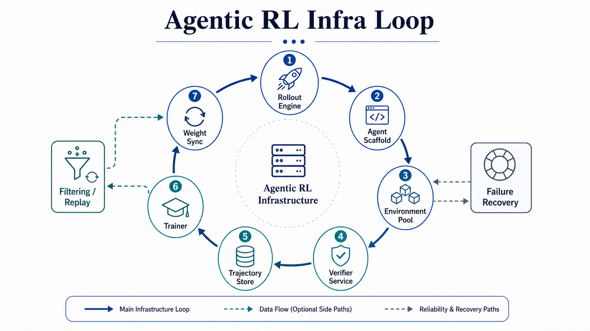

# From Language Models to Agentic Foundation Models: Architecture, Data, Environments, Rewards, Training, Agentic RL Infra, and Harnesses

**Authors:** darwin.mathsfan@gmail.com

## Abstract

Large language models are increasingly evaluated and deployed as agents that plan, use tools, interact with environments, recover from failures, and complete long-horizon tasks. This survey frames this shift as the emergence of Agentic Foundation Models (AFMs): foundation models whose capabilities are produced by the joint design of architecture, data, environments, rewards, training pipelines, reinforcement-learning infrastructure, and product harnesses. Rather than treating agentic capability as a single prompting technique or a single RL algorithm, we organize recent work into a formation stack. We distinguish disclosed model and training evidence from product/runtime evidence, synthesize mainline model-family reports and agentic RL systems, compare mainstream AFM routes, and analyze how AFMs become scenario agents in coding, research, GUI/computer-use, office, data, and multi-agent settings. The survey concludes with open problems around non-coding verification, long-horizon credit assignment, environment reliability, harness generalization, compute bottlenecks, multimodal and multi-agent agents, self-evolving data/reward loops, and reproducible agentic evaluation.

## Keywords

Agentic foundation models; agentic reinforcement learning; tool use; long-context inference; reward systems; verifiers; RL infrastructure; agent harness; scenario agents.

# 1. Introduction

This chapter establishes the conceptual and evidential foundations for the survey. It defines the object of study, separates model capability from runtime composition, and positions the paper relative to adjacent literatures.

## Chapter Visual Assets

**Figure (F01-01). AFM Formation Loop.** Show task distribution -> environment -> trajectory -> reward/verifier -> training -> model -> deployment/harness -> data refresh as the paper's thesis loop.

**Table (T01-01). Fragmented Evidence Map.** Explain what model reports, benchmarks, RL infra papers, reward surveys, product system cards, and local synthesis can each support.

| Evidence source type | Representative examples | Strong for | Weak for | Claim label |
|---|---|---|---|---|
| Model technical reports | MiniMax M2, Qwen3-Coder-Next, Kimi K2/K2.5, GLM-4.5/5, DeepSeek V3/R1/V3.2 | Architecture, data/training stages, disclosed rewards, benchmark setup | Undisclosed product telemetry or hidden pipelines | D1 |
| Release blogs / model cards | MiniMax M3, Command A+, product model pages | High-level capability, deployment scope, release positioning | Exact data ratios, reward weights, rollout prompts | D2 |
| Agent benchmarks and environments | AgentBench, GAIA, SWE-bench, WebArena, OSWorld, R2E-Gym | Capability boundaries, environment/verifier structure | Pure model attribution without harness controls | D1/D2 |
| RL infra papers/framework docs | OpenRLHF, ReaLHF, HybridFlow, AReaL, ROLL, ROSE, Agent Lightning | System modules, rollout/trainer/reward services, scaling bottlenecks | Specific closed-model recipes unless disclosed | D1/D2 |
| Reward/verifier surveys and methods | Reward model survey, Generative Verifiers, Rubrics as Rewards, AutoRubric | Reward taxonomy, judge/verifier risks, non-coding reward design | Exact reward stacks of closed systems | D1/D3 |
| Product system cards / engineering posts | OpenAI CUA/Operator/ChatGPT Agent, Anthropic harness posts, Google computer-use materials | Runtime governance, safety, permissions, telemetry/eval loops | Training data, RL algorithm, reward recipe unless disclosed | D2 |
| Local synthesis notes | User reading notes and project source maps | Cross-source organization, taxonomy, hypothesis generation | Public factual claims without official anchors | D3/D4 |

## 1.1 From Language Models to Agentic Foundation Models

Early tool-use work such as [ReAct: Synergizing Reasoning and Acting in Language Models](https://arxiv.org/abs/2210.03629) and [Toolformer: Language Models Can Teach Themselves to Use Tools](https://arxiv.org/abs/2302.04761) established that language models could interleave reasoning with external actions. Recent model reports move the emphasis from tool use as a prompting pattern to agentic behavior as a training target. The MiniMax, Qwen, GLM, and DeepSeek reports are not merely reporting better chat models; they describe models optimized for coding, tools, long context, reasoning with tool traces, and environment-grounded task completion.

This survey therefore uses the term AFM for a foundation model whose capabilities are shaped by a broader formation stack: model architecture for long-horizon inference, data pipelines that include trajectories rather than only prompt-response pairs, executable or simulated environments, reward and verifier systems, staged post-training, RL infrastructure, and product harnesses. The term does not imply that every model report discloses all parts of the stack. Instead, it names the emerging object of study: models whose useful behavior depends on co-design between training data, environments, rewards, infrastructure, and runtime systems.

Representative anchors for this section include [The MiniMax-M2 Series: Mini Activations Unleashing Max Real-World Intelligence](https://arxiv.org/abs/2605.26494); [Qwen3-Coder-Next Technical Report](https://arxiv.org/abs/2603.00729); [GLM-5: from Vibe Coding to Agentic Engineering](https://arxiv.org/abs/2602.15763); [DeepSeek-V3.2: Pushing the Frontier of Open Large Language Models](https://arxiv.org/abs/2512.02556); [Agentic Large Language Models, a Survey](https://arxiv.org/abs/2503.23037); [The Landscape of Agentic Reinforcement Learning for LLMs: A Survey](https://arxiv.org/abs/2509.02547); [ReAct: Synergizing Reasoning and Acting in Language Models](https://arxiv.org/abs/2210.03629); [Toolformer: Language Models Can Teach Themselves to Use Tools](https://arxiv.org/abs/2302.04761).

## 1.2 Why Agentic Capability Is a Training-and-Systems Problem

The core thesis of this paper is that agentic capability cannot be reduced to a larger base model, a longer context window, or a single RL objective. It emerges when tasks are converted into trajectories, trajectories are grounded in environments, environment feedback is converted into rewards or verifier signals, and post-training can consume those signals at scale. Agentic systems also need inference and runtime support: tool calls interrupt generation, observations expand context, multi-turn rollouts create long-tail latency, and product deployment adds permissions, state, monitoring, and safety gates.

[Agentic AI Needs a Systems Theory](https://arxiv.org/abs/2503.00237) motivates this systems framing at the conceptual level, while [Agent Lightning: Train ANY AI Agents with Reinforcement Learning](https://arxiv.org/abs/2508.03680) and [AReaL: A Large-Scale Asynchronous Reinforcement Learning System for Language Reasoning](https://arxiv.org/abs/2505.24298) show why the training substrate must decouple agent execution, rollout generation, and learning. Mainline AFM reports such as Kimi K2, GLM-4.5, and Tongyi DeepResearch provide model-family evidence that agentic progress is organized around tool use, environment interaction, search/research workflows, and staged training.

The implication is methodological. A survey of AFMs should not be organized only by model families, agent algorithms, or benchmarks. It should organize the field around the formation loop that makes agentic behavior trainable: architecture, data, environments, rewards, training, infrastructure, and runtime harnesses.

Representative anchors for this section include [Kimi K2: Open Agentic Intelligence](https://arxiv.org/abs/2507.20534); [GLM-4.5: Agentic, Reasoning, and Coding Foundation Models](https://arxiv.org/abs/2508.06471); [Tongyi DeepResearch Technical Report](https://arxiv.org/abs/2510.24701); [Agentic AI Needs a Systems Theory](https://arxiv.org/abs/2503.00237); [Agentic AI: A Comprehensive Survey of Architectures, Applications, and Future Directions](https://arxiv.org/abs/2510.25445); [Agent Lightning: Train ANY AI Agents with Reinforcement Learning](https://arxiv.org/abs/2508.03680); [AReaL: A Large-Scale Asynchronous Reinforcement Learning System for Language Reasoning](https://arxiv.org/abs/2505.24298); [Harness Engineering](https://openai.com/index/harness-engineering/).

## 1.3 Fragmented Evidence Across Model Reports, Agents, RL, Infra, and Products

AFM evidence is not concentrated in a single literature. Model reports tend to disclose selected architecture, data, evaluation, and post-training facts. Agent benchmark papers define environments and evaluation boundaries. Reward-model surveys explain judge, verifier, and rubric design. RL infrastructure papers explain the systems required to generate and train from online samples. Product system cards and engineering posts describe deployment harnesses, safety workflows, permissions, and telemetry, but usually disclose little about training data and RL recipes.

This fragmentation creates two risks. The first is under-synthesis: treating each paper as isolated and missing the shared formation loop behind recent agentic progress. The second is over-synthesis: reading product capability or benchmark performance as proof of undisclosed training recipes. The purpose of a section-level source map is to keep these two risks visible. For example, [HybridFlow: A Flexible and Efficient RLHF Framework](https://arxiv.org/abs/2409.19256) is strong evidence for RLHF/RLVR system abstractions, [EnvFactory: Scaling Tool-Use Agents via Executable Environments Synthesis and Robust RL](https://arxiv.org/abs/2605.18703) is strong evidence for environment synthesis as a data engine, and [Agent Harness Engineering: A Survey](https://openreview.net/forum?id=3hXEPbG0dh) is strong evidence for runtime architecture. They are related, but they support different claims.

This paper therefore treats AFM as a cross-literature construct. It builds a common vocabulary and then maps each source to the claim type it can legitimately support.

Representative anchors for this section include [NVIDIA Nemotron 3 Super Technical Report](https://research.nvidia.com/labs/nemotron/files/NVIDIA-Nemotron-3-Super-Technical-Report.pdf); [Introducing Command A+](https://cohere.com/blog/command-a-plus); [Agentic AI Frameworks: Architectures, Protocols, and Design Challenges](https://arxiv.org/abs/2508.10146); [A Comprehensive Survey of Reward Models: Taxonomy, Applications, Challenges, and Future](https://arxiv.org/abs/2504.12328); [HybridFlow: A Flexible and Efficient RLHF Framework](https://arxiv.org/abs/2409.19256); [EnvFactory: Scaling Tool-Use Agents via Executable Environments Synthesis and Robust RL](https://arxiv.org/abs/2605.18703); [Agent Harness Engineering: A Survey](https://openreview.net/forum?id=3hXEPbG0dh).

## 1.4 Contributions of This Survey

The survey makes four contributions. First, it proposes an AFM formation stack: model architecture for agentic inference, data pipeline, agentic environments, reward and verifier systems, training pipeline, agentic RL infrastructure, and product harness/runtime. This stack is designed to compare sources such as MiniMax, Qwen, Kimi, GLM, DeepSeek, Tongyi, and other model families without reducing them to benchmark scores.

Second, it introduces an evidence discipline. The paper distinguishes D1 technical-report or paper disclosures, D2 official product and system-card evidence, D3 local synthesis, and D4 inference. This is essential because many important product and harness sources are credible but do not disclose full training recipes.

Third, it builds a mainstream AFM landscape matrix. Instead of asking which model is "best," the matrix asks what each model family discloses across architecture, data, environments, rewards, training, infrastructure, harness, and evidence gaps.

Fourth, it translates the AFM stack into scenario-agent recipes. Coding/SWE, deep research, GUI/computer-use, office/productivity, data/SQL/MLE, and multi-agent workflows can be analyzed as different combinations of a model, scenario adaptation, environment, reward layer, RL infrastructure, and harness.

Representative anchors for this section include [The MiniMax-M2 Series: Mini Activations Unleashing Max Real-World Intelligence](https://arxiv.org/abs/2605.26494); [Qwen3-Coder-Next Technical Report](https://arxiv.org/abs/2603.00729); [Kimi K2.5: Visual Agentic Intelligence](https://arxiv.org/abs/2602.02276); [DeepSeek-V3.2: Pushing the Frontier of Open Large Language Models](https://arxiv.org/abs/2512.02556); [The Landscape of Agentic Reinforcement Learning for LLMs: A Survey](https://arxiv.org/abs/2509.02547); [AgentRL: Scaling Agentic Reinforcement Learning with a Multi-Turn, Multi-Task Framework](https://arxiv.org/abs/2510.04206); [From Model Scaling to System Scaling: Scaling the Harness in Agentic AI](https://arxiv.org/abs/2605.26112).

## 1.5 Scope and Boundary Statements

Coding/SWE agents are central to this survey because they provide the strongest early evidence that long-horizon agentic behavior can be trained with executable environments and verifiable rewards. Repositories, terminals, build systems, unit tests, hidden tests, logs, and patches create a rare domain where environment feedback can be converted into relatively objective training signal.

However, coding/SWE is not the whole AFM problem. Search, GUI, browser, office, data analysis, deep research, multimodal editing, and multi-agent collaboration often lack cheap unit-test-style verification. They require reward mixtures, rubric or judge systems, safety constraints, context and memory management, and product supervision. The paper therefore treats coding as a high-value special case and uses it to reason about generalization limits.

Product harnesses are also distinct from models. A system card or product article can be excellent evidence for runtime behavior, permission boundaries, supervision, tool surfaces, and safety workflows. It is not automatically evidence for the model's training data or RL algorithm. Scenario agents sit between these levels: they are produced when an AFM is adapted to a domain, placed in a task environment, evaluated by a scenario-specific verifier stack, and deployed through a runtime harness.

Representative anchors for this section include [Qwen3-Coder-Next Technical Report](https://arxiv.org/abs/2603.00729); [GLM-5: from Vibe Coding to Agentic Engineering](https://arxiv.org/abs/2602.15763); [DeepSeek-V3.2: Pushing the Frontier of Open Large Language Models](https://arxiv.org/abs/2512.02556); [Agent Harness for Large Language Model Agents: A Survey](https://www.preprints.org/manuscript/202604.0428); [The Landscape of Agentic Reinforcement Learning for LLMs: A Survey](https://arxiv.org/abs/2509.02547); [SWE-bench: Can Language Models Resolve Real-World GitHub Issues?](https://arxiv.org/abs/2310.06770); [OSWorld: Benchmarking Multimodal Agents for Open-Ended Tasks in Real Computer Environments](https://arxiv.org/abs/2404.07972); [Operator System Card](https://openai.com/index/operator-system-card/).

## Chapter Summary

This chapter contributes one component of the survey's AFM formation-stack argument. Its claims should be read with the evidence labels and disclosure boundaries defined in the foundation chapters and carried through the later landscape, scenario, and open-problem chapters.

# 2. Definitions, Capabilities, and Evaluation Boundaries

This chapter establishes the conceptual and evidential foundations for the survey. It defines the object of study, separates model capability from runtime composition, and positions the paper relative to adjacent literatures.

## Chapter Visual Assets

**Figure (F02-01). Model / Environment / Harness / Product / Scenario Agent Boundary.** Prevent model, environment, harness, product, and scenario agent from being collapsed into one object.

**Table (T02-01). Agentic Capability Taxonomy.** Define planning, tool use, environment interaction, self-correction, long-horizon execution, memory, artifact delivery, multi-agent coordination, and safety-aware action.

| Capability | Behavioral signal | Required substrate | Common eval evidence | Caveat |
|---|---|---|---|---|
| Planning | Breaks task into steps | Long context; task state | Agent benchmarks; scenario evals | Plans may be scaffold-generated |
| Tool use | Selects and calls tools | Tool schema; action format | Tool-use tasks; product docs | Tool success may depend on harness |
| Environment interaction | Acts on state and observations | Env API; observation packing | Web/OS/SWE envs | Eval scaffold is not training env |
| Self-correction | Detects and repairs failures | Feedback; verifier | SWE, browser, research tasks | May overfit to visible feedback |
| Long-horizon execution | Maintains progress over many steps | Memory; cache; checkpointing | Long tasks; deep research | Credit assignment remains hard |
| Artifact delivery | Produces files, reports, patches | Workspace; verifier | Coding/office/data tasks | Artifact quality may need judges |
| Multi-agent coordination | Delegates and integrates work | Orchestration; shared state | Multi-agent tasks | Credit assignment is ambiguous |
| Safety-aware action | Requests permissions and avoids unsafe actions | Policy; governance; sandbox | Product/system cards | Runtime evidence is not recipe evidence |

**Table (T02-02). Evidence Strength Levels D1-D4.** Define allowed claim types for disclosed facts, official high-level materials, local synthesis, and inference.

| Label | Source basis | Allowed wording | Not allowed | Example use |
|---|---|---|---|---|
| D1 | Paper, technical report, benchmark paper, system paper | "The paper reports...", "The technical report discloses..." | Filling in missing private details | Qwen3-Coder-Next data/reward/training disclosures |
| D2 | Official blog, product doc, model card, system card, framework docs | "The official system card describes...", "The product documentation indicates..." | Treating product runtime as training recipe | OpenAI/Anthropic/Google harness and computer-use evidence |
| D3 | Local synthesis across notes and official sources | "We synthesize...", "Across sources, the pattern suggests..." | Presenting synthesis as a source's explicit claim | AFM formation stack taxonomy |
| D4 | Plausible inference or hypothesis | "We infer cautiously...", "This may indicate..." | Stating exact data ratios, reward weights, prompts, tool schemas | Route labels and undisclosed feedback loops |

## 2.1 Working Definition of Agentic Foundation Models

This paper uses AFM as an operational category rather than a branding term. A model qualifies as agentic to the extent that its training, evaluation, and deployment target the ability to act through tools and environments over time. This includes coding agents that edit repositories and run tests, research agents that search and synthesize evidence, GUI agents that operate screens and applications, and productivity agents that produce durable artifacts.

The working definition has three parts. First, the model must preserve and use task state over a horizon longer than a single answer. Second, it must interact with an external action surface, such as tools, APIs, file systems, browsers, terminals, GUI controls, or other agents. Third, it must be shaped by feedback: direct verifiers, execution results, reward models, judges, human supervision, or product safety constraints.

This definition intentionally includes both open technical-report evidence and product-runtime evidence, but it does not collapse them. [GLM-4.5: Agentic, Reasoning, and Coding Foundation Models](https://arxiv.org/abs/2508.06471), [Kimi K2: Open Agentic Intelligence](https://arxiv.org/abs/2507.20534), and [The MiniMax-M2 Series: Mini Activations Unleashing Max Real-World Intelligence](https://arxiv.org/abs/2605.26494) provide model-family anchors for agentic training and capability. [Computer-Using Agent](https://openai.com/index/computer-using-agent/) provides product-runtime evidence for computer-use action loops.

Representative anchors for this section include [GLM-4.5: Agentic, Reasoning, and Coding Foundation Models](https://arxiv.org/abs/2508.06471); [Kimi K2: Open Agentic Intelligence](https://arxiv.org/abs/2507.20534); [The MiniMax-M2 Series: Mini Activations Unleashing Max Real-World Intelligence](https://arxiv.org/abs/2605.26494); [Agentic Large Language Models, a Survey](https://arxiv.org/abs/2503.23037); [Agentic AI: A Comprehensive Survey of Architectures, Applications, and Future Directions](https://arxiv.org/abs/2510.25445); [xLAM: A Family of Large Action Models to Empower AI Agent Systems](https://arxiv.org/abs/2409.03215); [Computer-Using Agent](https://openai.com/index/computer-using-agent/).

## 2.2 Agentic Capability Taxonomy

Agentic capability is multidimensional. Planning and decomposition allow a model to convert an open-ended task into executable subgoals. Tool use and action formatting allow the model to invoke APIs, commands, browser actions, editing operations, or structured function calls. Environment interaction allows the model to condition on state and observations rather than only on user text. Self-correction allows it to repair failures using tests, logs, search results, judge feedback, or user corrections.

Long-horizon execution extends these abilities over many turns and potentially many tool calls. Context and memory management determine whether the model can retain the right task state without being derailed by irrelevant history. Artifact delivery shifts success from "answer quality" to external outputs such as code patches, reports, spreadsheets, slides, web applications, or completed workflows. Multi-agent collaboration adds delegation and aggregation. Scaffold generalization asks whether the capability survives changes in tool schema, harness, prompt format, or environment. Safety-aware action controls whether the model can act under permission, policy, and risk constraints.

Benchmarks such as [AgentBench: Evaluating LLMs as Agents](https://arxiv.org/abs/2308.03688) and [GAIA: A Benchmark for General AI Assistants](https://arxiv.org/abs/2311.12983) are useful because they expose different subsets of this taxonomy. Mainline AFM reports such as Kimi K2.5, GLM-5 broaden the taxonomy toward visual, GUI, search, code, and real-world agency. Product engineering guidance such as [Building Effective AI Agents](https://www.anthropic.com/engineering/building-effective-agents) helps identify runtime capabilities that benchmarks often under-measure.

Representative anchors for this section include [Kimi K2.5: Visual Agentic Intelligence](https://arxiv.org/abs/2602.02276); [GLM-5: from Vibe Coding to Agentic Engineering](https://arxiv.org/abs/2602.15763); [The Landscape of Agentic Reinforcement Learning for LLMs: A Survey](https://arxiv.org/abs/2509.02547); [Agentic Large Language Models, a Survey](https://arxiv.org/abs/2503.23037); [AgentBench: Evaluating LLMs as Agents](https://arxiv.org/abs/2308.03688); [GAIA: A Benchmark for General AI Assistants](https://arxiv.org/abs/2311.12983); [Building Effective AI Agents](https://www.anthropic.com/engineering/building-effective-agents).

## 2.3 Model, Environment, Harness, Product, and Scenario Agent

The model is the learned policy and generator. It contains the parameters that produce reasoning, actions, tool calls, code, or natural-language responses. The environment is the external state and action space through which a task unfolds: a repository and shell, a browser, a web application, a GUI, a search corpus, a simulated API world, or a research workspace. The harness is the runtime governance layer around the model: it manages execution loops, tools, context, state, observability, verification, safety, and permissions.

The product is the user-facing integration of model and harness. It may include accounts, connectors, supervision modes, UI affordances, telemetry, billing, and policy enforcement. Finally, a scenario agent is a domain-specific assembly: an AFM plus task-specific tools, environment, reward/evaluation scheme, and runtime harness. A coding agent, deep research agent, GUI agent, or office agent should therefore be analyzed as a stack rather than as a model alone.

This separation is necessary for evidence attribution. [OpenHands: An Open Platform for AI Software Developers as Generalist Agents](https://arxiv.org/abs/2407.16741) and [WebArena: A Realistic Web Environment for Building Autonomous Agents](https://arxiv.org/abs/2307.13854) provide environment and harness evidence. [Qwen3-Coder-Next Technical Report](https://arxiv.org/abs/2603.00729) provides model and training evidence for a coding-agent direction. [Unlocking the Codex Harness: How We Built the App Server](https://openai.com/index/unlocking-the-codex-harness/) provides product-runtime engineering evidence.

Representative anchors for this section include [Qwen3-Coder-Next Technical Report](https://arxiv.org/abs/2603.00729); [Tongyi DeepResearch Technical Report](https://arxiv.org/abs/2510.24701); [Microsoft Magma: A Foundation Model for Multimodal AI Agents](https://arxiv.org/abs/2502.13130); [Agent Harness Engineering: A Survey](https://openreview.net/forum?id=3hXEPbG0dh); [Agentic AI Frameworks: Architectures, Protocols, and Design Challenges](https://arxiv.org/abs/2508.10146); [OpenHands: An Open Platform for AI Software Developers as Generalist Agents](https://arxiv.org/abs/2407.16741); [WebArena: A Realistic Web Environment for Building Autonomous Agents](https://arxiv.org/abs/2307.13854); [Unlocking the Codex Harness: How We Built the App Server](https://openai.com/index/unlocking-the-codex-harness/).

## 2.4 Benchmark Capability vs Product Capability

Benchmarks are indispensable because they provide external tasks, success criteria, and comparison points. [SWE-bench: Can Language Models Resolve Real-World GitHub Issues?](https://arxiv.org/abs/2310.06770), [OSWorld: Benchmarking Multimodal Agents for Open-Ended Tasks in Real Computer Environments](https://arxiv.org/abs/2404.07972), and [WebArena: A Realistic Web Environment for Building Autonomous Agents](https://arxiv.org/abs/2307.13854) each make a different part of agentic capability measurable. However, benchmark results are often produced by a complete evaluation stack: a model, prompt, action interface, tool sandbox, context policy, retry strategy, and grader.

Product capability is broader. A product must decide when an action is allowed, how to expose uncertainty, how to recover from failures, how to log and replay trajectories, how to manage user secrets and accounts, and how to prevent unsafe side effects. The Anthropic engineering article [Demystifying Evals for AI Agents](https://www.anthropic.com/engineering/demystifying-evals-for-ai-agents) is useful here because it treats evals as part of an operational loop, not merely a leaderboard.

For AFM analysis, this distinction controls attribution. If a benchmark uses a strong harness, the result should not be read as pure model capability. If a product succeeds through permissions, context management, and tool design, that success is relevant to agentic AI but should not be mistaken for disclosed post-training evidence.

Representative anchors for this section include [Qwen3-Coder-Next Technical Report](https://arxiv.org/abs/2603.00729); [DeepSeek-V3.2: Pushing the Frontier of Open Large Language Models](https://arxiv.org/abs/2512.02556); [Agent Harness for Large Language Model Agents: A Survey](https://www.preprints.org/manuscript/202604.0428); [The Landscape of Agentic Reinforcement Learning for LLMs: A Survey](https://arxiv.org/abs/2509.02547); [SWE-bench: Can Language Models Resolve Real-World GitHub Issues?](https://arxiv.org/abs/2310.06770); [OSWorld: Benchmarking Multimodal Agents for Open-Ended Tasks in Real Computer Environments](https://arxiv.org/abs/2404.07972); [WebArena: A Realistic Web Environment for Building Autonomous Agents](https://arxiv.org/abs/2307.13854); [Demystifying Evals for AI Agents](https://www.anthropic.com/engineering/demystifying-evals-for-ai-agents).

## 2.5 Evidence Strength: Disclosed Facts, Synthesis, and Inference

D1 evidence covers claims explicitly stated in papers and technical reports: architecture mechanisms, training stages, data descriptions, reward definitions, environment setups, evaluation protocols, and system designs when they are actually disclosed. D2 evidence covers official product pages, blogs, release notes, system cards, and engineering posts. These are important for runtime, safety, user interaction, and product behavior, but they usually do not expose complete data or RL recipes.

D3 evidence is synthesis from local reading notes and cross-source mapping. It can organize the field and propose a taxonomy, but it should not be phrased as if it were a public claim made by a model provider. D4 evidence is inference. It may be useful when connecting patterns across sources, but it must be expressed cautiously with phrases such as "suggests," "is consistent with," or "may indicate."

This scheme is especially important for AFMs because the strongest product evidence and the strongest training evidence often come from different sources. For example, [ChatGPT Agent System Card](https://openai.com/index/chatgpt-agent-system-card/) is strong product/runtime and safety evidence. [NVIDIA Nemotron 3 Super Technical Report](https://research.nvidia.com/labs/nemotron/files/NVIDIA-Nemotron-3-Super-Technical-Report.pdf) is closer to technical-report evidence. [MiniMax-M3](https://www.minimax.io/blog/minimax-m3) and [Introducing Command A+](https://cohere.com/blog/command-a-plus) must be read according to what they explicitly disclose.

Representative anchors for this section include [MiniMax-M3](https://www.minimax.io/blog/minimax-m3); [Introducing Command A+](https://cohere.com/blog/command-a-plus); [NVIDIA Nemotron 3 Super Technical Report](https://research.nvidia.com/labs/nemotron/files/NVIDIA-Nemotron-3-Super-Technical-Report.pdf); [Agentic AI: A Comprehensive Survey of Architectures, Applications, and Future Directions](https://arxiv.org/abs/2510.25445); [A Comprehensive Survey of Reward Models: Taxonomy, Applications, Challenges, and Future](https://arxiv.org/abs/2504.12328); [ChatGPT Agent System Card](https://openai.com/index/chatgpt-agent-system-card/); [Claude Code Auto Mode](https://www.anthropic.com/engineering/claude-code-auto-mode).

## Chapter Summary

This chapter contributes one component of the survey's AFM formation-stack argument. Its claims should be read with the evidence labels and disclosure boundaries defined in the foundation chapters and carried through the later landscape, scenario, and open-problem chapters.

# 3. Related Work and Literature Review

This chapter establishes the conceptual and evidential foundations for the survey. It defines the object of study, separates model capability from runtime composition, and positions the paper relative to adjacent literatures.

## Chapter Visual Assets

**Table (T03-01). Related Work Cluster Map.** Organize prior work into agentic AI surveys, action models, benchmarks, agentic RL, reward/verifiers, RL infra, GUI/deep research/multi-agent, harness, and model reports.

| Cluster | Representative sources | What it explains | Limitation for this survey |
|---|---|---|---|
| Agentic AI / LLM surveys | Agentic AI survey; Agentic LLM survey; Agentic systems theory | Broad agent concepts, architectures, and systems framing | Often framework-centric rather than training-stack-centric |
| Tool-use and action models | ReAct; Toolformer; xLAM; APIGen | Tool calls, action formats, reasoning-acting loops, function-call data | Usually not enough to explain environment rollout or RL infra |
| Agent benchmarks | AgentBench; GAIA; SWE-bench; WebArena; OSWorld | Capability measurement, task design, environment boundaries | Model/harness/tool attribution remains difficult |
| Agentic RL and post-training | DeepSeek-R1; DAPO; Agent Lightning; AgentRL; AgentGym-RL | RLVR, multi-turn rollout, post-training recipes | Often domain-specific or partially disclosed |
| Rewards and verifiers | Reward model survey; Generative Verifiers; Rubrics as Rewards; AutoRubric | Reward models, judges, GRMs, rubric rewards, verifier reliability | Non-coding rewards remain fragile |
| RL infra systems | OpenRLHF; ReaLHF; HybridFlow; AReaL; ROLL; ROSE; OpenTinker | Rollout/trainer/reward service scaling, async RL, disaggregation | Traditional RLHF infra is not always agentic |
| GUI/deep research/multi-agent | OSWorld; ToolCUA; Kimi-Researcher; WebDancer/WebSailor; AutoGen/Magentic-One | Scenario-specific environments, data, and harnesses | Evidence is fragmented by scenario |
| Harness and product runtime | Agent Harness surveys; OpenAI Codex/Operator/ChatGPT Agent; Anthropic harness posts; Google computer-use | Runtime governance, permissions, context/state, observability | D2, usually not training recipe evidence |
| Mainline model reports | MiniMax; Qwen; Kimi; GLM; DeepSeek; Tongyi; Seed; Nemotron/Cohere | Architecture, data, reward, training, and infra disclosures | Disclosure level varies across dimensions |

**Figure (F03-01). How This Survey Reorganizes Prior Work.** Show the shift from prior agent/framework/benchmark lenses to the AFM formation stack.

## 3.1 LLM Agent and Agentic AI Surveys

The first group of related work defines the agentic turn itself. [Agentic Large Language Models, a Survey](https://arxiv.org/abs/2503.23037) and [Agentic AI: A Comprehensive Survey of Architectures, Applications, and Future Directions](https://arxiv.org/abs/2510.25445) provide broad maps of reasoning, acting, planning, memory, tool use, interaction, applications, and future directions. [Agentic AI Needs a Systems Theory](https://arxiv.org/abs/2503.00237) sharpens the argument that agentic systems must be understood as coupled systems rather than isolated models.

This survey builds on those foundations but shifts the center of gravity. The main question is not only what agents do or how agent loops are structured. It is how recent foundation models become agentic through architecture, data, environments, rewards, training, and infrastructure. [GLM-4.5: Agentic, Reasoning, and Coding Foundation Models](https://arxiv.org/abs/2508.06471) illustrates why this shift is needed: the model-family framing already combines reasoning, coding, and agentic post-training concerns that do not fit neatly into classic agent-architecture categories.

The result is complementary to prior surveys. Broad agent surveys give the vocabulary of agents. This paper uses that vocabulary to read model reports, RL infrastructure systems, reward/verifier literature, and product harness evidence as parts of a single AFM formation stack.

Representative anchors for this section include [GLM-4.5: Agentic, Reasoning, and Coding Foundation Models](https://arxiv.org/abs/2508.06471); [Agentic AI: A Comprehensive Survey of Architectures, Applications, and Future Directions](https://arxiv.org/abs/2510.25445); [Agentic Large Language Models, a Survey](https://arxiv.org/abs/2503.23037); [Agentic AI Needs a Systems Theory](https://arxiv.org/abs/2503.00237); [ReAct: Synergizing Reasoning and Acting in Language Models](https://arxiv.org/abs/2210.03629); [Building Effective AI Agents](https://www.anthropic.com/engineering/building-effective-agents).

## 3.2 Tool-Use, Action Models, and Agent Algorithms

The tool-use literature begins from a simple but powerful observation: a language model can improve its effective capability by deciding when and how to invoke external tools. [Toolformer: Language Models Can Teach Themselves to Use Tools](https://arxiv.org/abs/2302.04761) frames tool use as a learnable behavior. [xLAM: A Family of Large Action Models to Empower AI Agent Systems](https://arxiv.org/abs/2409.03215) pushes this toward action-model specialization, while [APIGen: Automated Pipeline for Generating Verifiable and Diverse Function-Calling Datasets](https://arxiv.org/abs/2406.18518) shows the importance of verifiable function-calling data.

Mainline AFM reports transform this literature into a broader training problem. Kimi K2 and Qwen3-Coder-Next do not only need the model to emit syntactically valid calls; they need the model to choose tools, interpret observations, repair mistakes, and remain robust across tool templates and environments. Tool schemas become part of the data pipeline, action correctness becomes part of the reward layer, and runtime tool design becomes part of product reliability.

[Writing Effective Tools for AI Agents](https://www.anthropic.com/engineering/writing-tools-for-agents) is useful as D2 runtime evidence because it shows that tool affordances, schemas, and documentation influence agent reliability after training as well. This reinforces a recurring theme: model-side action capability and harness-side tool design co-produce deployed behavior.

Representative anchors for this section include [Kimi K2: Open Agentic Intelligence](https://arxiv.org/abs/2507.20534); [Qwen3-Coder-Next Technical Report](https://arxiv.org/abs/2603.00729); [Agentic Large Language Models, a Survey](https://arxiv.org/abs/2503.23037); [Toolformer: Language Models Can Teach Themselves to Use Tools](https://arxiv.org/abs/2302.04761); [xLAM: A Family of Large Action Models to Empower AI Agent Systems](https://arxiv.org/abs/2409.03215); [APIGen: Automated Pipeline for Generating Verifiable and Diverse Function-Calling Datasets](https://arxiv.org/abs/2406.18518); [Writing Effective Tools for AI Agents](https://www.anthropic.com/engineering/writing-tools-for-agents).

## 3.3 Agent Evaluation and Benchmark Literature

Benchmarks moved the agent literature from qualitative demos toward structured comparison. [AgentBench: Evaluating LLMs as Agents](https://arxiv.org/abs/2308.03688) provides a broad agent evaluation frame. [SWE-bench: Can Language Models Resolve Real-World GitHub Issues?](https://arxiv.org/abs/2310.06770) anchors the coding/SWE line with real repository issues. [WebArena: A Realistic Web Environment for Building Autonomous Agents](https://arxiv.org/abs/2307.13854) and [OSWorld: Benchmarking Multimodal Agents for Open-Ended Tasks in Real Computer Environments](https://arxiv.org/abs/2404.07972) extend evaluation toward web and computer-use settings.

For AFM analysis, benchmarks play three roles. They provide evaluation targets, expose environment abstractions, and sometimes become training substrates or verifier sources. The distinction matters: an environment used only for evaluation does not prove that a model was trained through that environment. Conversely, when a model report discloses executable rollout training or environment feedback, the benchmark literature helps interpret what kind of capability was optimized.

Mainline reports such as Qwen3-Coder-Next and Kimi K2.5 use benchmark results to demonstrate coding, visual, GUI, or agentic capability, but the measured outcome still depends on scaffolds, tools, and evaluation harnesses. Product evaluation guidance such as [Demystifying Evals for AI Agents](https://www.anthropic.com/engineering/demystifying-evals-for-ai-agents) reinforces the same point in deployment settings.

Representative anchors for this section include [Qwen3-Coder-Next Technical Report](https://arxiv.org/abs/2603.00729); [Kimi K2.5: Visual Agentic Intelligence](https://arxiv.org/abs/2602.02276); [The Landscape of Agentic Reinforcement Learning for LLMs: A Survey](https://arxiv.org/abs/2509.02547); [AgentBench: Evaluating LLMs as Agents](https://arxiv.org/abs/2308.03688); [SWE-bench: Can Language Models Resolve Real-World GitHub Issues?](https://arxiv.org/abs/2310.06770); [OSWorld: Benchmarking Multimodal Agents for Open-Ended Tasks in Real Computer Environments](https://arxiv.org/abs/2404.07972); [WebArena: A Realistic Web Environment for Building Autonomous Agents](https://arxiv.org/abs/2307.13854); [Demystifying Evals for AI Agents](https://www.anthropic.com/engineering/demystifying-evals-for-ai-agents).

## 3.4 Agentic RL and Post-Training Literature

Reasoning RL established that verifiable rewards can induce new reasoning behaviors in large models. [DeepSeek-R1: Incentivizing Reasoning Capability in LLMs via Reinforcement Learning](https://arxiv.org/abs/2501.12948) is a key anchor for this line. Agentic RL extends the challenge from single-answer reasoning to multi-turn interaction, where actions change environment state and rewards may arrive after long trajectories.

Post-training for AFMs is therefore best understood as a pipeline rather than a single RL stage. Continued pretraining and agentic mid-training expose the model to long context, tools, repositories, documents, and action traces. SFT or cold-start data teaches action grammar and basic trajectories. Domain RL optimizes strongly verifiable tasks such as math or code. Agentic RL then optimizes multi-turn task completion under environment feedback. Distillation and unification may merge specialists into a deployable model.

[Agent Lightning: Train ANY AI Agents with Reinforcement Learning](https://arxiv.org/abs/2508.03680) is important because it reframes agentic RL as a training-agent disaggregation problem. [Kimi-Researcher: End-to-End RL Training for Emerging Agentic Capabilities](https://moonshotai.github.io/Kimi-Researcher/) shows how scenario-specific deep research capabilities can be discussed in this same vocabulary, though it remains a scenario anchor rather than a universal recipe.

Representative anchors for this section include [DeepSeek-R1: Incentivizing Reasoning Capability in LLMs via Reinforcement Learning](https://arxiv.org/abs/2501.12948); [GLM-5: from Vibe Coding to Agentic Engineering](https://arxiv.org/abs/2602.15763); [The MiniMax-M2 Series: Mini Activations Unleashing Max Real-World Intelligence](https://arxiv.org/abs/2605.26494); [The Landscape of Agentic Reinforcement Learning for LLMs: A Survey](https://arxiv.org/abs/2509.02547); [Reinforcement Learning for Large Reasoning Models: A Survey](https://arxiv.org/abs/2509.08827); [DAPO: An Open-Source LLM Reinforcement Learning System at Scale](https://arxiv.org/abs/2503.14476); [Agent Lightning: Train ANY AI Agents with Reinforcement Learning](https://arxiv.org/abs/2508.03680); [Kimi-Researcher: End-to-End RL Training for Emerging Agentic Capabilities](https://moonshotai.github.io/Kimi-Researcher/).

## 3.5 Reward Models, Verifiers, and LLM-as-Judge

Classic RLHF uses preference modeling to align responses with human or AI preferences. AFMs need a richer reward layer because agentic tasks are interactive and heterogeneous. Coding tasks can use tests, build results, execution logs, and patch validation. Search and deep research tasks may use answer correctness, citation grounding, source quality, and judge scoring. GUI and product tasks may require state-diff verification, visual judges, permission checks, and safety gates.

The reward literature provides several building blocks. [A Comprehensive Survey of Reward Models: Taxonomy, Applications, Challenges, and Future](https://arxiv.org/abs/2504.12328) gives the broad taxonomy. [Generative Verifiers: Reward Modeling as Next-Token Prediction](https://arxiv.org/abs/2408.15240) and [Rubrics as Rewards: Reinforcement Learning Beyond Verifiable Domains](https://arxiv.org/abs/2507.17746) are important for domains where exact verification is unavailable. [AutoRubric: Scaling Rubric-Based Evaluation and Reward Modeling](https://arxiv.org/abs/2603.00077) points toward scalable rubric creation.

Mainline AFM reports supply the application pressure: Kimi K2, GLM-5, and DeepSeek-V3.2 all require reward systems that deal with tools, reasoning, and task completion. Product system cards such as [Operator System Card](https://openai.com/index/operator-system-card/) show another reward-adjacent layer: safety, permission, and user-control signals that govern deployed action.

Representative anchors for this section include [Kimi K2: Open Agentic Intelligence](https://arxiv.org/abs/2507.20534); [GLM-5: from Vibe Coding to Agentic Engineering](https://arxiv.org/abs/2602.15763); [DeepSeek-V3.2: Pushing the Frontier of Open Large Language Models](https://arxiv.org/abs/2512.02556); [A Comprehensive Survey of Reward Models: Taxonomy, Applications, Challenges, and Future](https://arxiv.org/abs/2504.12328); [Generative Verifiers: Reward Modeling as Next-Token Prediction](https://arxiv.org/abs/2408.15240); [Rubrics as Rewards: Reinforcement Learning Beyond Verifiable Domains](https://arxiv.org/abs/2507.17746); [AutoRubric: Scaling Rubric-Based Evaluation and Reward Modeling](https://arxiv.org/abs/2603.00077); [Operator System Card](https://openai.com/index/operator-system-card/).

## 3.6 RLHF/RLVR/RLInfra Systems

RLHF and RLVR infrastructure began as a way to coordinate actor, critic, reference, reward, and trainer components for preference or verifiable-reward training. Systems such as [OpenRLHF: An Easy-to-use, Scalable and High-performance RLHF Framework](https://aclanthology.org/2025.acl-demo.3/) and [HybridFlow: A Flexible and Efficient RLHF Framework](https://arxiv.org/abs/2409.19256) are key anchors for this stage. They expose the dataflow and resource-placement problem behind large-scale post-training.

Agentic RL increases the system burden. Rollouts are multi-turn, tool-interrupted, variable-length, and environment-dependent. Reward computation may require code execution, browser state, judges, sandboxes, or delayed outcome checks. Asynchronous systems such as [AReaL: A Large-Scale Asynchronous Reinforcement Learning System for Language Reasoning](https://arxiv.org/abs/2505.24298) and agentic rollout systems such as [ROSE: Rollout On Serving GPUs via Cooperative Elasticity for Agentic RL](https://arxiv.org/abs/2605.06534) show that systems choices become part of the effective training algorithm.

MiniMax-M2 and GLM-5 provide model-report pressure for this category: their agentic capabilities require infrastructure that can support long trajectories, verifiers, and scalable feedback loops. Product runtime sources such as [Running Codex Safely at OpenAI](https://openai.com/index/running-codex-safely/) are related but should be kept in a separate product harness category unless they explicitly discuss training infrastructure.

Representative anchors for this section include [The MiniMax-M2 Series: Mini Activations Unleashing Max Real-World Intelligence](https://arxiv.org/abs/2605.26494); [GLM-5: from Vibe Coding to Agentic Engineering](https://arxiv.org/abs/2602.15763); [The Landscape of Agentic Reinforcement Learning for LLMs: A Survey](https://arxiv.org/abs/2509.02547); [OpenRLHF: An Easy-to-use, Scalable and High-performance RLHF Framework](https://aclanthology.org/2025.acl-demo.3/); [HybridFlow: A Flexible and Efficient RLHF Framework](https://arxiv.org/abs/2409.19256); [AReaL: A Large-Scale Asynchronous Reinforcement Learning System for Language Reasoning](https://arxiv.org/abs/2505.24298); [ROSE: Rollout On Serving GPUs via Cooperative Elasticity for Agentic RL](https://arxiv.org/abs/2605.06534); [Running Codex Safely at OpenAI](https://openai.com/index/running-codex-safely/).

## 3.7 GUI, Computer-Use, Deep Research, and Multi-Agent Surveys

Coding/SWE is the strongest verifier domain, but the AFM agenda extends far beyond code. Deep research agents must search, select sources, synthesize evidence, cite claims, and manage uncertainty over long investigations. GUI and computer-use agents must map visual observations to actions under changing interface state. Multi-agent systems must coordinate roles, distribute context, aggregate results, and handle credit assignment across agents.

The survey literature reflects this diversification. [Deep Research Agents: A Systematic Examination and Roadmap](https://arxiv.org/abs/2506.18096) and [Reinforcement Learning Foundations for Deep Research Systems: A Survey](https://arxiv.org/abs/2509.06733) organize the search/research line. [Large Language Model-Brained GUI Agents: A Survey](https://arxiv.org/abs/2411.18279) and [OS Agents: A Survey on MLLM-based Agents for Computer, Phone and Browser Use](https://arxiv.org/abs/2508.04482) organize GUI and operating-system agents. [AutoGen: Enabling Next-Gen LLM Applications via Multi-Agent Conversation](https://arxiv.org/abs/2308.08155) and [Magentic-One: A Generalist Multi-Agent System for Solving Complex Tasks](https://arxiv.org/abs/2411.04468) anchor multi-agent orchestration.

These scenario literatures expose different bottlenecks in the same AFM stack. Deep research stresses source grounding and long-context synthesis. GUI agents stress multimodal perception and state verification. Computer-use products stress permissions and safety. Multi-agent systems stress context sharing and orchestration.

Representative anchors for this section include [Kimi K2.5: Visual Agentic Intelligence](https://arxiv.org/abs/2602.02276); [Microsoft Magma: A Foundation Model for Multimodal AI Agents](https://arxiv.org/abs/2502.13130); [Tongyi DeepResearch Technical Report](https://arxiv.org/abs/2510.24701); [Deep Research Agents: A Systematic Examination and Roadmap](https://arxiv.org/abs/2506.18096); [Reinforcement Learning Foundations for Deep Research Systems: A Survey](https://arxiv.org/abs/2509.06733); [Large Language Model-Brained GUI Agents: A Survey](https://arxiv.org/abs/2411.18279); [OS Agents: A Survey on MLLM-based Agents for Computer, Phone and Browser Use](https://arxiv.org/abs/2508.04482); [AutoGen: Enabling Next-Gen LLM Applications via Multi-Agent Conversation](https://arxiv.org/abs/2308.08155).

## 3.8 How This Survey Reorganizes Prior Work

Prior work can be read through several valid lenses: agent algorithms, tool use, benchmarks, reward modeling, RL systems, product harnesses, or scenario applications. This survey does not replace those lenses; it connects them. The central object is the AFM formation stack, which asks how a model becomes capable of long-horizon environment-grounded action and how that capability is made reliable in runtime systems.

The reorganization has three consequences. First, model architecture appears before data and RL because long context, cache-aware inference, active compute, and agentic serving constraints determine what trajectories can be represented and trained. Second, data, environments, rewards, training, and RL infrastructure are treated as a loop rather than separate topics. Third, agent harness and product runtime are given their own chapter so that product evidence is valued without being confused with training disclosure.

Mainline reports such as MiniMax-M2, Qwen3-Coder-Next, Kimi K2, GLM-5, and DeepSeek-V3.2 provide the cross-model evidence that this reorganization is necessary. Surveys such as [Agentic AI: A Comprehensive Survey of Architectures, Applications, and Future Directions](https://arxiv.org/abs/2510.25445) and [The Landscape of Agentic Reinforcement Learning for LLMs: A Survey](https://arxiv.org/abs/2509.02547) provide the broader research map. [Agent Lightning: Train ANY AI Agents with Reinforcement Learning](https://arxiv.org/abs/2508.03680) and [Agent Harness Engineering: A Survey](https://openreview.net/forum?id=3hXEPbG0dh) anchor two crucial system boundaries: training-agent disaggregation and runtime harness engineering.

Representative anchors for this section include [The MiniMax-M2 Series: Mini Activations Unleashing Max Real-World Intelligence](https://arxiv.org/abs/2605.26494); [Qwen3-Coder-Next Technical Report](https://arxiv.org/abs/2603.00729); [Kimi K2: Open Agentic Intelligence](https://arxiv.org/abs/2507.20534); [GLM-5: from Vibe Coding to Agentic Engineering](https://arxiv.org/abs/2602.15763); [DeepSeek-V3.2: Pushing the Frontier of Open Large Language Models](https://arxiv.org/abs/2512.02556); [Agentic AI: A Comprehensive Survey of Architectures, Applications, and Future Directions](https://arxiv.org/abs/2510.25445); [The Landscape of Agentic Reinforcement Learning for LLMs: A Survey](https://arxiv.org/abs/2509.02547); [Agent Lightning: Train ANY AI Agents with Reinforcement Learning](https://arxiv.org/abs/2508.03680).

## Chapter Summary

This chapter contributes one component of the survey's AFM formation-stack argument. Its claims should be read with the evidence labels and disclosure boundaries defined in the foundation chapters and carried through the later landscape, scenario, and open-problem chapters.

# 4. Model Architecture for Agentic Inference

This chapter develops one layer of the AFM formation stack. It should be read together with the neighboring technical chapters: architecture, data, environments, rewards, training, and infrastructure jointly shape agentic capability.

## Chapter Visual Assets

**Figure (F04-01). Architecture Substrate for Agentic Inference.** Connect long context, KV/cache design, hybrid attention, MoE/active compute, and tool-interrupted serving to agentic inference.

**Figure (F04-02). From Base LLMs to Agentic Foundation Models.** Show the three-stage evolution from base/aligned LLMs to reasoning LLMs and then AFMs, emphasizing SFT/RLHF, RLVR, long context, KV/cache, and tool-interrupted inference.

**Figure (F04-03). Attention and Long-Context Architecture Roadmap for AFMs.** Show the model-architecture route from dense short-context attention toward KV/memory compression, sparse and hybrid attention, and model-system co-design for long-horizon agentic workloads.

**Table (T04-01). Long-Context and KV/Cache Mechanism Matrix.** Compare DeepSeek, MiniMax, Kimi, GLM, Qwen, and related families on public evidence for long context, cache, attention, and MoE mechanisms.

| Model family | Long context | KV/cache mechanism | Attention pattern | Active compute / MoE | Agentic relevance | Evidence label |
|---|---|---|---|---|---|---|
| DeepSeek | V3/V3.2 long context; V4 million-token route | MLA/compressed KV; V4 heterogeneous/on-disk KV watch | Sparse/hybrid attention in V3.2/V4 route | MoE, low precision, active compute | Long-horizon architecture/infra substrate, not full agent recipe | D1/D2/D3 |
| MiniMax | M2/M3 long-context and real-world intelligence claims | Serving/agent infra details through M2/Forge materials | Full-attention vs efficient attention tradeoffs in local synthesis | MoE/efficient active activations | Long context and efficient inference for agentic workloads | D1/D2/D3 |
| Kimi | K2/K2.5 long tool/research/visual context | Context and rollout support in K2/K2.5/Researcher materials | Agentic/tool and visual attention patterns as disclosed/synthesized | Efficient open agentic model route | Tool, research, GUI, and coding contexts | D1/D2/D3 |
| GLM | GLM-4.5/5 agentic/coding/reasoning context | Agentic engineering context management and async RL support | Architecture details from GLM reports | MoE/active compute where disclosed | Agentic reasoning/coding foundation evidence | D1/D3 |
| Qwen | Qwen3 and Qwen3-Coder context for coding/tool use | Tool/coding trace packing and serving ecosystem evidence | Long-context/coding model design as disclosed | Efficient open model family route | Coding and tool-use contexts | D1/D2/D3 |
| Serving systems | Multi-turn serving and KV scheduling | PagedAttention, LMCache, TokenCake, Continuum | Program-aware scheduling and agentic inference systems | Not model parameters; serving-side optimization | Rollout and product serving substrate | D1/D2 |

**Table (T04-02). Attention Efficiency and Long-Context Design Routes.** Map dense attention, context extension, KV compression, sparse/hybrid attention, active compute, context parallelism, and tool-interrupted serving to training and inference pressures.

| Design route | Core mechanism | Training-side role | Inference-side role | Agentic relevance | Representative anchors | Evidence boundary |
|---|---|---|---|---|---|---|
| Dense full attention baseline | Quadratic token-token attention over a bounded context | Establishes the baseline architecture and loss behavior for ordinary sequence modeling | High KV and attention cost as context grows | Useful for short prompt-response tasks, insufficient alone for long tool traces or repositories | Transformer-family baseline; mainstream LLM reports | D1/D3 synthesis |
| Positional and context extension | RoPE scaling, positional extrapolation, long-context continued pretraining | Teaches the model to consume longer context distributions | Extends usable window but does not by itself solve KV cost | Enables longer documents, traces, and multi-turn context | Long-context model reports across DeepSeek, MiniMax, Kimi, GLM, Qwen | D1/D2/D3 |
| KV/cache-aware compression | MLA-style latent KV, KV reuse, cache hierarchy, deduplication | Encourages architecture/data co-design for long sequences and repeated state | Reduces KV footprint, bandwidth, and multi-turn recomputation | Makes persistent agent state and repeated tool loops cheaper | DeepSeek V3/V4 route; vLLM/LMCache/TokenCake-style serving systems | D1/D2/D3 |
| Windowed and sparse attention | Sliding windows, block sparsity, selective global access | Trains models to combine local detail with sparse long-range access | Avoids dense scans over the entire context | Supports long traces where only selected past states matter | DeepSeek V3.2/V4-style sparse/hybrid routes; long-context systems papers | D1/D3 |
| Hybrid retrieval and compressed memory | Retrieval-augmented attention, compressed summaries, learned selection | Aligns context construction with task-relevant memory | Trades exact recall for scalable selection and lower latency | Useful for deep research, repository-scale coding, and long-horizon memory | DeepSeek-V4 substrate; retrieval/memory and agentic serving papers | D1/D2/D3 |
| MoE and active-compute control | Sparse experts, routing, low-precision experts, controlled active parameters | Expands total capacity without proportional per-token compute | Keeps long-context inference and rollout cost within budget | Supports broad agent skills while controlling serving cost | DeepSeek, MiniMax, GLM, Qwen, Kimi family reports where disclosed | D1/D2/D3 |
| Context parallelism and deterministic kernels | Sequence/context parallelism, low-precision kernels, deterministic execution | Makes long-context training and post-training more stable and recoverable | Improves throughput, reproducibility, and failure recovery | Critical for long-horizon rollout training and serving | DeepSeek-V4 infra substrate; RL infra and serving systems papers | D1/D2/D3 |
| Tool-interrupted serving and state reuse | Multi-turn cache reuse, interruption-aware scheduling, rollout recovery | Couples training traces with serving/runtime constraints | Handles tool calls, observations, pauses, and resumed state | Bridges model architecture with agent harness and agentic RL infra | vLLM/LMCache/TokenCake/Continuum/ThunderAgent-style systems; product harness materials | D1/D2/D3 |

**Figure (D04-01). DeepSeek-V4 as Long-Context Infra Anchor.** Show CSA/HCA, heterogeneous KV, on-disk KV, context parallelism, deterministic kernels, and rollout recovery as architecture/infra substrate.

## 4.1 Long-Context Architectures

Chapter 4 focuses on the model and inference substrate that makes long-horizon agency feasible. Agentic workloads stress context in a different way from ordinary long-document question answering. A coding agent may need repository files, issue text, command logs, test failures, patch history, and tool outputs in the same episode. A research agent may need retrieved pages, source notes, intermediate hypotheses, citations, and rejected evidence. A GUI or computer-use agent may need screenshots, action history, user constraints, and safety decisions. Long context is therefore an infrastructure requirement for preserving task state across a long horizon.

The architecture evidence should be read as a spectrum. DeepSeek-V3 and DeepSeek-V3.2 establish efficient attention and long-context extensions as part of the DeepSeek route, while DeepSeek-V4 is the P0 example of a million-token context substrate. MiniMax, Qwen3, and GLM-5 show that long-context capacity is now tied to coding, agentic engineering, and production-style workflows. The key claim is not that every long-context model is an AFM, but that AFMs need long-context mechanisms to carry tool traces, repositories, documents, memory, and trajectories without repeatedly collapsing state into lossy summaries.

Representative anchors for this section include [DeepSeek-V3 Technical Report](https://arxiv.org/abs/2412.19437); [DeepSeek-V3.2: Pushing the Frontier of Open Large Language Models](https://arxiv.org/abs/2512.02556); [DeepSeek-V4: Towards Highly Efficient Million-Token Context Intelligence](https://huggingface.co/deepseek-ai/DeepSeek-V4-Pro); [The MiniMax-M2 Series: Mini Activations Unleashing Max Real-World Intelligence](https://arxiv.org/abs/2605.26494); [Qwen3](https://qwenlm.github.io/blog/qwen3/); [GLM-5: from Vibe Coding to Agentic Engineering](https://arxiv.org/abs/2602.15763); [Agentic Large Language Models, a Survey](https://arxiv.org/abs/2503.23037); [vLLM: Easy, Fast, and Cheap LLM Serving with PagedAttention](https://arxiv.org/abs/2309.06180).

## 4.2 KV/Cache-Aware Model Design

Chapter 4 focuses on the model and inference substrate that makes long-horizon agency feasible. Agentic inference makes KV cache management a first-order design problem. Multi-turn agents repeatedly reuse a growing prefix of instructions, task state, tool schemas, previous observations, and partial artifacts. If every action turn requires recomputing or storing full history at full precision, rollout training and product serving become dominated by cache pressure rather than model quality.

DeepSeek-style compressed KV and DeepSeek-V4's heterogeneous cache direction show a model-side route: reduce the amount of state that must be carried per token and manage different cache types for local, compressed, and persistent context. Serving systems such as LMCache, TokenCake, and Continuum show the systems route: cache movement, TTL, sharing, and multi-turn scheduling must align with agent execution. The AFM lesson is that cache-aware design is not a serving afterthought; it constrains which long-horizon trajectories can be trained, replayed, and served economically.

Representative anchors for this section include [DeepSeek-V3 Technical Report](https://arxiv.org/abs/2412.19437); [Kimi K2: Open Agentic Intelligence](https://arxiv.org/abs/2507.20534); [The MiniMax-M2 Series: Mini Activations Unleashing Max Real-World Intelligence](https://arxiv.org/abs/2605.26494); [DeepSeek-V4: Towards Highly Efficient Million-Token Context Intelligence](https://huggingface.co/deepseek-ai/DeepSeek-V4-Pro); [Agentic AI Needs a Systems Theory](https://arxiv.org/abs/2503.00237); [LMCache: An Efficient KV Cache Layer for Enterprise-Scale LLM Inference](https://arxiv.org/abs/2510.09665); [TokenCake: A KV-Cache-centric Serving Framework for LLM-based Multi-Agent Applications](https://arxiv.org/abs/2510.18586); [Continuum: Efficient and Robust Multi-Turn LLM Agent Scheduling with KV Cache Time-to-Live](https://arxiv.org/abs/2511.02230).

## 4.3 Sparse, Linear, and Hybrid Attention

Chapter 4 focuses on the model and inference substrate that makes long-horizon agency feasible. Dense attention over very long histories is a poor match for agents because most tokens in a long trajectory are not equally relevant to the next action. Sparse, linear, and hybrid attention mechanisms try to preserve local detail and selected global memory while reducing the cost of scanning the entire sequence.

DeepSeek-V4 is the central anchor here because its hybrid attention route combines local sliding-window detail, compressed sparse retrieval, and compressed global memory. MiniMax-M2, MiniMax-M3, and DeepSeek-V3.2 provide adjacent evidence that sparse or efficient attention is becoming a model-family differentiator for agentic and long-context workloads. The main synthesis is that AFM architecture is moving from passive context extension to active memory selection: the model must decide, cheaply and reliably, which parts of a long task history remain useful for the next action.

Representative anchors for this section include [The MiniMax-M2 Series: Mini Activations Unleashing Max Real-World Intelligence](https://arxiv.org/abs/2605.26494); [MiniMax-M3](https://www.minimax.io/blog/minimax-m3); [DeepSeek-V3.2: Pushing the Frontier of Open Large Language Models](https://arxiv.org/abs/2512.02556); [DeepSeek-V4: Towards Highly Efficient Million-Token Context Intelligence](https://huggingface.co/deepseek-ai/DeepSeek-V4-Pro); [Agentic Large Language Models, a Survey](https://arxiv.org/abs/2503.23037); [ThunderAgent: A Simple, Fast and Program-Aware Agentic Inference System](https://arxiv.org/abs/2602.13692); [Unlocking the Codex Harness: How We Built the App Server](https://openai.com/index/unlocking-the-codex-harness/).

## 4.4 Efficient Active Computation and MoE

Chapter 4 focuses on the model and inference substrate that makes long-horizon agency feasible. Long-horizon agents increase inference volume: they may make many model calls, produce long reasoning traces, and run several candidate rollouts per task. Efficient active computation, especially MoE and small active-parameter designs, is one way to increase model capacity without making every token pay the full cost of the total parameter count.

The relevant evidence spans DeepSeek, MiniMax, Kimi, GLM, NVIDIA, and Cohere. DeepSeek-V4 should be used as architecture and infra evidence for active-cost control under million-token workloads, including FP4 or FP8 low-precision expert paths when disclosed by the source. It should not be read as an agent training recipe. The broader AFM claim is that MoE, routing, precision, and active parameter budgets determine whether agentic inference can be affordable enough to support rollout-heavy training and product loops.

Representative anchors for this section include [DeepSeek-V3 Technical Report](https://arxiv.org/abs/2412.19437); [DeepSeek-V4: Towards Highly Efficient Million-Token Context Intelligence](https://huggingface.co/deepseek-ai/DeepSeek-V4-Pro); [The MiniMax-M2 Series: Mini Activations Unleashing Max Real-World Intelligence](https://arxiv.org/abs/2605.26494); [Kimi K2: Open Agentic Intelligence](https://arxiv.org/abs/2507.20534); [GLM-4.5: Agentic, Reasoning, and Coding Foundation Models](https://arxiv.org/abs/2508.06471); [NVIDIA Nemotron 3 Super Technical Report](https://research.nvidia.com/labs/nemotron/files/NVIDIA-Nemotron-3-Super-Technical-Report.pdf); [Agentic AI: A Comprehensive Survey of Architectures, Applications, and Future Directions](https://arxiv.org/abs/2510.25445); [Agentic AI Workload Characteristics](https://arxiv.org/abs/2605.26297).

## 4.5 Agentic Inference Patterns

Chapter 4 focuses on the model and inference substrate that makes long-horizon agency feasible. Agentic inference is not a single prompt followed by a final answer. It is an interleaved sequence of reasoning, action selection, tool invocation, observation ingestion, state update, and possible repair. This pattern creates long inputs, long outputs, frequent interruptions, and structured histories that must remain usable by the model.

ReAct supplies the classic reasoning-action-observation primitive, but recent AFM reports turn this primitive into a training and inference requirement. DeepSeek-V3.2 emphasizes reasoning with tool-use history, Qwen3-Coder-Next and GLM-5 emphasize coding or engineering loops, Kimi K2.5 extends the pattern to visual and multi-agent settings, and Tongyi DeepResearch stresses long research/search trajectories. Product runtime sources such as the Codex agent loop show the deployed form of the same pattern. The section should make clear that architecture and serving design must support this interleaving before data and RL can scale it.

Representative anchors for this section include [DeepSeek-V3.2: Pushing the Frontier of Open Large Language Models](https://arxiv.org/abs/2512.02556); [Qwen3-Coder-Next Technical Report](https://arxiv.org/abs/2603.00729); [GLM-5: from Vibe Coding to Agentic Engineering](https://arxiv.org/abs/2602.15763); [Kimi K2.5: Visual Agentic Intelligence](https://arxiv.org/abs/2602.02276); [Tongyi DeepResearch Technical Report](https://arxiv.org/abs/2510.24701); [The Landscape of Agentic Reinforcement Learning for LLMs: A Survey](https://arxiv.org/abs/2509.02547); [ReAct: Synergizing Reasoning and Acting in Language Models](https://arxiv.org/abs/2210.03629); [FlowAgent: Tools as Continuous Flow for Evolving Agentic Reasoning](https://arxiv.org/abs/2605.07339).

## 4.6 Architecture and Serving Co-Design

Chapter 4 focuses on the model and inference substrate that makes long-horizon agency feasible. Architecture and serving are increasingly co-designed because agentic workloads expose the mismatch between training-time sequence modeling and deployment-time stateful execution. Long contexts, tool interruptions, cache reuse, rollout scheduling, and environment calls all shape the effective cost of an AFM.

DeepSeek-V4 is the clearest P0 model-system co-design anchor in this section: million-token context is tied to hybrid attention, cache hierarchy, deterministic kernels, context parallelism, and rollout-oriented infrastructure. MiniMax, GLM, and DeepSeek-V3.2 provide model-family evidence that agentic models also need efficient serving and rollout systems. ThunderAgent, ROSE, and workload characterization papers provide system-level anchors. The synthesis is that serving is part of the AFM substrate, not merely a deployment optimization after the model is trained.

Representative anchors for this section include [The MiniMax-M2 Series: Mini Activations Unleashing Max Real-World Intelligence](https://arxiv.org/abs/2605.26494); [GLM-5: from Vibe Coding to Agentic Engineering](https://arxiv.org/abs/2602.15763); [DeepSeek-V3.2: Pushing the Frontier of Open Large Language Models](https://arxiv.org/abs/2512.02556); [DeepSeek-V4: Towards Highly Efficient Million-Token Context Intelligence](https://huggingface.co/deepseek-ai/DeepSeek-V4-Pro); [Agentic AI Needs a Systems Theory](https://arxiv.org/abs/2503.00237); [ThunderAgent: A Simple, Fast and Program-Aware Agentic Inference System](https://arxiv.org/abs/2602.13692); [ROSE: Rollout On Serving GPUs via Cooperative Elasticity for Agentic RL](https://arxiv.org/abs/2605.06534); [Agentic AI Workload Characteristics](https://arxiv.org/abs/2605.26297).

## 4.7 Representative Model-Family Evidence

Chapter 4 focuses on the model and inference substrate that makes long-horizon agency feasible. A model-family view prevents the architecture chapter from becoming a list of isolated mechanisms. MiniMax emphasizes long context, small active computation, and agentic production workloads. Qwen connects foundation models to coding-agent specialization. Kimi emphasizes open agentic intelligence and later visual/multi-agent extension. GLM frames agentic, reasoning, and coding capabilities as a unified foundation-model direction. DeepSeek's route moves from R1 reasoning RL through V3/V3.2 efficient attention and tool-use reasoning toward V4 million-token context and infra substrate. Tongyi DeepResearch adds a search/research scenario in which long context and tool-use histories matter.

The key comparison dimension is not which family has the largest context window. It is which architecture and inference choices support the downstream AFM loop: trajectory data, environment rollout, reward computation, post-training, RL infrastructure, and harness runtime. This section should set up Chapter 10, where the same model families are compared across all pillars rather than architecture alone.

Representative anchors for this section include [The MiniMax-M2 Series: Mini Activations Unleashing Max Real-World Intelligence](https://arxiv.org/abs/2605.26494); [Qwen3-Coder-Next Technical Report](https://arxiv.org/abs/2603.00729); [Kimi K2: Open Agentic Intelligence](https://arxiv.org/abs/2507.20534); [GLM-5: from Vibe Coding to Agentic Engineering](https://arxiv.org/abs/2602.15763); [DeepSeek-V3.2: Pushing the Frontier of Open Large Language Models](https://arxiv.org/abs/2512.02556); [DeepSeek-V4: Towards Highly Efficient Million-Token Context Intelligence](https://huggingface.co/deepseek-ai/DeepSeek-V4-Pro); [Tongyi DeepResearch Technical Report](https://arxiv.org/abs/2510.24701); [Agentic AI: A Comprehensive Survey of Architectures, Applications, and Future Directions](https://arxiv.org/abs/2510.25445).

## Chapter Summary

This chapter contributes one component of the survey's AFM formation-stack argument. Its claims should be read with the evidence labels and disclosure boundaries defined in the foundation chapters and carried through the later landscape, scenario, and open-problem chapters.

# 5. Data Pipeline

This chapter develops one layer of the AFM formation stack. It should be read together with the neighboring technical chapters: architecture, data, environments, rewards, training, and infrastructure jointly shape agentic capability.

## Chapter Visual Assets

**Figure (F05-01). From Prompt-Response Data to Agentic Trajectories.** Show the data unit shift from prompt-response pairs to tool-call demos, environment trajectories, rollout data, and data flywheels.

**Table (T05-01). Data Stage Comparison.** Compare foundation data, agentic CPT, SFT/cold-start trajectories, and RL rollout data.

| Stage | Unit of data | Typical source | Used for | Main risk | Evidence label |
|---|---|---|---|---|---|
| Foundation data | Documents/code/web text | Pretraining corpora | General priors | Weak action grounding | D1/D3 |
| Agentic CPT | Tool/reasoning/code/search traces | Curated or synthetic trajectories | Agentic priors | Contamination; format bias | D1/D3 |
| SFT/cold start | Demonstrations | Human/synthetic trajectories | Initial policy behavior | Imitation ceiling | D1/D3 |
| RL rollout data | Multi-turn trajectories | Environment rollout | Policy improvement | Verifier hacking; staleness | D1/D3 |

**Table (T05-02). Trajectory Generation Modes.** Compare repo/PR mining, synthetic tasks, tool simulation, browser/search traces, GUI traces, office/artifact workflows, multi-agent traces, and telemetry.

| Mode | Typical tasks | Data unit | Verifier/eval signal | Representative anchors | Main caveat |
|---|---|---|---|---|---|
| Repository / PR mining | Coding, SWE, maintenance | Issue, repo state, patch, test logs | Tests, build, hidden tests | SWE-bench, R2E-Gym, Qwen3-Coder-Next | Leakage and scaffold overfitting |
| Synthetic task generation | Tool use, coding, web, GUI | Generated task plus solution trace | Rule/state/verifier checks | APIGen, EnvFactory, WebShaper | Synthetic distribution bias |
| Tool simulation | Function calls, API use | Tool schema, call, result, repair | Format validity, execution result | Toolformer, xLAM, APIGen | Tool schema may be artificial |
| Search/browser trajectories | Deep research, web QA | Query, page, evidence, answer/report | QA correctness, citation quality, rubric | WebDancer, WebSailor, Tongyi DeepResearch | Open-ended report quality is hard |
| GUI/computer-use traces | Desktop, browser, mobile UI | Screenshot, action, state transition | UI state, task completion, safety gate | OSWorld, ToolCUA, OpenComputer, Kimi K2.5 | State verification remains fragile |
| Office/artifact workflows | Docs, sheets, slides, reports | Artifact edit trace, tool calls, final file | Artifact judge, user/task rubric | Product harness materials, scenario notes | Often D2/D3 rather than disclosed training |
| Multi-agent trajectories | Delegation, co-work, orchestration | Subtasks, messages, shared state, merged artifact | Team outcome, subagent credit | AutoGen, Magentic-One, Multi-Agent Computer Use | Credit assignment is ambiguous |
| Product telemetry / badcases | Runtime agent products | Logs, approvals, failures, user corrections | Eval refresh, safety triage | OpenAI/Anthropic/Google product docs | D2 runtime evidence unless training use is disclosed |

## 5.1 Foundation Data and Capability Priors

Chapter 5 shifts from model substrate to the data forms that teach agentic behavior. Foundation data creates capability priors before explicit agent training begins. Code, math, repositories, web documents, tool/API text, and multimodal data influence whether a model can understand task instructions, reason over artifacts, follow tool schemas, and interpret observations. These priors do not by themselves produce a reliable agent, but they define the raw material that later agentic CPT, SFT, and RL refine.

Mainline reports such as Qwen3, DeepSeek-V3, Kimi K2, GLM-4.5, and MiniMax-M2 show that foundation data is increasingly described in terms of code, reasoning, long context, and tool-use relevance. Synthetic-data surveys and Toolformer-style work explain how data can introduce tool-use priors even before environment rollout. The section should avoid claiming exact data ratios unless disclosed; the important claim is that AFMs inherit their initial action and reasoning affordances from broad foundation data before specialized trajectory data takes over.

Representative anchors for this section include [Qwen3](https://qwenlm.github.io/blog/qwen3/); [DeepSeek-V3 Technical Report](https://arxiv.org/abs/2412.19437); [Kimi K2: Open Agentic Intelligence](https://arxiv.org/abs/2507.20534); [GLM-4.5: Agentic, Reasoning, and Coding Foundation Models](https://arxiv.org/abs/2508.06471); [The MiniMax-M2 Series: Mini Activations Unleashing Max Real-World Intelligence](https://arxiv.org/abs/2605.26494); [A Survey of LLM-driven Synthetic Data Generation, Curation, and Evaluation](https://arxiv.org/abs/2406.15126); [Toolformer: Language Models Can Teach Themselves to Use Tools](https://arxiv.org/abs/2302.04761); [Introducing Command A+](https://cohere.com/blog/command-a-plus).

## 5.2 Agentic CPT and Mid-Training Data

Chapter 5 shifts from model substrate to the data forms that teach agentic behavior. Agentic CPT or mid-training is the bridge between static foundation tokens and executable trajectories. It exposes the model to tool descriptions, repository-scale context, search and browser traces, GUI/action traces, code execution patterns, and other stateful formats before the model is optimized through SFT or RL.

Tongyi DeepResearch, Qwen3-Coder-Next, GLM-5, MiniMax-M2, and DeepSeek-V3.2 are primary anchors for this stage. APIGen and EnvFactory show how tool-use and environment data can be synthesized or verified. DeepSeek-V4 belongs here only as a substrate signal: million-token context motivates data structures that can pack long histories and artifacts, but V4 should not be written as disclosing a full agentic CPT recipe. The core point is that agentic mid-training changes the unit of data from text spans to partially structured work histories.

Representative anchors for this section include [Tongyi DeepResearch Technical Report](https://arxiv.org/abs/2510.24701); [Qwen3-Coder-Next Technical Report](https://arxiv.org/abs/2603.00729); [GLM-5: from Vibe Coding to Agentic Engineering](https://arxiv.org/abs/2602.15763); [The MiniMax-M2 Series: Mini Activations Unleashing Max Real-World Intelligence](https://arxiv.org/abs/2605.26494); [DeepSeek-V3.2: Pushing the Frontier of Open Large Language Models](https://arxiv.org/abs/2512.02556); [DeepSeek-V4: Towards Highly Efficient Million-Token Context Intelligence](https://huggingface.co/deepseek-ai/DeepSeek-V4-Pro); [The Landscape of Agentic Reinforcement Learning for LLMs: A Survey](https://arxiv.org/abs/2509.02547); [APIGen: Automated Pipeline for Generating Verifiable and Diverse Function-Calling Datasets](https://arxiv.org/abs/2406.18518).

## 5.3 Demonstration and Cold-Start Trajectories

Chapter 5 shifts from model substrate to the data forms that teach agentic behavior. Before RL can improve an agent, the model usually needs to learn valid action grammar and basic trajectory structure. Demonstration and cold-start data teach how to call tools, interpret observations, stop at the right time, repair common failures, and deliver final artifacts.

Qwen3-Coder-Next, Tongyi DeepResearch, Kimi K2, and GLM-5 show different ways of using high-quality demonstrations or filtered trajectories. WebDancer, SWE-RL, and Agent-RLVR connect this to research and software-agent practice. The key synthesis is that cold-start trajectories reduce the search burden for RL. They give the policy enough behavioral support to explore within legal action spaces rather than wasting rollout budget on malformed tool calls or incoherent loops.

Representative anchors for this section include [Qwen3-Coder-Next Technical Report](https://arxiv.org/abs/2603.00729); [Tongyi DeepResearch Technical Report](https://arxiv.org/abs/2510.24701); [Kimi K2: Open Agentic Intelligence](https://arxiv.org/abs/2507.20534); [GLM-5: from Vibe Coding to Agentic Engineering](https://arxiv.org/abs/2602.15763); [Deep Research Agents: A Systematic Examination and Roadmap](https://arxiv.org/abs/2506.18096); [WebDancer: Towards Autonomous Information Seeking Agency](https://arxiv.org/abs/2505.22648); [SWE-RL: Advancing LLM Reasoning via Reinforcement Learning on Open Software Evolution](https://arxiv.org/abs/2502.18449); [Agent-RLVR: Training Software Engineering Agents via Guidance and Environment Rewards](https://arxiv.org/abs/2506.11425).

## 5.4 Synthetic Task and Trajectory Generation

Chapter 5 shifts from model substrate to the data forms that teach agentic behavior. Synthetic generation becomes central once agentic tasks require diverse environments and rare failure cases. The generated object may be a task seed, a tool schema, a simulated environment, an entire trajectory, a verifier, or a refreshed curriculum item.

MiniMax-M2, Tongyi DeepResearch, Kimi K2, and GLM-5 provide model-family evidence for synthetic agentic data. EnvFactory, WebExplorer, AReaL-SEA, and WebShaper supply method anchors for environment synthesis, web exploration, self-evolution, and information-seeking data. The synthesis is that AFM data engines are moving beyond synthetic answers toward synthetic worlds and trajectories. This gives the training loop a way to create tasks whose outcomes can be checked or at least judged, but it also raises risks of distribution artifacts and reward hacking.

Representative anchors for this section include [The MiniMax-M2 Series: Mini Activations Unleashing Max Real-World Intelligence](https://arxiv.org/abs/2605.26494); [Tongyi DeepResearch Technical Report](https://arxiv.org/abs/2510.24701); [Kimi K2: Open Agentic Intelligence](https://arxiv.org/abs/2507.20534); [GLM-5: from Vibe Coding to Agentic Engineering](https://arxiv.org/abs/2602.15763); [A Survey of LLM-driven Synthetic Data Generation, Curation, and Evaluation](https://arxiv.org/abs/2406.15126); [EnvFactory: Scaling Tool-Use Agents via Executable Environments Synthesis and Robust RL](https://arxiv.org/abs/2605.18703); [WebExplorer: Explore and Evolve for Training Long-Horizon Web Agents](https://arxiv.org/abs/2509.06501); [AReaL-SEA: Self-Evolving Agents with Verifiable Rewards](https://arxiv.org/abs/2601.22607).

## 5.5 RL Rollout Data

Chapter 5 shifts from model substrate to the data forms that teach agentic behavior. RL rollout data is the online or semi-online record of an agent interacting with an environment. A useful rollout record contains the task seed, environment state, policy actions, observations, rewards or verifier outputs, log probabilities, masks, failure reasons, and filtering metadata.

MiniMax-M2, GLM-5, Qwen3-Coder-Next, and Kimi-Researcher are anchors for rollout-driven agentic improvement. Agent Lightning, AgentRL, AgentGym-RL, and ProRL Agent clarify the framework side: agent trajectories need standardized interfaces so trainers can consume multi-turn, multi-task experience. Product runtime materials are relevant only as adjacent evidence for safety and operational loops. The section should define rollout data as the data product of an environment-grounded training system, not as ordinary conversation logs.

Representative anchors for this section include [The MiniMax-M2 Series: Mini Activations Unleashing Max Real-World Intelligence](https://arxiv.org/abs/2605.26494); [GLM-5: from Vibe Coding to Agentic Engineering](https://arxiv.org/abs/2602.15763); [Qwen3-Coder-Next Technical Report](https://arxiv.org/abs/2603.00729); [Kimi-Researcher: End-to-End RL Training for Emerging Agentic Capabilities](https://moonshotai.github.io/Kimi-Researcher/); [The Landscape of Agentic Reinforcement Learning for LLMs: A Survey](https://arxiv.org/abs/2509.02547); [Agent Lightning: Train ANY AI Agents with Reinforcement Learning](https://arxiv.org/abs/2508.03680); [AgentRL: Scaling Agentic Reinforcement Learning with a Multi-Turn, Multi-Task Framework](https://arxiv.org/abs/2510.04206); [AgentGym-RL: Training LLM Agents for Long-Horizon Decision Making through Multi-Turn Reinforcement Learning](https://arxiv.org/abs/2509.08755).

## 5.6 Data Filtering, Difficulty Control, and Leakage Prevention

Chapter 5 shifts from model substrate to the data forms that teach agentic behavior. Agentic data quality is controlled as much by filtering as by generation. Training on tasks that are too easy, too noisy, leaked from benchmarks, or exploitable by reward hacking can produce misleading gains and brittle agents.

Qwen3-Coder-Next, GLM-5, DeepSeek-V3.2, and Kimi K2.5 provide model-family evidence for filtering, curriculum, or task selection. SWE-bench and WebSailor-V2 illustrate benchmark and synthetic-data pressure points, while infrastructure-noise analysis shows that evaluation environments themselves can add variance. The synthesis is that AFM data pipelines need difficulty calibration, leakage controls, verifier quality checks, stale-sample removal, and reward-hacking blockers. These controls are especially important when training and evaluation share scaffolds or environment families.

Representative anchors for this section include [Qwen3-Coder-Next Technical Report](https://arxiv.org/abs/2603.00729); [GLM-5: from Vibe Coding to Agentic Engineering](https://arxiv.org/abs/2602.15763); [DeepSeek-V3.2: Pushing the Frontier of Open Large Language Models](https://arxiv.org/abs/2512.02556); [Kimi K2.5: Visual Agentic Intelligence](https://arxiv.org/abs/2602.02276); [The Landscape of Agentic Reinforcement Learning for LLMs: A Survey](https://arxiv.org/abs/2509.02547); [SWE-bench: Can Language Models Resolve Real-World GitHub Issues?](https://arxiv.org/abs/2310.06770); [WebSailor-V2: Bridging the Chasm to Proprietary Agents via Synthetic Data and Scalable RL Training](https://arxiv.org/abs/2509.13305); [Quantifying Infrastructure Noise in Agentic Coding Evals](https://www.anthropic.com/engineering/infrastructure-noise).

## 5.7 Data Flywheels and Self-Evolution

Chapter 5 shifts from model substrate to the data forms that teach agentic behavior. A mature AFM data pipeline is cyclic. Models generate trajectories, environments expose failures, verifiers produce reward reports, bad cases become new tasks, and improved policies refresh the data pool. This flywheel can operate offline through synthetic self-evolution or online through product telemetry and regression tasks.

MiniMax-M2, Kimi K2.5, GLM-5, and Tongyi DeepResearch show model-family pressure toward data-policy feedback loops. Tool-R0, AReaL-SEA, and self-play SWE-RL provide method anchors for self-evolving agents. Product orchestration material such as Symphony is D2 runtime evidence for how failures and workflows can be structured, not direct training disclosure. The key claim is that self-evolution is not magic self-improvement; it is a data-engineering loop that depends on task generation, verifier reliability, filtering, and governance.

Representative anchors for this section include [The MiniMax-M2 Series: Mini Activations Unleashing Max Real-World Intelligence](https://arxiv.org/abs/2605.26494); [Kimi K2.5: Visual Agentic Intelligence](https://arxiv.org/abs/2602.02276); [GLM-5: from Vibe Coding to Agentic Engineering](https://arxiv.org/abs/2602.15763); [Tongyi DeepResearch Technical Report](https://arxiv.org/abs/2510.24701); [A Survey of LLM-driven Synthetic Data Generation, Curation, and Evaluation](https://arxiv.org/abs/2406.15126); [Tool-R0: Self-Evolving LLM Agents for Tool-Learning from Zero Data](https://arxiv.org/abs/2602.21320); [AReaL-SEA: Self-Evolving Agents with Verifiable Rewards](https://arxiv.org/abs/2601.22607); [Toward Training Superintelligent Software Agents through Self-Play SWE-RL](https://arxiv.org/abs/2512.18552).

## Chapter Summary

This chapter contributes one component of the survey's AFM formation-stack argument. Its claims should be read with the evidence labels and disclosure boundaries defined in the foundation chapters and carried through the later landscape, scenario, and open-problem chapters.

# 6. Agentic Environments

This chapter develops one layer of the AFM formation stack. It should be read together with the neighboring technical chapters: architecture, data, environments, rewards, training, and infrastructure jointly shape agentic capability.

## Chapter Visual Assets

**Figure (F06-01). Environment Interface Schema.** Define task init, state, action/tools, observation, verifier, reset, and safety boundary as environment primitives.

**Figure (F06-02). Environment Verifiability Spectrum.** Show strong-verifier, semi-verifiable, and weak/product-like environments with representative domains and reward implications.

**Table (T06-01). Training Environment vs Evaluation Harness.** Distinguish evaluation scaffold, rollout training environment, data generation environment, and product harness.

| System role | Primary purpose | Produces training signal? | Examples | Evidence use | Common confusion |
|---|---|---|---|---|---|
| Training environment | Let policy interact and receive rewards | Yes, if used in rollout/RL | R2E-Gym, AgentGym-RL, WebAgent-R1, EnvFactory | Data/reward/training evidence when disclosed | Treating any benchmark env as training env |
| Evaluation harness | Measure behavior under fixed tasks/tools | Usually no | SWE-bench harnesses, OSWorld, WebArena, GAIA | Capability boundary and attribution evidence | Benchmark score as pure model capability |
| Data generation environment | Produce demonstrations or synthetic trajectories | Indirectly | APIGen, WebShaper, synthetic tool/browser setups | Data pipeline evidence | Assuming generated data equals RL rollout |
| Product harness/runtime | Run tasks safely for users | D2 unless training use disclosed | ChatGPT Agent, Claude Code, Gemini computer-use, Codex harness | Runtime, permissions, observability, safety | Treating product telemetry as training recipe |
| Local experiment scaffold | Research or product-specific wrapper | Depends on use | OpenHands, SWE-agent, custom scaffolds | Harness/interface evidence | Scaffold gains attributed to base model |

## 6.1 Environment Schema: State, Action, Observation, Verifier

Chapter 6 treats environments as the interface through which data, action, and reward become grounded. An agentic environment can be defined by four core interfaces: state, action, observation, and verifier. State includes files, pages, screenshots, tool results, memory, or task artifacts. Actions include shell commands, edits, browser operations, API calls, GUI controls, code execution, or delegation. Observations are the returned logs, pages, screenshots, outputs, or judge feedback. Verifiers decide whether the trajectory or final artifact satisfies the task.

Qwen3-Coder-Next, Tongyi DeepResearch, GLM-5, and MiniMax-M2 show why this schema is needed across coding, search, research, and productivity tasks. Agent Lightning, AgentRL, and RLFactory provide framework-level evidence that environments and trajectories must be exposed through trainable interfaces. The synthesis is that AFM environments are not only evaluation backdrops; when used for rollout, they become data generators and reward interfaces.

Representative anchors for this section include [Qwen3-Coder-Next Technical Report](https://arxiv.org/abs/2603.00729); [Tongyi DeepResearch Technical Report](https://arxiv.org/abs/2510.24701); [GLM-5: from Vibe Coding to Agentic Engineering](https://arxiv.org/abs/2602.15763); [The MiniMax-M2 Series: Mini Activations Unleashing Max Real-World Intelligence](https://arxiv.org/abs/2605.26494); [The Landscape of Agentic Reinforcement Learning for LLMs: A Survey](https://arxiv.org/abs/2509.02547); [Agent Lightning: Train ANY AI Agents with Reinforcement Learning](https://arxiv.org/abs/2508.03680); [AgentRL: Scaling Agentic Reinforcement Learning with a Multi-Turn, Multi-Task Framework](https://arxiv.org/abs/2510.04206); [RLFactory: A Unified Reinforcement Learning Framework for LLM Agents](https://arxiv.org/abs/2509.06980).

## 6.2 Environment Verifiability Spectrum

Chapter 6 treats environments as the interface through which data, action, and reward become grounded. Agentic environments differ by how cheaply and reliably success can be verified. Strongly verifiable environments include math, code, SQL, terminal tasks, and tests. Semi-verifiable environments include web search, browser tasks, office artifacts, and data analysis, where rubrics or judges supplement rules. Weak or product-like environments include GUI, desktop/mobile computer use, multi-agent cowork, and long-horizon professional workflows, where human oversight, state verifiers, and safety gates become important.

DeepSeek-R1 and Qwen3-Coder-Next anchor strong verifiability, while Kimi K2.5 and Tongyi DeepResearch show the expansion into more complex settings. SWE-bench, WebArena, and OSWorld define benchmark points along the spectrum. The section should use this spectrum to explain why coding scaled early and why general AFM training requires richer reward stacks.

Representative anchors for this section include [DeepSeek-R1: Incentivizing Reasoning Capability in LLMs via Reinforcement Learning](https://arxiv.org/abs/2501.12948); [Qwen3-Coder-Next Technical Report](https://arxiv.org/abs/2603.00729); [Kimi K2.5: Visual Agentic Intelligence](https://arxiv.org/abs/2602.02276); [Tongyi DeepResearch Technical Report](https://arxiv.org/abs/2510.24701); [A Comprehensive Survey of Reward Models: Taxonomy, Applications, Challenges, and Future](https://arxiv.org/abs/2504.12328); [SWE-bench: Can Language Models Resolve Real-World GitHub Issues?](https://arxiv.org/abs/2310.06770); [WebArena: A Realistic Web Environment for Building Autonomous Agents](https://arxiv.org/abs/2307.13854); [OSWorld: Benchmarking Multimodal Agents for Open-Ended Tasks in Real Computer Environments](https://arxiv.org/abs/2404.07972).

## 6.3 Strongly Verifiable Environments

Chapter 6 treats environments as the interface through which data, action, and reward become grounded. Strongly verifiable environments are the earliest scalable substrate for agentic RL because the environment can cheaply decide whether the final state is correct. SWE tasks, code execution, terminal tasks, SQL, math, and kernel-backed problems can use tests, exact answers, build results, or state checks.

Qwen3-Coder-Next, DeepSWE, R2E-Gym, OpenHands, SWE-bench, and related coding-agent work show this pattern. The AFM lesson is that strong verification turns long-horizon action into trainable signal. However, strong verifiers are not free of risk: tests can be flaky, incomplete, leaked, or exploitable. The section should present coding/SWE as a powerful special case whose mechanisms inform general agents but whose verifier strength does not transfer automatically.

Representative anchors for this section include [Qwen3-Coder-Next Technical Report](https://arxiv.org/abs/2603.00729); [DeepSeek-V3.2: Pushing the Frontier of Open Large Language Models](https://arxiv.org/abs/2512.02556); [GLM-5: from Vibe Coding to Agentic Engineering](https://arxiv.org/abs/2602.15763); [The Landscape of Agentic Reinforcement Learning for LLMs: A Survey](https://arxiv.org/abs/2509.02547); [R2E-Gym: Procedural Environments and Hybrid Verifiers for Scaling Open-Weights SWE Agents](https://arxiv.org/abs/2504.07164); [OpenHands: An Open Platform for AI Software Developers as Generalist Agents](https://arxiv.org/abs/2407.16741); [SWE-RL: Advancing LLM Reasoning via Reinforcement Learning on Open Software Evolution](https://arxiv.org/abs/2502.18449); [SQL-R1: Training Natural Language to SQL Reasoning Model By Reinforcement Learning](https://arxiv.org/abs/2504.08600).

## 6.4 Semi-Verifiable Environments

Chapter 6 treats environments as the interface through which data, action, and reward become grounded. Semi-verifiable environments sit between executable tests and open-ended human judgment. Search, browser, office, frontend, slides, and data-analysis tasks may have partial objective checks, but they often need LLM judges, VLM judges, rubrics, artifact rendering, source-grounding checks, or human review.

Tongyi DeepResearch, GLM-5, MiniMax-M2, Kimi K2, WebArena, WebDancer, and WebSailor-style work provide anchors for this zone. The key synthesis is that semi-verifiable tasks are where AFM training begins to look general: the environment can expose observations and partial rewards, but the reward system must combine rules with judges and artifact validators. This makes reliability and reward hacking harder than in SWE.

Representative anchors for this section include [Tongyi DeepResearch Technical Report](https://arxiv.org/abs/2510.24701); [The MiniMax-M2 Series: Mini Activations Unleashing Max Real-World Intelligence](https://arxiv.org/abs/2605.26494); [GLM-5: from Vibe Coding to Agentic Engineering](https://arxiv.org/abs/2602.15763); [Kimi-Researcher: End-to-End RL Training for Emerging Agentic Capabilities](https://moonshotai.github.io/Kimi-Researcher/); [Deep Research Agents: A Systematic Examination and Roadmap](https://arxiv.org/abs/2506.18096); [WebDancer: Towards Autonomous Information Seeking Agency](https://arxiv.org/abs/2505.22648); [WebSailor: Navigating Super-human Reasoning for Web Agent](https://arxiv.org/abs/2507.02592); [WebExplorer: Explore and Evolve for Training Long-Horizon Web Agents](https://arxiv.org/abs/2509.06501).

## 6.5 GUI, Computer-Use, and Product-Like Environments

Chapter 6 treats environments as the interface through which data, action, and reward become grounded. GUI and computer-use environments expose the agent to real or realistic user interfaces. State is represented through screenshots, accessibility trees, browser state, action history, files, windows, or connectors. Actions include clicking, typing, scrolling, dragging, using terminal tools, or invoking UI functions.

Kimi K2.5, Microsoft Magma, OSWorld, OpenComputer, ToolCUA, OpenAI CUA, Google Computer Use, and Anthropic materials show that this is a major frontier for AFMs. The section should keep training and product evidence separate: product system cards and API posts are strong evidence for runtime loops, permissions, and safety mechanisms, but they usually do not disclose full training environments or reward recipes. The core claim is that GUI/computer-use agents require environment design that merges perception, action grounding, safety, and state verification.

Representative anchors for this section include [Kimi K2.5: Visual Agentic Intelligence](https://arxiv.org/abs/2602.02276); [Microsoft Magma: A Foundation Model for Multimodal AI Agents](https://arxiv.org/abs/2502.13130); [Large Language Model-Brained GUI Agents: A Survey](https://arxiv.org/abs/2411.18279); [OS Agents: A Survey on MLLM-based Agents for Computer, Phone and Browser Use](https://arxiv.org/abs/2508.04482); [OSWorld: Benchmarking Multimodal Agents for Open-Ended Tasks in Real Computer Environments](https://arxiv.org/abs/2404.07972); [OpenComputer: Verifiable Software Worlds for Computer-Use Agents](https://arxiv.org/abs/2605.19769); [ToolCUA: GUI-Tool Path Orchestration for Computer Use Agents](https://arxiv.org/abs/2605.12481).

## 6.6 Environment Generation and Scaling

Chapter 6 treats environments as the interface through which data, action, and reward become grounded. Environment scaling is the process of turning a few tasks into many reproducible, diverse, and verifiable training worlds. It includes task synthesis, container or browser provisioning, reset logic, tool APIs, verifier construction, failure logging, and difficulty balancing.

EnvFactory, R2E-Gym, AgentGym-RL, AgentRL, OpenHands, and MiniMax Forge show different versions of this scaling problem. The section should emphasize that environments must be generated and maintained as infrastructure. A weak environment factory creates noisy rewards and brittle agents, while a strong one can continuously refresh task distributions and support self-evolution.

Representative anchors for this section include [The MiniMax-M2 Series: Mini Activations Unleashing Max Real-World Intelligence](https://arxiv.org/abs/2605.26494); [Qwen3-Coder-Next Technical Report](https://arxiv.org/abs/2603.00729); [GLM-5: from Vibe Coding to Agentic Engineering](https://arxiv.org/abs/2602.15763); [Tongyi DeepResearch Technical Report](https://arxiv.org/abs/2510.24701); [The Landscape of Agentic Reinforcement Learning for LLMs: A Survey](https://arxiv.org/abs/2509.02547); [EnvFactory: Scaling Tool-Use Agents via Executable Environments Synthesis and Robust RL](https://arxiv.org/abs/2605.18703); [AgentGym-RL: Training LLM Agents for Long-Horizon Decision Making through Multi-Turn Reinforcement Learning](https://arxiv.org/abs/2509.08755); [Let It Flow: ROME / Agentic Learning Ecosystem](https://arxiv.org/abs/2512.24873).

## 6.7 Training Environment vs Evaluation Harness

Chapter 6 treats environments as the interface through which data, action, and reward become grounded. An environment used for evaluation is not automatically an environment used for training. Evaluation harnesses measure behavior under fixed protocols. Training environments generate trajectories, rewards, and failures that directly update the policy or data pool. The distinction matters because benchmark performance can reflect scaffold design without proving environment-grounded training.

OpenHands, SWE-bench, OSWorld, WebArena, Qwen3-Coder-Next, DeepSWE, Agent Lightning, and product eval materials all illustrate this boundary. The section should propose a simple evidence question for every source: was the environment used only to measure the model, or was it part of rollout training, SFT trajectory generation, or reward computation? This question prevents product and benchmark claims from being mistaken for training recipe disclosure.

Representative anchors for this section include [Qwen3-Coder-Next Technical Report](https://arxiv.org/abs/2603.00729); [DeepSeek-V3.2: Pushing the Frontier of Open Large Language Models](https://arxiv.org/abs/2512.02556); [Tongyi DeepResearch Technical Report](https://arxiv.org/abs/2510.24701); [Agent Harness Engineering: A Survey](https://openreview.net/forum?id=3hXEPbG0dh); [AgentBench: Evaluating LLMs as Agents](https://arxiv.org/abs/2308.03688); [SWE-bench: Can Language Models Resolve Real-World GitHub Issues?](https://arxiv.org/abs/2310.06770); [Agent Lightning: Train ANY AI Agents with Reinforcement Learning](https://arxiv.org/abs/2508.03680); [AgentRL: Scaling Agentic Reinforcement Learning with a Multi-Turn, Multi-Task Framework](https://arxiv.org/abs/2510.04206).

## Chapter Summary

This chapter contributes one component of the survey's AFM formation-stack argument. Its claims should be read with the evidence labels and disclosure boundaries defined in the foundation chapters and carried through the later landscape, scenario, and open-problem chapters.

# 7. Reward and Verifier Systems

This chapter develops one layer of the AFM formation stack. It should be read together with the neighboring technical chapters: architecture, data, environments, rewards, training, and infrastructure jointly shape agentic capability.

## Chapter Visual Assets

**Table (T07-01). Reward / Verifier Taxonomy.** Map outcome, rule, unit-test, format, process, rubric/judge/GRM, budget, safety, and multi-agent rewards.

| Reward/verifier type | Signal source | Best-fit scenarios | Strength | Main risk |
|---|---|---|---|---|
| Outcome reward | Final answer/artifact | QA, research, coding | Simple and scalable | Sparse credit |
| Rule verifier | Programmatic rule | Format, API, SQL | Cheap and deterministic | Rule gaming |
| Unit-test/execution | Tests, build, runtime | Coding/SWE | Strong verifier | Leakage/flakiness |
| Action-format reward | Tool call validity | Tool-use agents | Stabilizes interface | Over-rewards syntax |
| Process reward | Intermediate steps | Reasoning, planning | Dense signal | Process bias |
| Rubric/judge/GRM | LLM or rubric judge | Open-ended tasks | Broad coverage | Judge bias |
| Cost/budget reward | Tokens/time/tool budget | Long-horizon tasks | Efficiency pressure | Under-exploration |
| Safety/permission signal | Policy gate | Product/runtime | Prevents unsafe action | May not reflect task success |
| Multi-agent reward | Shared/team outcome | Co-work agents | Team objective | Credit assignment |

**Figure (F07-01). Environment Feedback to Training Signal.** Show environment observation -> verifier/reward service -> reward report -> trajectory store -> RL update.

**Table (T07-02). Coding-Specific vs General-Agentic Rewards.** Explain why unit tests are a strong special case and why rubric/judge/state verifiers are harder for general agents.

| Dimension | Coding/SWE reward | General-agentic reward | Transferable? | Main risk |
|---|---|---|---|---|
| Outcome check | Unit tests, build, hidden tests | QA correctness, task completion, artifact quality | Partly | Non-coding success is often ambiguous |
| Execution verifier | Run code, lint, tests, type checks | UI state, browser state, tool result, file diff | Partly | State verifiers can be brittle |
| Process feedback | Patch attempts, logs, failing tests | Search trace, click path, subtask trace, plan revisions | Yes | Dense feedback can bias behavior |
| Rubric/judge | Less central when tests exist | Central for reports, GUI, office, multi-agent | Limited | Judge bias and rubric fragility |
| Cost/budget reward | Time, test count, tokens, retries | Tokens, tools, latency, safety approvals | Yes | Over-penalizes exploration |
| Safety/permission | Sandbox and execution limits | Permissions, external actions, policy constraints | Yes | Safety may conflict with task completion |
| Multi-agent credit | Rare or simple | Delegation, shared state, merged artifacts | No/simple transfer | Team reward obscures individual credit |

## 7.1 Feedback Sources and Reward Granularity

Chapter 7 explains how environment feedback becomes trainable signal. Agentic feedback arrives at multiple granularities. A final outcome may say whether the task succeeded. A process signal may grade steps or tool choices. A format signal may penalize malformed actions. A state verifier may inspect environment transitions. A budget signal may penalize excessive steps, tokens, or latency. A safety signal may block or mark risky actions.

MiniMax-M2, Kimi K2, GLM-5, Qwen3-Coder-Next, and DeepSeek-V3.2 show that modern AFM reward systems are stacks rather than single scalars. Reward-model surveys and Agentic RL surveys provide taxonomy. The key claim is that reward granularity determines what credit assignment is possible. Sparse final rewards are clean but hard to learn from; dense process rewards can help but may introduce bias or exploitable proxies.

Representative anchors for this section include [The MiniMax-M2 Series: Mini Activations Unleashing Max Real-World Intelligence](https://arxiv.org/abs/2605.26494); [Kimi K2: Open Agentic Intelligence](https://arxiv.org/abs/2507.20534); [GLM-5: from Vibe Coding to Agentic Engineering](https://arxiv.org/abs/2602.15763); [DeepSeek-V3.2: Pushing the Frontier of Open Large Language Models](https://arxiv.org/abs/2512.02556); [A Comprehensive Survey of Reward Models: Taxonomy, Applications, Challenges, and Future](https://arxiv.org/abs/2504.12328); [The Landscape of Agentic Reinforcement Learning for LLMs: A Survey](https://arxiv.org/abs/2509.02547); [Generative Verifiers: Reward Modeling as Next-Token Prediction](https://arxiv.org/abs/2408.15240); [Operator System Card](https://openai.com/index/operator-system-card/).

## 7.2 Rule-Based and Outcome Verifiers

Chapter 7 explains how environment feedback becomes trainable signal. Rule-based and outcome verifiers are the cleanest reward sources when the task admits an objective answer or final state. Math answers, exact tool results, code execution, tests, and search QA correctness can be converted into binary or graded rewards.

DeepSeek-R1, DeepSeek-V3.2, Qwen3-Coder-Next, GLM-5, Kimi K2, and Tongyi DeepResearch provide anchors for verifiable-reward training. The synthesis is that RLVR is powerful because it reduces dependence on learned reward models, but it also narrows the task distribution toward what can be checked. AFMs need rule-based verifiers where possible and complementary judge or rubric systems where objective checks are insufficient.

Representative anchors for this section include [DeepSeek-R1: Incentivizing Reasoning Capability in LLMs via Reinforcement Learning](https://arxiv.org/abs/2501.12948); [DeepSeek-V3.2: Pushing the Frontier of Open Large Language Models](https://arxiv.org/abs/2512.02556); [Kimi K2: Open Agentic Intelligence](https://arxiv.org/abs/2507.20534); [Tongyi DeepResearch Technical Report](https://arxiv.org/abs/2510.24701); [GLM-4.5: Agentic, Reasoning, and Coding Foundation Models](https://arxiv.org/abs/2508.06471); [A Comprehensive Survey of Reward Models: Taxonomy, Applications, Challenges, and Future](https://arxiv.org/abs/2504.12328); [DAPO: An Open-Source LLM Reinforcement Learning System at Scale](https://arxiv.org/abs/2503.14476); [Kimi-Researcher: End-to-End RL Training for Emerging Agentic Capabilities](https://moonshotai.github.io/Kimi-Researcher/).

## 7.3 Execution, Unit-Test, and State Verifiers

Chapter 7 explains how environment feedback becomes trainable signal. Execution verifiers convert environment state into reward by running code, tests, builds, queries, scripts, or state-diff checks. They are the core reason software-engineering agents became an early AFM success case.

SWE-bench, R2E-Gym, DeepSWE, Qwen3-Coder-Next, Agent-RLVR, and OpenComputer show the range from repository tests to state verifiers for computer-use worlds. The section should stress both strength and fragility. Execution rewards are objective and scalable, but they can be incomplete, flaky, leaked, or gamed. Reliable AFM training needs hidden checks, hybrid verifiers, contamination controls, and failure logging.

Representative anchors for this section include [Qwen3-Coder-Next Technical Report](https://arxiv.org/abs/2603.00729); [GLM-5: from Vibe Coding to Agentic Engineering](https://arxiv.org/abs/2602.15763); [DeepSeek-V3.2: Pushing the Frontier of Open Large Language Models](https://arxiv.org/abs/2512.02556); [The Landscape of Agentic Reinforcement Learning for LLMs: A Survey](https://arxiv.org/abs/2509.02547); [R2E-Gym: Procedural Environments and Hybrid Verifiers for Scaling Open-Weights SWE Agents](https://arxiv.org/abs/2504.07164); [SWE-RL: Advancing LLM Reasoning via Reinforcement Learning on Open Software Evolution](https://arxiv.org/abs/2502.18449); [Agent-RLVR: Training Software Engineering Agents via Guidance and Environment Rewards](https://arxiv.org/abs/2506.11425); [OpenComputer: Verifiable Software Worlds for Computer-Use Agents](https://arxiv.org/abs/2605.19769).

## 7.4 Tool/Action Format Rewards

Chapter 7 explains how environment feedback becomes trainable signal. Tool/action format rewards train the model to speak the language of the environment. A malformed function call, invalid JSON/XML, illegal shell command pattern, unsupported browser action, or missing termination signal can break the rollout before task reasoning matters.

Qwen3-Coder-Next, GLM-5, Kimi K2, APIGen, xLAM, and Anthropic tool-writing materials are anchors for this topic. The synthesis is that action format is not a cosmetic detail. It is the interface between a probabilistic model and a deterministic execution system. Format rewards and penalties help preserve legal trajectories, support scaffold generalization, and reduce wasted rollout budget, but they should not dominate task-quality rewards.

Representative anchors for this section include [Qwen3-Coder-Next Technical Report](https://arxiv.org/abs/2603.00729); [GLM-5: from Vibe Coding to Agentic Engineering](https://arxiv.org/abs/2602.15763); [Kimi K2: Open Agentic Intelligence](https://arxiv.org/abs/2507.20534); [Tongyi DeepResearch Technical Report](https://arxiv.org/abs/2510.24701); [Agentic Large Language Models, a Survey](https://arxiv.org/abs/2503.23037); [APIGen: Automated Pipeline for Generating Verifiable and Diverse Function-Calling Datasets](https://arxiv.org/abs/2406.18518); [ToolCUA: GUI-Tool Path Orchestration for Computer Use Agents](https://arxiv.org/abs/2605.12481); [xLAM: A Family of Large Action Models to Empower AI Agent Systems](https://arxiv.org/abs/2409.03215).

## 7.5 Process, Trajectory, and Credit Assignment Rewards

Chapter 7 explains how environment feedback becomes trainable signal. Long-horizon agents need credit assignment across actions, observations, and repairs. A final success signal may arrive only after dozens of steps, making it hard to know which decisions helped. Process, trajectory, reward-to-go, budget, and subtask signals are attempts to distribute credit across the episode.

MiniMax-M2, Kimi K2.5, GLM-5, Agent Lightning, AgentRL, AgentGym-RL, and ProRL Agent provide anchors for long-trajectory reward design. The synthesis is that process rewards are attractive but dangerous. They can stabilize learning and reduce variance, but poorly specified process signals can train agents to optimize traces rather than outcomes. This section should set up Chapter 9's infra discussion, where trajectory storage and replay make such signals usable.

Representative anchors for this section include [The MiniMax-M2 Series: Mini Activations Unleashing Max Real-World Intelligence](https://arxiv.org/abs/2605.26494); [Kimi K2.5: Visual Agentic Intelligence](https://arxiv.org/abs/2602.02276); [Qwen3-Coder-Next Technical Report](https://arxiv.org/abs/2603.00729); [GLM-5: from Vibe Coding to Agentic Engineering](https://arxiv.org/abs/2602.15763); [The Landscape of Agentic Reinforcement Learning for LLMs: A Survey](https://arxiv.org/abs/2509.02547); [Agent Lightning: Train ANY AI Agents with Reinforcement Learning](https://arxiv.org/abs/2508.03680); [Learning CLI Agents with Structured Action Credit](https://arxiv.org/abs/2605.08013); [AgentRL: Scaling Agentic Reinforcement Learning with a Multi-Turn, Multi-Task Framework](https://arxiv.org/abs/2510.04206).

## 7.6 Rubric, Judge, GRM, and Generative Verifiers

Chapter 7 explains how environment feedback becomes trainable signal. Rubrics, LLM/VLM judges, generative reward models, and generative verifiers are needed for tasks where exact verification is unavailable. They are central to research reports, office artifacts, visual editing, GUI tasks, and open-ended productivity workflows.

Kimi K2, Kimi K2.5, GLM-5, MiniMax-M2, Tongyi DeepResearch, Generative Verifiers, Rubrics as Rewards, and AutoRubric provide the core evidence. The section should emphasize calibration. Judges expand the trainable task space, but they bring bias, inconsistency, prompt sensitivity, and susceptibility to reward hacking. AFMs therefore need judge systems coupled with objective checks, human audits, and evidence-strength labeling.

Representative anchors for this section include [Kimi K2: Open Agentic Intelligence](https://arxiv.org/abs/2507.20534); [Kimi K2.5: Visual Agentic Intelligence](https://arxiv.org/abs/2602.02276); [GLM-5: from Vibe Coding to Agentic Engineering](https://arxiv.org/abs/2602.15763); [The MiniMax-M2 Series: Mini Activations Unleashing Max Real-World Intelligence](https://arxiv.org/abs/2605.26494); [A Comprehensive Survey of Reward Models: Taxonomy, Applications, Challenges, and Future](https://arxiv.org/abs/2504.12328); [Generative Verifiers: Reward Modeling as Next-Token Prediction](https://arxiv.org/abs/2408.15240); [Rubrics as Rewards: Reinforcement Learning Beyond Verifiable Domains](https://arxiv.org/abs/2507.17746); [AutoRubric: Scaling Rubric-Based Evaluation and Reward Modeling](https://arxiv.org/abs/2603.00077).

## 7.7 Cost, Safety, Permission, and Governance Signals

Chapter 7 explains how environment feedback becomes trainable signal. Agentic systems must optimize not only task success but also cost, time, safety, and permission compliance. Long-horizon agents can spend excessive tokens, call expensive tools, take risky actions, or touch sensitive user resources. Product systems make these constraints visible through confirmation gates, supervision modes, sandboxing, and audit logs.

MiniMax-M2, Kimi K2.5, GLM-5, OpenAI Operator and ChatGPT Agent system cards, Google Computer Use, and Anthropic product materials anchor this section. The evidence boundary is crucial: product materials can support claims about runtime governance and safety evaluation, but they should not be written as disclosed training rewards unless explicitly stated. The AFM synthesis is that these signals are part of the broader reward/governance stack even when their training use is undisclosed.

Representative anchors for this section include [The MiniMax-M2 Series: Mini Activations Unleashing Max Real-World Intelligence](https://arxiv.org/abs/2605.26494); [Kimi K2.5: Visual Agentic Intelligence](https://arxiv.org/abs/2602.02276); [GLM-5: from Vibe Coding to Agentic Engineering](https://arxiv.org/abs/2602.15763); [Agent Harness Engineering: A Survey](https://openreview.net/forum?id=3hXEPbG0dh); [Agentic AI Workload Characteristics](https://arxiv.org/abs/2605.26297); [Operator System Card](https://openai.com/index/operator-system-card/); [Claude Code Auto Mode](https://www.anthropic.com/engineering/claude-code-auto-mode); [Running Codex Safely at OpenAI](https://openai.com/index/running-codex-safely/).

## 7.8 Reward Hacking and Verifier Reliability

Chapter 7 explains how environment feedback becomes trainable signal. Reward hacking is a central failure mode for AFM training. Agents can exploit weak tests, leak benchmark information, satisfy format rewards without solving the task, manipulate judge prompts, over-optimize artifacts for surface quality, or learn shortcuts in generated environments.

Qwen3-Coder-Next, R2E-Gym, DeepSWE, MiniMax-M2, reward-model surveys, and infrastructure-noise analyses provide anchors for this risk. The synthesis is that verifier reliability is a systems problem. It requires hidden checks, hybrid verifiers, benchmark leakage controls, judge calibration, environment isolation, failure taxonomy, and post-training audits. This section closes the reward chapter by showing why Chapter 8's training pipeline must be read together with Chapter 9's infrastructure.

Representative anchors for this section include [Qwen3-Coder-Next Technical Report](https://arxiv.org/abs/2603.00729); [DeepSeek-V3.2: Pushing the Frontier of Open Large Language Models](https://arxiv.org/abs/2512.02556); [Kimi K2: Open Agentic Intelligence](https://arxiv.org/abs/2507.20534); [GLM-5: from Vibe Coding to Agentic Engineering](https://arxiv.org/abs/2602.15763); [A Comprehensive Survey of Reward Models: Taxonomy, Applications, Challenges, and Future](https://arxiv.org/abs/2504.12328); [Open Problems and Fundamental Limitations of Reinforcement Learning from Human Feedback](https://arxiv.org/abs/2307.15217); [SandboxEval: Towards Securing Test Environment for Untrusted Code](https://arxiv.org/abs/2504.00018); [Quantifying Infrastructure Noise in Agentic Coding Evals](https://www.anthropic.com/engineering/infrastructure-noise).

## Chapter Summary

This chapter contributes one component of the survey's AFM formation-stack argument. Its claims should be read with the evidence labels and disclosure boundaries defined in the foundation chapters and carried through the later landscape, scenario, and open-problem chapters.

# 8. Training Pipeline

This chapter asks how an agentic foundation model (AFM) is trained once the architectural substrate, data pipeline, environments, and reward systems have been prepared. The answer is not a single universal recipe. Instead, recent model reports and agent-training systems point to a staged formation process: base pretraining establishes broad priors; agentic continued pretraining shifts the model toward tool and trajectory distributions; supervised and imitation stages provide a valid action grammar; preference and rejection-based refinement improve candidate quality; verifiable-reward RL and agentic RL optimize behavior against environments; domain and mixed RL specialize and rebalance capabilities; and distillation or cross-stage unification integrates specialist policies into a deployable model. The training pipeline is therefore best understood as a formation stack, rather than as a replacement of pretraining by RL.

This perspective also clarifies the relation between post-training and the broader AFM pipeline. Post-training is not a peer of the training pipeline; it is the most agent-specific block inside it. For ordinary aligned language models, post-training may focus on helpfulness, preference alignment, and refusal behavior. For AFMs, post-training must additionally shape tool use, observation handling, long-horizon planning, retry behavior, environment interaction, and task completion under imperfect feedback. This makes post-training more dependent on environments, verifiers, rollout infrastructure, and data refresh loops than the classic SFT/RLHF regime.

Figure 8.1 summarizes the high-level pipeline used as the organizing structure of this chapter. The figure is a survey synthesis across model reports and agentic RL systems, not a claim that any single laboratory discloses all stages in exactly this order.

**Figure 8.1. AFM training pipeline.** A representative formation stack for AFMs, moving from base pretraining and agentic continued pretraining to SFT/cold start, preference refinement, RLVR and agentic RL, domain or mixed RL, distillation/unification, and self-evolving update loops..

Table 8.1 provides the companion taxonomy for training paradigms. It is intentionally organized by route rather than by model brand: reasoning-first systems, coding-first systems, general-agent-first systems, and product-computer-first systems expose different evidence profiles and should not be flattened into a single recipe.

**Table 8.1. Training paradigms for AFM development.**.

## 8.1 Base Pretraining and Agentic Capability Priors

The AFM training pipeline begins before explicit agent training. Base pretraining creates the priors that later stages exploit: language modeling, code understanding, mathematical reasoning, document processing, instruction interpretation, tool-description grounding, and long-context retention. These priors do not by themselves produce a reliable agent, but they determine how efficiently later training can induce agentic behavior. A model that cannot parse code repositories, preserve long task state, or understand tool schemas will require much heavier downstream scaffolding and data repair.

Recent model-family reports illustrate this substrate role. DeepSeek-V3 exposes a mixture-of-experts and efficient training route for large-scale base modeling ([DeepSeek-V3 Technical Report](https://arxiv.org/abs/2412.19437)). Qwen3, Kimi K2, GLM-4.5, and MiniMax-M2 each provide evidence that current frontier open model families treat coding, reasoning, and tool-oriented capability as central preconditions for later agentic performance ([Qwen3](https://qwenlm.github.io/blog/qwen3/); [Kimi K2: Open Agentic Intelligence](https://arxiv.org/abs/2507.20534); [GLM-4.5: Agentic, Reasoning, and Coding Foundation Models](https://arxiv.org/abs/2508.06471); [The MiniMax-M2 Series: Mini Activations Unleashing Max Real-World Intelligence](https://arxiv.org/abs/2605.26494)). These reports differ in disclosure depth, but together they support the claim that AFM training depends on capability priors accumulated before agent-specific post-training.

Long-context design belongs in this stage as an enabling substrate. DeepSeek-V4, for example, is best used here as evidence for million-token context and model-system co-design rather than as evidence for a disclosed end-to-end agent training recipe ([DeepSeek-V4: Towards Highly Efficient Million-Token Context Intelligence](https://huggingface.co/deepseek-ai/DeepSeek-V4-Pro)). Its relevance is that long-horizon agentic workloads require storing and serving repositories, documents, traces, observations, and intermediate artifacts across extended interactions. In this chapter, DeepSeek-V4 is therefore cited only for architecture and infrastructure support for long-context training and rollout, not for data, reward, or RL-recipe disclosure.

This distinction matters because surveys of AFMs easily over-attribute behavior to post-training alone. Post-training can shape an agentic policy, but it operates over the representational geometry produced by pretraining. A model with stronger code priors, document priors, and context priors can turn the same supervised trajectories or RL rollouts into more stable behavior. The first stage of the pipeline is therefore not "non-agentic"; it is the capability-prior layer on which agentic adaptation is built.

## 8.2 Agentic CPT and Mid-Training

Agentic continued pretraining (agentic CPT) and mid-training move the model from generic text distributions toward the distributions it will later act within. In ordinary language modeling, the basic training unit is often a document or prompt-response sequence. In AFM formation, the important units increasingly include tool histories, code edits, browser traces, search sessions, GUI actions, execution logs, intermediate artifacts, and multi-turn state-action-observation trajectories. Mid-training is where passive text modeling starts to absorb environment-like structure.

Model reports and scenario-agent studies provide several anchors for this stage. Qwen3-Coder-Next emphasizes coding-oriented training evidence and tool-facing distributions ([Qwen3-Coder-Next Technical Report](https://arxiv.org/abs/2603.00729)). Tongyi DeepResearch points toward deep-research trajectories and search-oriented agent data ([Tongyi DeepResearch Technical Report](https://arxiv.org/abs/2510.24701)). GLM-5, DeepSeek-V3.2, and MiniMax-M2 each provide evidence that model builders are moving beyond isolated instruction examples toward training corpora aligned with coding, tool use, long-horizon execution, and agentic engineering ([GLM-5: from Vibe Coding to Agentic Engineering](https://arxiv.org/abs/2602.15763); [DeepSeek-V3.2: Pushing the Frontier of Open Large Language Models](https://arxiv.org/abs/2512.02556); [The MiniMax-M2 Series: Mini Activations Unleashing Max Real-World Intelligence](https://arxiv.org/abs/2605.26494)).

This stage is distinct from both base pretraining and final post-training. It is not merely more raw text, because the data distribution is selected or generated around agentic interaction patterns. It is also not yet full online RL, because the objective may still be next-token prediction or supervised continuation over curated traces. Its function is distribution shaping: it makes later SFT and RL less brittle by exposing the model to the kinds of states, observations, and artifacts that agentic policies must process.

The evidence boundary is important. Some sources explicitly disclose continued training or task-specific training stages, while others only reveal capability outcomes or product behavior. When the source does not disclose data composition, the survey should describe agentic CPT as a synthesized stage in the formation stack rather than assert hidden ratios or proprietary pipelines. D2 product or harness materials may motivate the distributions that a model must handle, but they cannot be treated as proof of private training data unless the source says so.

## 8.3 SFT, Imitation, and Cold Start

After pretraining and agentic CPT, supervised fine-tuning (SFT), imitation, and cold-start training provide the first explicit behavioral policy for agentic work. Their role is not simply to make the model "follow instructions." They teach the grammar of agency: how to call tools, how to read observations, how to maintain intermediate state, how to recover from failed actions, how to produce final answers or artifacts, and how to obey formatting and safety constraints. In multi-turn environments, invalid action syntax or poor observation handling can waste expensive rollout budgets; cold start is therefore a systems-level efficiency measure as much as a modeling stage.

Representative evidence comes from coding, deep-research, and tool-use systems. Qwen3-Coder-Next, KAT-Coder-V2, Tongyi DeepResearch, WebDancer, SWE-RL, and R1-Code-Interpreter all use or discuss trajectories, demonstrations, filtered successes, or multi-turn tool-use traces as a way to initialize agentic behavior before stronger optimization ([Qwen3-Coder-Next Technical Report](https://arxiv.org/abs/2603.00729); [KAT-Coder-V2](https://arxiv.org/abs/2603.27703); [Tongyi DeepResearch Technical Report](https://arxiv.org/abs/2510.24701); [WebDancer: Towards Autonomous Information Seeking Agency](https://arxiv.org/abs/2505.22648); [SWE-RL: Advancing LLM Reasoning via Reinforcement Learning on Open Software Evolution](https://arxiv.org/abs/2502.18449); [R1-Code-Interpreter: Training Code Interpreter Tool Use via Multi-Turn SFT and RL](https://arxiv.org/abs/2505.21668)). These sources support a general pattern: supervised traces teach policy support, while later RL improves selection, exploration, and robustness.

Cold-start data can come from several channels. Human or expert demonstrations provide high-quality traces but may not scale to the diversity of agentic tasks. Synthetic demonstrations can scale but require filtering to avoid compounding errors. Rejection-sampled successes can turn a weak policy into a better supervised dataset if the verifier is reliable. Failure-repair traces are particularly valuable for agents because many real tasks require detecting a bad state, backtracking, and choosing a new action sequence.

The limitation is equally central. SFT teaches the model what a plausible action trace looks like; it does not by itself optimize long-horizon completion under delayed rewards. A coding agent can imitate successful edits without learning which explorations are worthwhile. A search agent can imitate browsing traces without learning when to reformulate a query. A GUI agent can imitate action sequences without robust state grounding. For this reason, SFT and imitation are best viewed as the launchpad for agentic RL, not a substitute for it.

## 8.4 Preference Optimization and Rejection Fine-Tuning

Preference optimization, rejection fine-tuning (RFT), direct preference optimization (DPO)-style methods, and candidate filtering occupy the bridge between imitation and full environment-grounded RL. They improve behavior by generating multiple candidates, ranking or filtering them, and updating the policy toward preferred responses or trajectories. This stage is especially useful when strong online interaction is expensive but candidate quality can be judged by humans, rubrics, outcome verifiers, or LLM judges.

In AFM training, the object being ranked may be more complex than a final answer. It may be a multi-step tool trace, a repository patch, a search trajectory, a browser session, or an artifact-producing workflow. Reward-model surveys, DAPO, WebSailor, and model-family reports such as GLM-4.5, Kimi K2, MiniMax-M2, and Qwen3-Coder-Next provide evidence for the broader family of preference, rejection, and verifier-filtered refinement methods ([A Comprehensive Survey of Reward Models: Taxonomy, Applications, Challenges, and Future](https://arxiv.org/abs/2504.12328); [DAPO: An Open-Source LLM Reinforcement Learning System at Scale](https://arxiv.org/abs/2503.14476); [WebSailor: Navigating Super-human Reasoning for Web Agent](https://arxiv.org/abs/2507.02592); [GLM-4.5: Agentic, Reasoning, and Coding Foundation Models](https://arxiv.org/abs/2508.06471); [Kimi K2: Open Agentic Intelligence](https://arxiv.org/abs/2507.20534); [The MiniMax-M2 Series: Mini Activations Unleashing Max Real-World Intelligence](https://arxiv.org/abs/2605.26494); [Qwen3-Coder-Next Technical Report](https://arxiv.org/abs/2603.00729)).

The main advantage of this stage is stability. It can improve a policy without requiring fully online multi-turn optimization, and it can use existing sampled outputs, demonstrations, or trajectories. It also provides a way to inject preferences and rubric-level judgments when exact rewards are not available. This makes it attractive for semi-verifiable domains such as deep research, report writing, and tool-assisted data analysis, where final success is not always reducible to a unit test.

The limitation is exploration. Preference and rejection methods can select among candidates the policy already knows how to produce; they are weaker when the model must discover new action sequences through environment interaction. They also depend on judge reliability. If the judge rewards persuasive but unsupported answers, brittle tool traces, or short-term success at the expense of long-horizon completion, the resulting model can become better at passing the filter rather than better at completing tasks. This is why AFM pipelines increasingly combine preference refinement with RLVR, agentic RL, and environment-grounded verification.

## 8.5 RLVR and Agentic RL

Reinforcement learning with verifiable rewards (RLVR) is the first stage where the model is optimized directly against objective or semi-objective task feedback. In reasoning and coding domains, a verifier can often check final answers, unit tests, build results, execution outputs, or format constraints. DeepSeek-R1 made this route prominent for reasoning capability, while DAPO and other RL systems highlight the infrastructure and algorithmic requirements for scaling verifiable-reward training ([DeepSeek-R1: Incentivizing Reasoning Capability in LLMs via Reinforcement Learning](https://arxiv.org/abs/2501.12948); [DAPO: An Open-Source LLM Reinforcement Learning System at Scale](https://arxiv.org/abs/2503.14476)). In coding and software-engineering agents, tests and execution provide unusually strong reward signals ([SWE-RL: Advancing LLM Reasoning via Reinforcement Learning on Open Software Evolution](https://arxiv.org/abs/2502.18449); [Agent-RLVR: Training Software Engineering Agents via Guidance and Environment Rewards](https://arxiv.org/abs/2506.11425)).

Agentic RL extends this idea from single-turn or final-answer verification to multi-turn environment interaction. A policy must choose actions, observe state changes, recover from failures, call tools, manage context, and eventually complete a task. The reward may still include verifiable outcomes, but the training object becomes a trajectory rather than a response. Agent Lightning, AgentRL, AgentGym-RL, and Kimi-Researcher provide representative anchors for this shift toward multi-turn, environment-grounded optimization ([Agent Lightning: Train ANY AI Agents with Reinforcement Learning](https://arxiv.org/abs/2508.03680); [AgentRL: Scaling Agentic Reinforcement Learning with a Multi-Turn, Multi-Task Framework](https://arxiv.org/abs/2510.04206); [AgentGym-RL: Training LLM Agents for Long-Horizon Decision Making through Multi-Turn Reinforcement Learning](https://arxiv.org/abs/2509.08755); [Kimi-Researcher: End-to-End RL Training for Emerging Agentic Capabilities](https://moonshotai.github.io/Kimi-Researcher/)).

The transition from RLVR to agentic RL adds three difficulties. First, state matters: the same action can be correct or useless depending on the current environment state. Second, credit assignment becomes long-horizon: a failure may originate many steps before the final verifier returns a negative signal. Third, rollout cost grows sharply because environment steps involve tool execution, web or GUI interaction, sandboxing, and verifier calls. These difficulties connect Chapter 8 directly to Chapter 9: agentic RL is not only a training algorithmic shift, but also an infrastructure shift.

DeepSeek-V4 can be mentioned in this section only under that infrastructure lens. Long-horizon rollouts need cache-aware serving, recoverable state, long-context retention, and efficient context handling ([DeepSeek-V4: Towards Highly Efficient Million-Token Context Intelligence](https://huggingface.co/deepseek-ai/DeepSeek-V4-Pro)). This does not make DeepSeek-V4 a disclosed agentic RL recipe. Rather, it supports the substrate claim that AFM training at long horizons stresses model serving, KV/cache systems, and rollout recoverability. The RL evidence itself should come from RLVR and agentic RL papers, model reports that disclose RL stages, and agent training frameworks.

## 8.6 Domain RL, Mixed RL, and General RL

As AFM training expands beyond one task family, post-training often becomes staged across domains. A system may train reasoning first, then coding, then tool use or search, then general alignment. Another system may mix domains from the start. A third may train specialist policies and later merge them. These choices define different routes into agentic capability: reasoning-first, coding-first, general-agent-first, and product-computer-first. Table 8.1 summarizes these routes as survey categories rather than official labels for every source.

Reasoning-first routes start from exact-answer or RLVR-friendly tasks and then expand toward tools and agents. DeepSeek-R1 is the clearest anchor for the reasoning-RL phase ([DeepSeek-R1: Incentivizing Reasoning Capability in LLMs via Reinforcement Learning](https://arxiv.org/abs/2501.12948)). Coding-first routes exploit strong verifiers such as unit tests, build systems, and repository-level checks; Qwen3-Coder-Next, SWE-RL, Agent-RLVR, DeepSWE-like systems, and KAT-style systems belong in this evidence cluster ([Qwen3-Coder-Next Technical Report](https://arxiv.org/abs/2603.00729); [SWE-RL: Advancing LLM Reasoning via Reinforcement Learning on Open Software Evolution](https://arxiv.org/abs/2502.18449); [Agent-RLVR: Training Software Engineering Agents via Guidance and Environment Rewards](https://arxiv.org/abs/2506.11425); [KAT-Coder-V2](https://arxiv.org/abs/2603.27703)). General-agent-first routes combine heterogeneous tasks and rewards earlier, as suggested by MiniMax-M2, GLM-5, Kimi K2/K2.5, and related model reports ([The MiniMax-M2 Series: Mini Activations Unleashing Max Real-World Intelligence](https://arxiv.org/abs/2605.26494); [GLM-5: from Vibe Coding to Agentic Engineering](https://arxiv.org/abs/2602.15763); [Kimi K2: Open Agentic Intelligence](https://arxiv.org/abs/2507.20534); [Kimi K2.5: Visual Agentic Intelligence](https://arxiv.org/abs/2602.02276)).

Product-computer-first routes require the most caution. Official materials from OpenAI, Anthropic, and Google can show runtime behavior, safety policies, product evaluation practices, and computer-use capabilities ([Computer-Using Agent](https://openai.com/index/computer-using-agent/); [ChatGPT Agent System Card](https://openai.com/index/chatgpt-agent-system-card/); [Introducing the Gemini 2.5 Computer Use Model](https://blog.google/technology/google-deepmind/gemini-computer-use-model/); [Demystifying Evals for AI Agents](https://www.anthropic.com/engineering/demystifying-evals-for-ai-agents)). They do not automatically disclose the underlying training recipe. In this survey, such sources are D2 runtime or product evidence unless they explicitly describe training stages.

Mixed RL and general RL introduce interference and balancing problems. A model that improves coding may regress on general helpfulness; a model that optimizes search may overuse tools; a model that becomes stronger at long-horizon autonomy may require stricter safety and permission behavior. This motivates reward normalization, task mixture scheduling, replay buffers, regression evaluation, and expert-to-unified integration. Domain RL is therefore not the end of the pipeline. It creates specialist strength that must later be balanced into a single deployable AFM.

## 8.7 Distillation, Unification, and Self-Evolution

After domain or expert training, AFM builders face a unification problem. Specialist policies may be strong in reasoning, coding, search, GUI control, multimodal perception, or tool use, but a product or general-purpose AFM needs these capabilities in one model or coordinated model family. Distillation, on-policy distillation, cross-stage distillation, teacher scheduling, and capability merging address this integration problem. They are not merely compression techniques; in AFM formation, they are mechanisms for preserving earlier capabilities while adding new ones.

This is where OPD, MOPD, and Cross-Stage Distillation should be placed in the pipeline. They belong after expert or sequential domain RL stages, where they can transfer specialist behavior, recover previous-stage capabilities, and reduce forgetting. GLM-5 explicitly motivates cross-stage distillation as a way to recover earlier capabilities after later stages ([GLM-5: from Vibe Coding to Agentic Engineering](https://arxiv.org/abs/2602.15763)). KAT-Coder-V2 and Qwen3-Coder-Next provide additional anchors for specialist-to-unified or coding-agent integration patterns ([KAT-Coder-V2](https://arxiv.org/abs/2603.27703); [Qwen3-Coder-Next Technical Report](https://arxiv.org/abs/2603.00729)). In this chapter, OPD/MOPD should not be described as early preference refinement; it is a late unification and anti-forgetting mechanism.

Figure 8.2 zooms into the post-training block and makes this placement explicit. Preference/RFT and RLVR appear before expert or domain RL; OPD/MOPD/Cross-Stage Distillation appears after expert/domain branches; unified RL or capability merging produces a deployable AFM. The figure also shows continual post-training as a loop fed by deployment, evaluations, bad cases, and new tools.

**Figure 8.2. AFM post-training as a zoom-in block inside the training pipeline.** OPD/MOPD/Cross-Stage Distillation is placed after expert/domain RL as an expert-to-unified integration mechanism. Continual post-training is represented as a governed update loop rather than as a single linear stage..

Table 8.2 provides the detailed mechanism taxonomy behind this figure. It distinguishes SFT/cold start, rejection/RFT, DPO-style preference optimization, RLVR, expert/domain RL, agentic RL, mixed/general RL, OPD/MOPD/Cross-Stage Distillation, unified RL, continual post-training, and product/runtime feedback.

**Table 8.2. Post-training mechanisms within the AFM training pipeline.**.

Self-evolution extends the unification problem into time. A deployed or evaluated agent generates bad cases, new tasks, tool failures, preference drift, and environment changes. When disclosed or when supported by formal self-evolving agent papers, these signals can motivate a continual post-training loop. AReaL-SEA, Tool-R0, EnvFactory, and self-play SWE-RL provide representative evidence for self-evolving data, environment, and reward loops ([AReaL-SEA: Self-Evolving Agents with Verifiable Rewards](https://arxiv.org/abs/2601.22607); [Tool-R0: Self-Evolving LLM Agents for Tool-Learning from Zero Data](https://arxiv.org/abs/2602.21320); [EnvFactory: Scaling Tool-Use Agents via Executable Environments Synthesis and Robust RL](https://arxiv.org/abs/2605.18703); [Toward Training Superintelligent Software Agents through Self-Play SWE-RL](https://arxiv.org/abs/2512.18552)). Product telemetry, however, remains D2 or D4 evidence unless a source explicitly states that it is used for training.

The key synthesis is that late-stage AFM training is as much about governance and regression control as about adding new capability. A continual loop without replay, regression tests, teacher policies, rollback, evaluator refresh, and privacy filtering risks erasing old skills or overfitting to short-term product feedback. The final AFM is therefore produced not by "more RL" in the abstract, but by a managed post-training system that coordinates specialists, verifiers, environments, infrastructure, and feedback loops.

## 8.8 Training Recipe Disclosure Across Model Families

Training-recipe disclosure is uneven across the AFM landscape. Some sources provide technical reports with explicit stages, reward types, data construction, or infrastructure details. Others provide model cards, product system cards, launch blogs, or benchmark results. A survey can compare these sources only if it preserves evidence labels. Otherwise, there is a risk of turning product behavior into imagined training facts.

Table 8.3 records this disclosure problem across representative model families. DeepSeek has strong architecture and reasoning-RL anchors, while DeepSeek-V4 is bounded to long-context and infrastructure substrate evidence ([DeepSeek-V3 Technical Report](https://arxiv.org/abs/2412.19437); [DeepSeek-R1: Incentivizing Reasoning Capability in LLMs via Reinforcement Learning](https://arxiv.org/abs/2501.12948); [DeepSeek-V3.2: Pushing the Frontier of Open Large Language Models](https://arxiv.org/abs/2512.02556); [DeepSeek-V4: Towards Highly Efficient Million-Token Context Intelligence](https://huggingface.co/deepseek-ai/DeepSeek-V4-Pro)). Qwen, GLM, MiniMax, Kimi, Tongyi, KAT-style systems, and SWE-agent systems expose different portions of the training stack ([Qwen3-Coder-Next Technical Report](https://arxiv.org/abs/2603.00729); [GLM-5: from Vibe Coding to Agentic Engineering](https://arxiv.org/abs/2602.15763); [The MiniMax-M2 Series: Mini Activations Unleashing Max Real-World Intelligence](https://arxiv.org/abs/2605.26494); [Kimi K2: Open Agentic Intelligence](https://arxiv.org/abs/2507.20534); [Tongyi DeepResearch Technical Report](https://arxiv.org/abs/2510.24701); [KAT-Coder-V2](https://arxiv.org/abs/2603.27703)). OpenAI, Anthropic, and Google materials are valuable for product harness and runtime evidence, but closed training details must remain marked as undisclosed unless explicitly stated ([ChatGPT Agent System Card](https://openai.com/index/chatgpt-agent-system-card/); [Computer-Using Agent](https://openai.com/index/computer-using-agent/); [Introducing the Gemini 2.5 Computer Use Model](https://blog.google/technology/google-deepmind/gemini-computer-use-model/); [Effective Harnesses for Long-Running Agents](https://www.anthropic.com/engineering/effective-harnesses-for-long-running-agents)).

**Table 8.3. Training-stage disclosure across representative AFM model families.**.

The disclosure matrix should use at least five categories: explicitly disclosed, partially disclosed, product/runtime-only, survey synthesis, and inference or gap. This is not a bureaucratic detail; it shapes the claims the paper is allowed to make. A D1 technical report can support a statement such as "the model uses a verifiable reward stage" if the report says so. A D2 system card can support "the product evaluates agentic behavior under safety constraints." It cannot support "the model was trained with a specific RL recipe" unless the source discloses that recipe.

This chapter therefore ends with a methodological claim. The AFM training pipeline is a useful synthesis because it organizes the repeated mechanisms emerging across model families and agent systems. But the pipeline should not be read as a fully disclosed recipe for any one closed model. The next chapter turns from the training stages themselves to the infrastructure required to make them practical: rollout orchestration, environment pools, verifier services, trajectory storage, trainer-inference disaggregation, KV/cache reuse, observability, and cost control.

## Chapter Summary

AFM training is a multi-stage formation process. Base pretraining and long-context architecture provide capability priors; agentic CPT shifts the model toward tool and trajectory distributions; SFT and imitation supply action grammar; preference optimization and rejection fine-tuning improve candidate quality; RLVR and agentic RL optimize behavior against verifiable and environment-grounded feedback; domain and mixed RL create specialist capabilities; and distillation, OPD/MOPD-style integration, unified RL, and continual post-training loops consolidate the system into a deployable AFM.

The most important conceptual boundary is that post-training is a child module of the training pipeline, not a separate peer. It is the AFM-specific adaptation block where tool use, long-horizon behavior, rewards, environments, and infrastructure converge. Within that block, OPD/MOPD/Cross-Stage Distillation belongs after expert or domain RL as an integration and anti-forgetting mechanism, while continual post-training should be treated as a governed feedback loop from deployment and evaluation back into data, environments, rewards, and model updates.

This framing prepares the transition to Agentic RL Infra. Once training depends on multi-turn rollouts, verifiers, environment pools, long-context serving, trajectory replay, and continual update loops, infrastructure becomes part of the learning system rather than a passive execution backend.

# 9. Agentic RL Infra

This chapter develops one layer of the AFM formation stack. It should be read together with the neighboring technical chapters: architecture, data, environments, rewards, training, and infrastructure jointly shape agentic capability.

## Chapter Visual Assets

**Figure (F09-01). Agentic RL Infra Loop.** Show policy/rollout engine, gateway, agent scaffold, environment pool, verifier service, trajectory pool, trainer, and weight sync.

**Figure (F09-02). Traditional RL Infra vs Agentic RL Infra.** Compare traditional RLHF/RLVR infra with agentic RL infra and summarize the new systems challenges.

**Table (T09-01). RL Infra Module Comparison.** Compare rollout, sandbox, reward service, trajectory store, trainer-inference sync, staleness, KV reuse, and observability modules.

| Module | Role | Agentic-specific pressure | Representative systems | Evidence label |
|---|---|---|---|---|
| Rollout orchestration | Runs policies in environments | Long-tail, variable-length, multi-tool rollouts | AReaL, ROSE, ProRL Agent, AgentRL | D1/D2/D3 |
| Sandbox/env pool | Isolates tasks and resets state | Setup cost, failure recovery, dependency drift | R2E-Gym, AgentGym-RL, OpenComputer, OpenTinker | D1/D2/D3 |
| Reward service | Scores trajectories and artifacts | Multi-signal latency, execution/judge bottlenecks | Agent Lightning, RLFactory, Generative Verifiers, Rubrics as Rewards | D1/D2/D3 |
| Trajectory store | Stores/replays/filter rollouts | Huge heterogeneous multi-step records | RollArt/RollArc, Agent Lightning, local synthesis | D1/D3 |
| Trainer-inference sync | Moves new weights to rollout workers | Staleness, throughput, on-policy constraints | AReaL, ROLL, HybridFlow, OpenRLHF | D1/D2 |
| KV/context integration | Reuses long context state | KV pressure, tool interruptions, multi-turn cache correctness | vLLM, LMCache, TokenCake, Continuum, DeepSeek-V4 | D1/D2/D3 |
| Observability | Debugs failures and attribution | Model/tool/env/verifier interactions | Agentic workload studies, harness engineering posts, local RL infra notes | D1/D2/D3 |

**Table (T09-02). Bottlenecks and Representative Solutions.** Map long-tail rollout, staleness, weight sync, sandbox cost, KV/cache pressure, and verifier bottlenecks to representative solutions.

| Bottleneck | Why it appears in agentic RL | Representative solution direction | Example anchors | Remaining gap |
|---|---|---|---|---|
| Long-tail rollouts | Tasks vary by steps, tools, failures, and latency | Async rollout, elastic scheduling, rollout-as-a-service | AReaL, ROSE, ProRL Agent | On-policy freshness vs throughput |
| Environment failures | Sandboxes, dependencies, web/UI state can fail | Reset/checkpoint, failure recovery, env pools | AgentGym-RL, OpenTinker, R2E-Gym | Reproducibility and cost |
| Weight sync and staleness | Rollouts lag behind trainer updates | Staleness control, filtering, trainer-inference disaggregation | AReaL, ROLL, Agent Lightning | Stability under multi-turn rollouts |
| KV/context pressure | Long traces and tool histories inflate serving cost | KV reuse, cache hierarchy, context scheduling | vLLM, LMCache, TokenCake, Continuum, DeepSeek-V4 | Cache correctness across tool interruptions |
| Verifier bottleneck | Rewards may require execution, judging, or external tools | Reward service pools, batching, hybrid verifiers | AgentRL, RLFactory, reward/verifier methods | Latency and judge reliability |
| Trajectory storage scale | Rollouts create heterogeneous multi-step logs | Structured trajectory store, replay/filtering | RollArt/RollArc, Agent Lightning, local synthesis | Standard formats and privacy |
| Observability/debugging | Failure cause spans model, tool, env, verifier, harness | Replay, traces, per-step attribution, dashboards | Agentic workload studies, harness engineering | Cross-system attribution remains weak |

## 9.1 Why Agentic RL Requires New Infra

Chapter 9 explains the infrastructure that makes multi-turn agentic RL scalable and reproducible. Agentic RL is rollout-heavy, environment-bound, verifier-heavy, and failure-prone. Unlike ordinary SFT or single-turn RLHF, it must coordinate model generation, tool calls, environment state, reward services, trajectory storage, and training updates across long and variable episodes.

MiniMax-M2, GLM-5, Kimi-Researcher, Qwen3-Coder-Next, Agent Lightning, and AgentRL provide the core evidence. The synthesis is that infrastructure is part of the training algorithm's effective behavior. Scheduling, staleness, sandbox failures, verifier latency, cache reuse, and data filtering all change what the policy sees and learns.

Representative anchors for this section include [The MiniMax-M2 Series: Mini Activations Unleashing Max Real-World Intelligence](https://arxiv.org/abs/2605.26494); [GLM-5: from Vibe Coding to Agentic Engineering](https://arxiv.org/abs/2602.15763); [Kimi-Researcher: End-to-End RL Training for Emerging Agentic Capabilities](https://moonshotai.github.io/Kimi-Researcher/); [Qwen3-Coder-Next Technical Report](https://arxiv.org/abs/2603.00729); [The Landscape of Agentic Reinforcement Learning for LLMs: A Survey](https://arxiv.org/abs/2509.02547); [Agent Lightning: Train ANY AI Agents with Reinforcement Learning](https://arxiv.org/abs/2508.03680); [AgentRL: Scaling Agentic Reinforcement Learning with a Multi-Turn, Multi-Task Framework](https://arxiv.org/abs/2510.04206); [Harness Engineering](https://openai.com/index/harness-engineering/).

## 9.2 Rollout Orchestration and Scheduling

Chapter 9 explains the infrastructure that makes multi-turn agentic RL scalable and reproducible. Rollout orchestration determines how tasks are sampled, assigned to workers, executed through agents and environments, paused, resumed, filtered, and returned to trainers. Long-tail episode length makes naive synchronous batching inefficient.

MiniMax-M2, GLM-5, Kimi-Researcher, ProRL Agent, AReaL, ROLL, ROSE, and orchestration materials anchor this section. DeepSeek-V4 is P0 only as long-context and rollout infra substrate: teacher/reference/rollout/offload/cache scheduling should be discussed as model-system support, not as a standalone agent RL recipe. The key claim is that scalable agentic RL needs rollout-as-a-service and scheduling policies designed for heterogeneous multi-turn work.

Representative anchors for this section include [The MiniMax-M2 Series: Mini Activations Unleashing Max Real-World Intelligence](https://arxiv.org/abs/2605.26494); [GLM-5: from Vibe Coding to Agentic Engineering](https://arxiv.org/abs/2602.15763); [Kimi-Researcher: End-to-End RL Training for Emerging Agentic Capabilities](https://moonshotai.github.io/Kimi-Researcher/); [DeepSeek-V4: Towards Highly Efficient Million-Token Context Intelligence](https://huggingface.co/deepseek-ai/DeepSeek-V4-Pro); [The Landscape of Agentic Reinforcement Learning for LLMs: A Survey](https://arxiv.org/abs/2509.02547); [ProRL Agent: Rollout-as-a-Service for RL Training of Multi-Turn LLM Agents](https://arxiv.org/abs/2603.18815); [AReaL: A Large-Scale Asynchronous Reinforcement Learning System for Language Reasoning](https://arxiv.org/abs/2505.24298); [ROLL: A Flexible, Efficient and User-Friendly Large-Scale Reinforcement Learning Framework](https://arxiv.org/abs/2506.06122).

## 9.3 Sandbox and Environment Pools

Chapter 9 explains the infrastructure that makes multi-turn agentic RL scalable and reproducible. Agentic RL needs pools of reproducible execution environments: Docker containers, browsers, GUI sessions, Jupyter kernels, terminals, APIs, and task-specific services. These environments must reset, isolate side effects, handle timeouts, log observations, and recover from failure.

Qwen3-Coder-Next, GLM-5, MiniMax-M2, Kimi K2.5, R2E-Gym, OpenHands, AgentGym-RL, TrEnv, and Claude Code sandboxing provide anchors. DeepSeek-V4 may be used only for long-horizon recoverability and infra substrate when relevant. The synthesis is that environment pools are the physical substrate of agentic data and rewards. Without stable pools, reward quality and training reproducibility collapse.

Representative anchors for this section include [Qwen3-Coder-Next Technical Report](https://arxiv.org/abs/2603.00729); [GLM-5: from Vibe Coding to Agentic Engineering](https://arxiv.org/abs/2602.15763); [The MiniMax-M2 Series: Mini Activations Unleashing Max Real-World Intelligence](https://arxiv.org/abs/2605.26494); [Kimi K2.5: Visual Agentic Intelligence](https://arxiv.org/abs/2602.02276); [DeepSeek-V4: Towards Highly Efficient Million-Token Context Intelligence](https://huggingface.co/deepseek-ai/DeepSeek-V4-Pro); [The Landscape of Agentic Reinforcement Learning for LLMs: A Survey](https://arxiv.org/abs/2509.02547); [R2E-Gym: Procedural Environments and Hybrid Verifiers for Scaling Open-Weights SWE Agents](https://arxiv.org/abs/2504.07164); [OpenHands: An Open Platform for AI Software Developers as Generalist Agents](https://arxiv.org/abs/2407.16741).

## 9.4 Reward and Verifier Services

Chapter 9 explains the infrastructure that makes multi-turn agentic RL scalable and reproducible. Reward and verifier services turn environment results into training data. They may run tests, compare states, query judges, evaluate artifacts, enforce format rules, or attach safety labels. In agentic RL, these services are often slower and more heterogeneous than model forward passes.

Qwen3-Coder-Next, Kimi K2, GLM-5, MiniMax-M2, Tongyi DeepResearch, RLFactory, Agent Lightning, OpenComputer, and agent-eval product materials provide anchors. The section should emphasize interface design: reward services must return structured reports that can be stored, filtered, debugged, and aligned with trajectory steps.

Representative anchors for this section include [Qwen3-Coder-Next Technical Report](https://arxiv.org/abs/2603.00729); [Kimi K2: Open Agentic Intelligence](https://arxiv.org/abs/2507.20534); [GLM-5: from Vibe Coding to Agentic Engineering](https://arxiv.org/abs/2602.15763); [The MiniMax-M2 Series: Mini Activations Unleashing Max Real-World Intelligence](https://arxiv.org/abs/2605.26494); [Tongyi DeepResearch Technical Report](https://arxiv.org/abs/2510.24701); [A Comprehensive Survey of Reward Models: Taxonomy, Applications, Challenges, and Future](https://arxiv.org/abs/2504.12328); [RLFactory: A Unified Reinforcement Learning Framework for LLM Agents](https://arxiv.org/abs/2509.06980); [Agent Lightning: Train ANY AI Agents with Reinforcement Learning](https://arxiv.org/abs/2508.03680).

## 9.5 Trajectory Storage, Replay, and Filtering

Chapter 9 explains the infrastructure that makes multi-turn agentic RL scalable and reproducible. Trajectory stores hold the raw material of AFM improvement: prompts, actions, observations, rewards, logprobs, masks, tool errors, timestamps, and failure reasons. Replay and filtering decide which trajectories become SFT data, RL samples, regression tests, or discarded noise.

MiniMax-M2, Qwen3-Coder-Next, GLM-5, Kimi K2.5, AReaL-SEA, RollArt/RollArc, AgentRL, and product safety materials anchor this section. The synthesis is that trajectory storage is not just logging. It is the data plane of agentic RL, enabling difficulty control, stale-sample removal, reward-hacking detection, badcase refresh, and self-evolution.

Representative anchors for this section include [The MiniMax-M2 Series: Mini Activations Unleashing Max Real-World Intelligence](https://arxiv.org/abs/2605.26494); [Qwen3-Coder-Next Technical Report](https://arxiv.org/abs/2603.00729); [GLM-5: from Vibe Coding to Agentic Engineering](https://arxiv.org/abs/2602.15763); [Kimi K2.5: Visual Agentic Intelligence](https://arxiv.org/abs/2602.02276); [The Landscape of Agentic Reinforcement Learning for LLMs: A Survey](https://arxiv.org/abs/2509.02547); [AReaL-SEA: Self-Evolving Agents with Verifiable Rewards](https://arxiv.org/abs/2601.22607); [RollArt and RollArc: Disaggregated Agentic RL Infrastructure](https://arxiv.org/abs/2512.22560); [AgentRL: Scaling Agentic Reinforcement Learning with a Multi-Turn, Multi-Task Framework](https://arxiv.org/abs/2510.04206).

## 9.6 Trainer-Inference Disaggregation and Weight Sync

Chapter 9 explains the infrastructure that makes multi-turn agentic RL scalable and reproducible. Agentic RL separates the actor's training form from its inference form. Training uses distributed optimizer and sharded parameters; rollout uses serving engines, KV caches, continuous batching, tool interruptions, and environment calls. Weight synchronization and resharding determine how quickly updated policies can generate fresh samples.

MiniMax-M2, GLM-5, DeepSeek-V3.2, Agent Lightning, ReaLHF, HybridFlow, and AReaL provide the system evidence. DeepSeek-V4 should be framed as post-training infra substrate when discussing teacher scheduling, cache movement, and long-context state, not as a complete agent training recipe. The AFM point is that trainer-inference disaggregation becomes unavoidable once rollouts dominate compute.

Representative anchors for this section include [The MiniMax-M2 Series: Mini Activations Unleashing Max Real-World Intelligence](https://arxiv.org/abs/2605.26494); [GLM-5: from Vibe Coding to Agentic Engineering](https://arxiv.org/abs/2602.15763); [DeepSeek-V3.2: Pushing the Frontier of Open Large Language Models](https://arxiv.org/abs/2512.02556); [DeepSeek-V4: Towards Highly Efficient Million-Token Context Intelligence](https://huggingface.co/deepseek-ai/DeepSeek-V4-Pro); [The Landscape of Agentic Reinforcement Learning for LLMs: A Survey](https://arxiv.org/abs/2509.02547); [Agent Lightning: Train ANY AI Agents with Reinforcement Learning](https://arxiv.org/abs/2508.03680); [ReaLHF: Optimized RLHF Training for Large Language Models through Parameter Reallocation](https://arxiv.org/abs/2406.14088); [HybridFlow: A Flexible and Efficient RLHF Framework](https://arxiv.org/abs/2409.19256).

## 9.7 Staleness, Async RL, and On-Policy Constraints

Chapter 9 explains the infrastructure that makes multi-turn agentic RL scalable and reproducible. Asynchronous RL improves utilization by allowing rollout and training to proceed without waiting for the slowest episodes. The cost is staleness: trajectories may be generated by older policies, while agent environments and rewards may change over time.

GLM-5, MiniMax-M2, Kimi-Researcher, AReaL, AReaL-DTA, RollArt/RollArc, and A-3PO anchor this discussion. The synthesis is that agentic RL must balance on-policy freshness with system throughput. Staleness-aware objectives, importance correction, sample filtering, and bounded async windows are not minor details; they shape training stability and reproducibility.

Representative anchors for this section include [GLM-5: from Vibe Coding to Agentic Engineering](https://arxiv.org/abs/2602.15763); [The MiniMax-M2 Series: Mini Activations Unleashing Max Real-World Intelligence](https://arxiv.org/abs/2605.26494); [Kimi-Researcher: End-to-End RL Training for Emerging Agentic Capabilities](https://moonshotai.github.io/Kimi-Researcher/); [The Landscape of Agentic Reinforcement Learning for LLMs: A Survey](https://arxiv.org/abs/2509.02547); [AReaL: A Large-Scale Asynchronous Reinforcement Learning System for Language Reasoning](https://arxiv.org/abs/2505.24298); [AReaL-DTA: Dynamic Tree Attention for Efficient RL Training](https://arxiv.org/abs/2602.00482); [RollArt and RollArc: Disaggregated Agentic RL Infrastructure](https://arxiv.org/abs/2512.22560); [A-3PO: Staleness-aware Proximal Policy Approximation](https://arxiv.org/abs/2512.06547).

## 9.8 Rollout Acceleration, KV Reuse, and Tool-Interrupted Serving

Chapter 9 explains the infrastructure that makes multi-turn agentic RL scalable and reproducible. Rollout acceleration attacks the cost of repeated, long, tool-interrupted generation. Agents share prefixes, pause for tools, resume with observations, and often explore multiple candidate paths. This makes prefix trees, KV reuse, speculative rollout, compressed or on-disk KV, and program-aware scheduling highly valuable.

MiniMax-M2, DeepSeek-V3.2, DeepSeek-V4, GLM-5, KAT-Coder-V2, ROSE, AReaL-DTA, ThunderAgent, TokenCake, LMCache, and Codex loop materials anchor the section. DeepSeek-V4 is especially important as P0 KV/context/serving integration evidence, with the strict boundary that it is a long-context infra substrate. The core claim is that serving optimizations feed back into what RL rollouts are affordable enough to train.

Representative anchors for this section include [The MiniMax-M2 Series: Mini Activations Unleashing Max Real-World Intelligence](https://arxiv.org/abs/2605.26494); [DeepSeek-V3.2: Pushing the Frontier of Open Large Language Models](https://arxiv.org/abs/2512.02556); [DeepSeek-V4: Towards Highly Efficient Million-Token Context Intelligence](https://huggingface.co/deepseek-ai/DeepSeek-V4-Pro); [GLM-5: from Vibe Coding to Agentic Engineering](https://arxiv.org/abs/2602.15763); [KAT-Coder-V2](https://arxiv.org/abs/2603.27703); [Agentic AI Needs a Systems Theory](https://arxiv.org/abs/2503.00237); [ROSE: Rollout On Serving GPUs via Cooperative Elasticity for Agentic RL](https://arxiv.org/abs/2605.06534); [AReaL-DTA: Dynamic Tree Attention for Efficient RL Training](https://arxiv.org/abs/2602.00482).

## 9.9 Observability, Debugging, and Cost Control

Chapter 9 explains the infrastructure that makes multi-turn agentic RL scalable and reproducible. Agentic RL infrastructure must expose traces, replay, cost, latency, failure taxonomy, deterministic execution, and rollout recovery. Without observability, failed tasks cannot become useful training data, and benchmark variance cannot be separated from model behavior.

MiniMax-M2, GLM-5, Qwen3-Coder-Next, DeepSeek-V4, Agent Harness Engineering, Agentic AI Workload Characteristics, Agent Lightning, OpenAI safety materials, and Anthropic infrastructure-noise analysis provide anchors. The synthesis is that observability closes the loop from training to evaluation to product. DeepSeek-V4 can be used here as P0/P1 reproducible rollout infra evidence, especially around deterministic kernels and recoverability, while remaining outside complete training-recipe claims.

Representative anchors for this section include [The MiniMax-M2 Series: Mini Activations Unleashing Max Real-World Intelligence](https://arxiv.org/abs/2605.26494); [GLM-5: from Vibe Coding to Agentic Engineering](https://arxiv.org/abs/2602.15763); [Qwen3-Coder-Next Technical Report](https://arxiv.org/abs/2603.00729); [DeepSeek-V4: Towards Highly Efficient Million-Token Context Intelligence](https://huggingface.co/deepseek-ai/DeepSeek-V4-Pro); [Agent Harness Engineering: A Survey](https://openreview.net/forum?id=3hXEPbG0dh); [Agentic AI Workload Characteristics](https://arxiv.org/abs/2605.26297); [Agent Lightning: Train ANY AI Agents with Reinforcement Learning](https://arxiv.org/abs/2508.03680); [Running Codex Safely at OpenAI](https://openai.com/index/running-codex-safely/).

## Chapter Summary

This chapter contributes one component of the survey's AFM formation-stack argument. Its claims should be read with the evidence labels and disclosure boundaries defined in the foundation chapters and carried through the later landscape, scenario, and open-problem chapters.

# 10. Mainstream Agentic Foundation Model Landscape

This chapter moves from mechanisms to systems. It compares model families, runtime harnesses, and scenario agents while preserving the evidence boundaries established earlier in the survey.

## Chapter Visual Assets

**Table (T10-01). Mainstream AFM Six-Dimension Matrix.** Compare mainstream families across architecture, data, environment, reward, training, RL infra, harness, and evidence gaps.

| Model family | Architecture | Data | Environment | Reward/verifier | Training pipeline | RL infra | Harness/runtime | Evidence gap |
|---|---|---|---|---|---|---|---|---|
| MiniMax | Long-context/efficient activation route; M2/M3 evidence | Agentic/task trajectory and Forge-related data evidence | Agent RL environments and real-world tasks | Reward/verifier stack partially disclosed | M2/Forge agentic RL route | Forge as D2/D3 infra anchor | Product/runtime details partial | Some recipe details remain undisclosed |
| Qwen | Qwen3/Qwen3-Coder architecture and coding context | Coding/tool trajectories; Qwen3-Coder-Next | Coding/SWE/tool environments | Execution and coding verifiers | Agentic CPT + coding RL evidence | MegaFlow ecosystem anchors where disclosed | Qwen Code/ecosystem D2 | Product ecosystem claims need separation |
| Kimi | K2/K2.5 agentic and visual context | Tool/research/visual trajectories | Deep research, GUI, multimodal tasks | RLVR/PARL and judge/verifier evidence | General agentic + visual agentic route | Researcher/rollout infra partially disclosed | Kimi-Researcher D2 | Some infra details remain D2/local synthesis |
| GLM | GLM-4.5/5 agentic, reasoning, coding model reports | Agentic engineering and coding data | Coding/engineering environments | ARC/reward and async RL evidence | Agentic engineering training route | Async RL and infra evidence | Product/runtime not primary | Exact mixtures and prompts not always disclosed |
| DeepSeek | V3 MLA/MoE; V3.2 sparse/tool-use; V4 long-context substrate | Limited agentic data disclosure | Tool-use/reasoning environments in V3.2 | R1 reasoning RL; V3.2 mixed/tool-use signals | R1 RLVR; V3.2 tool-use reasoning | V4 architecture/infra substrate | Product harness not primary | V4 is architecture/infra substrate, not full agent recipe |
| Tongyi | DeepResearch model/system route | FAS/HAS and deep research data | Search/browser/research environments | Verifiable QA answer correctness; report quality more cautious | Agentic CPT + SFT/RL for deep research | Deep research rollout infra partially disclosed | DeepResearch product/system evidence | Open-ended report reward should be weakly phrased |
| Seed | General agency and GUI/search/code execution route | Real-world agency data disclosed in report | GUI/search/code execution scenarios | Mixed verifier stack where disclosed | General agentic route | Partial | Product/runtime partial | Coverage depends on report details |
| Nemotron/Cohere | Open/enterprise agentic model route | Synthetic tool-use and enterprise workflows | Enterprise/tool workflows | Partial | Partial | Partial | Enterprise harness D2 | Often high-level release evidence |
| OpenAI/Anthropic/Google | Closed frontier model families with strong runtime evidence | Mostly undisclosed for training; product signals D2 | Product computer-use/coding/research runtimes | System-card/eval/safety evidence | Training recipe mostly undisclosed | Product/runtime infra D2 | Strong product harness evidence | Product evidence mostly D2, not training recipe |

**Figure (F10-01). AFM Route Taxonomy.** Show reasoning-first, coding-first, general-agent-first, and product-computer-first routes.

**Table (T10-02). Disclosure and Evidence Strength Matrix.** Show Strong, Partial, Product-only, Inferred, Missing or D1-D4 strength across model families and dimensions.

Legend:

- Strong = D1 explicit paper/technical report disclosure
- Partial = limited D1/D2 disclosure
- Product-only = D2 runtime/product evidence
- Synthesized = D3 local synthesis
- Inferred = D4 cautious inference
- Missing = no usable evidence

| Family / dimension | Architecture | Data | Environment | Reward | Training | RL infra | Harness/runtime |
|---|---|---|---|---|---|---|---|
| MiniMax | Strong/Partial | Partial | Partial | Partial | Strong/Partial | Partial | Partial |
| Qwen | Strong | Strong/Partial | Strong | Strong/Partial | Strong | Partial | Product-only/Partial |
| Kimi | Strong | Strong/Partial | Partial | Strong/Partial | Strong/Partial | Partial | Product-only/Partial |
| GLM | Strong | Strong/Partial | Strong/Partial | Strong/Partial | Strong | Strong/Partial | Partial |
| DeepSeek | Strong | Limited | Partial | Strong for R1; partial for agentic reward | Strong for reasoning; partial for agentic recipe | Strong for architecture/infra substrate | Limited |
| Tongyi | Partial | Strong | Strong | Strong for verifiable QA; partial for report reward | Strong/Partial | Partial | Product-only/Partial |
| Seed/Nemotron/Cohere | Strong/Partial | Partial | Partial | Partial | Partial | Partial | Product-only/Partial |
| OpenAI/Anthropic/Google | Product-only/Partial | Missing/Product-only | Product-only | Product-only | Missing/Product-only | Product-only | Strong Product-only |

**Figure (F10-03). Mainstream AFM Capability Evolution Map.** Visualize mainstream model families across long context, KV/cache, tool use, agentic data, reward/RL, RL infra, harness, and broad route labels.

## 10.1 Comparison Protocol and Evidence Labels

Chapter 10 turns the formation stack into a model-family landscape. The landscape chapter should compare model families through the same columns used throughout the paper: architecture and inference substrate, data pipeline, environment strategy, reward/verifier system, training pipeline, RL infrastructure, harness/runtime disclosure, and evidence gaps. This prevents the comparison from collapsing into a benchmark leaderboard.

The evidence labels are part of the comparison protocol. Technical reports such as MiniMax-M2, Qwen3-Coder-Next, Kimi K2, GLM-5, DeepSeek-V3.2, and Tongyi DeepResearch can support D1 claims where they disclose mechanisms. Product system cards and official pages can support D2 runtime or safety claims. Local source maps and project plans provide D3 synthesis. D4 inference should be explicitly marked when connecting undisclosed mechanisms across sources. The section should make the matrix legible before filling it.

Representative anchors for this section include [The MiniMax-M2 Series: Mini Activations Unleashing Max Real-World Intelligence](https://arxiv.org/abs/2605.26494); [Qwen3-Coder-Next Technical Report](https://arxiv.org/abs/2603.00729); [Kimi K2: Open Agentic Intelligence](https://arxiv.org/abs/2507.20534); [GLM-5: from Vibe Coding to Agentic Engineering](https://arxiv.org/abs/2602.15763); [DeepSeek-V3.2: Pushing the Frontier of Open Large Language Models](https://arxiv.org/abs/2512.02556); [Tongyi DeepResearch Technical Report](https://arxiv.org/abs/2510.24701); [Agentic AI: A Comprehensive Survey of Architectures, Applications, and Future Directions](https://arxiv.org/abs/2510.25445); [Agent Lightning: Train ANY AI Agents with Reinforcement Learning](https://arxiv.org/abs/2508.03680).

## 10.2 Architecture and Inference Strategies

Chapter 10 turns the formation stack into a model-family landscape. Architecture comparison should focus on what each model family makes possible for agentic workloads. DeepSeek's route is central: V3 establishes efficient MoE and MLA-style substrate, V3.2 extends efficient long-context and tool-use reasoning, and DeepSeek-V4 provides a P0 million-token context and infra route with CSA/HCA, mHC, FP4 experts, heterogeneous KV, and on-disk KV. MiniMax contributes long-context and active-compute evidence for production agents. Kimi and GLM connect agentic capability to general and coding/reasoning model families. Nemotron and Cohere add overseas/open or product-oriented reference points.

The goal is not to declare one architecture superior. It is to show how long context, cache design, sparse or hybrid attention, MoE routing, active parameter budgets, and serving systems become enabling conditions for downstream data, environment rollout, reward computation, and harness runtime.

Representative anchors for this section include [DeepSeek-V3 Technical Report](https://arxiv.org/abs/2412.19437); [DeepSeek-V4: Towards Highly Efficient Million-Token Context Intelligence](https://huggingface.co/deepseek-ai/DeepSeek-V4-Pro); [The MiniMax-M2 Series: Mini Activations Unleashing Max Real-World Intelligence](https://arxiv.org/abs/2605.26494); [Kimi K2: Open Agentic Intelligence](https://arxiv.org/abs/2507.20534); [GLM-4.5: Agentic, Reasoning, and Coding Foundation Models](https://arxiv.org/abs/2508.06471); [NVIDIA Nemotron 3 Super Technical Report](https://research.nvidia.com/labs/nemotron/files/NVIDIA-Nemotron-3-Super-Technical-Report.pdf); [Agentic Large Language Models, a Survey](https://arxiv.org/abs/2503.23037); [vLLM: Easy, Fast, and Cheap LLM Serving with PagedAttention](https://arxiv.org/abs/2309.06180).

## 10.3 Data and Environment Strategies

Chapter 10 turns the formation stack into a model-family landscape. The model-family landscape should compare how each family constructs the task distributions and environments that feed AFM training. Qwen is strongest for verifiable coding and executable SWE data. Tongyi DeepResearch emphasizes search/research data and agentic CPT. Kimi extends tool-use data into visual and multi-agent trajectories. GLM-5 and MiniMax broaden the environment mix into engineering, search, terminal, office, and artifacts. 

The comparison should track whether a source discloses task seeds, tool schemas, environment setup, verifier design, filtering rules, or only high-level capability. Synthetic-data and environment-factory literature provides the common vocabulary for reading these reports. Product harness materials should be used cautiously as runtime evidence, not proof of training data.

Representative anchors for this section include [Qwen3-Coder-Next Technical Report](https://arxiv.org/abs/2603.00729); [Tongyi DeepResearch Technical Report](https://arxiv.org/abs/2510.24701); [Kimi K2: Open Agentic Intelligence](https://arxiv.org/abs/2507.20534); [GLM-5: from Vibe Coding to Agentic Engineering](https://arxiv.org/abs/2602.15763); [The MiniMax-M2 Series: Mini Activations Unleashing Max Real-World Intelligence](https://arxiv.org/abs/2605.26494); [A Survey of LLM-driven Synthetic Data Generation, Curation, and Evaluation](https://arxiv.org/abs/2406.15126); [EnvFactory: Scaling Tool-Use Agents via Executable Environments Synthesis and Robust RL](https://arxiv.org/abs/2605.18703).

## 10.4 Reward and Training Strategies

Chapter 10 turns the formation stack into a model-family landscape. Reward and training comparison should ask which signals each family can optimize and which stages are disclosed. DeepSeek-R1 anchors reasoning RL. Qwen3-Coder-Next anchors executable coding-agent RL. Kimi K2/K2.5 covers verifiable and subjective rewards, visual tasks, and multi-agent orchestration. GLM-5 organizes reasoning, agentic, and general RL. MiniMax-M2 emphasizes composite reward, long trajectories, and infra-supported agentic RL. DeepSeek-V3.2 connects reasoning with tool-use, while DeepSeek-V4 can only support post-training system and long-context substrate discussion.

The comparison should avoid treating all reward claims equally. Rule rewards, unit tests, GRMs, rubrics, format penalties, budget rewards, and safety signals solve different problems. Training stages such as CPT, SFT, RFT, RLVR, agentic RL, distillation, and self-evolution should be compared as disclosed stages rather than inferred recipes.

Representative anchors for this section include [DeepSeek-R1: Incentivizing Reasoning Capability in LLMs via Reinforcement Learning](https://arxiv.org/abs/2501.12948); [Qwen3-Coder-Next Technical Report](https://arxiv.org/abs/2603.00729); [Kimi K2.5: Visual Agentic Intelligence](https://arxiv.org/abs/2602.02276); [GLM-5: from Vibe Coding to Agentic Engineering](https://arxiv.org/abs/2602.15763); [The MiniMax-M2 Series: Mini Activations Unleashing Max Real-World Intelligence](https://arxiv.org/abs/2605.26494); [DeepSeek-V3.2: Pushing the Frontier of Open Large Language Models](https://arxiv.org/abs/2512.02556); [DeepSeek-V4: Towards Highly Efficient Million-Token Context Intelligence](https://huggingface.co/deepseek-ai/DeepSeek-V4-Pro); [A Comprehensive Survey of Reward Models: Taxonomy, Applications, Challenges, and Future](https://arxiv.org/abs/2504.12328).

## 10.5 RL Infra and Harness Disclosure

Chapter 10 turns the formation stack into a model-family landscape. Infrastructure disclosure varies sharply across model families. MiniMax, GLM, Qwen, and Kimi disclose pieces of rollout, environment, data-pool, verifier, or training infrastructure. DeepSeek-V3.2 provides long-context and tool-use training context, while DeepSeek-V4 adds strong P0 evidence for integrated long-context cache, context parallelism, deterministic kernels, on-disk KV, and rollout-oriented infrastructure. OpenAI and Google product materials disclose harness and computer-use runtime behavior but not full training infrastructure.

The section should compare two layers: agentic RL infra for training and harness/product runtime for deployment. AReaL-SEA, ROLL, and ROSE provide frontier infra anchors that help interpret model-house systems. Product materials such as Codex safety or Gemini Computer Use are valuable for permission, runtime, and user-supervision evidence, but they should not substitute for D1 training disclosure.

Representative anchors for this section include [The MiniMax-M2 Series: Mini Activations Unleashing Max Real-World Intelligence](https://arxiv.org/abs/2605.26494); [GLM-5: from Vibe Coding to Agentic Engineering](https://arxiv.org/abs/2602.15763); [Qwen3-Coder-Next Technical Report](https://arxiv.org/abs/2603.00729); [Kimi K2.5: Visual Agentic Intelligence](https://arxiv.org/abs/2602.02276); [DeepSeek-V3.2: Pushing the Frontier of Open Large Language Models](https://arxiv.org/abs/2512.02556); [DeepSeek-V4: Towards Highly Efficient Million-Token Context Intelligence](https://huggingface.co/deepseek-ai/DeepSeek-V4-Pro); [Agent Harness Engineering: A Survey](https://openreview.net/forum?id=3hXEPbG0dh); [AReaL-SEA: Self-Evolving Agents with Verifiable Rewards](https://arxiv.org/abs/2601.22607).

## 10.6 Route Taxonomy: Reasoning-First, Coding-First, General-Agent-First, Product-Computer-First

Chapter 10 turns the formation stack into a model-family landscape. A route taxonomy makes the landscape easier to reason about. Reasoning-first routes begin from verifiable reasoning RL and extend toward tool-use and agentic tasks, with DeepSeek-R1 as the clearest anchor. Coding-first routes exploit strong SWE verifiers, with Qwen3-Coder-Next and SWE-RL-style work as examples. General-agent-first routes build broader tool, search, GUI, office, and multi-agent distributions, represented by MiniMax, Kimi, and GLM-5. Product-computer-first routes begin from real user workflows and computer-use surfaces, represented most clearly by OpenAI product materials.

These routes are analytical categories, not mutually exclusive company labels. A model family may shift route over time or combine them. The section should mark uncertainty, especially where product-only sources reveal capabilities and safety systems but not training recipes.

Representative anchors for this section include [DeepSeek-R1: Incentivizing Reasoning Capability in LLMs via Reinforcement Learning](https://arxiv.org/abs/2501.12948); [Qwen3-Coder-Next Technical Report](https://arxiv.org/abs/2603.00729); [Kimi K2: Open Agentic Intelligence](https://arxiv.org/abs/2507.20534); [The MiniMax-M2 Series: Mini Activations Unleashing Max Real-World Intelligence](https://arxiv.org/abs/2605.26494); [GLM-5: from Vibe Coding to Agentic Engineering](https://arxiv.org/abs/2602.15763); [Computer-Using Agent](https://openai.com/index/computer-using-agent/); [The Landscape of Agentic Reinforcement Learning for LLMs: A Survey](https://arxiv.org/abs/2509.02547); [SWE-RL: Advancing LLM Reasoning via Reinforcement Learning on Open Software Evolution](https://arxiv.org/abs/2502.18449).

## 10.7 Open/Closed Disclosure Gaps

Chapter 10 turns the formation stack into a model-family landscape. The landscape should close by naming what is missing. Many sources omit exact data ratios, rollout prompts, full tool schemas, reward weights, filtering thresholds, hidden verifier design, sandbox details, and training-inference synchronization. Some product sources disclose impressive runtime capability but little about training. Some release posts disclose architecture or benchmark results before a full technical report exists.

MiniMax-M3, Command A+, OpenAI CUA, Gemini Computer Use, Operator, and Claude Code materials are useful precisely because they illustrate the difference between capability or product disclosure and recipe disclosure. DeepSeek-V4 is the opposite kind of caution: architecture and infra disclosure are strong for long-context substrate, but it should not be promoted into complete agentic data/reward/RL recipe evidence. This section should prepare readers for a careful, non-overclaiming landscape matrix.

Representative anchors for this section include [MiniMax-M3](https://www.minimax.io/blog/minimax-m3); [DeepSeek-V4: Towards Highly Efficient Million-Token Context Intelligence](https://huggingface.co/deepseek-ai/DeepSeek-V4-Pro); [Introducing Command A+](https://cohere.com/blog/command-a-plus); [Computer-Using Agent](https://openai.com/index/computer-using-agent/); [Introducing the Gemini 2.5 Computer Use Model](https://blog.google/technology/google-deepmind/gemini-computer-use-model/); [Agentic AI: A Comprehensive Survey of Architectures, Applications, and Future Directions](https://arxiv.org/abs/2510.25445); [Open Problems and Fundamental Limitations of Reinforcement Learning from Human Feedback](https://arxiv.org/abs/2307.15217); [Operator System Card](https://openai.com/index/operator-system-card/).

## Chapter Summary

This chapter contributes one component of the survey's AFM formation-stack argument. Its claims should be read with the evidence labels and disclosure boundaries defined in the foundation chapters and carried through the later landscape, scenario, and open-problem chapters.

# 11. Agent Harness and Product Runtime

This chapter moves from mechanisms to systems. It compares model families, runtime harnesses, and scenario agents while preserving the evidence boundaries established earlier in the survey.

## Chapter Visual Assets

**Figure (F11-01). Agent Harness Runtime Stack.** Show execution environment, tool interface, context/state, lifecycle, observability, verification, and governance.

**Figure (F11-02). Product Harness Governance Loop.** Show user task -> runtime -> permission/safety -> tools/workspace -> telemetry -> badcase triage -> data/eval refresh.

**Table (T11-01). Product Evidence vs Training Evidence.** State what OpenAI, Anthropic, Google, and similar official materials can and cannot prove.

| Product/runtime source | Can support | Cannot support without disclosure | Evidence label | How to write |
|---|---|---|---|---|
| System cards | Safety policy, eval setup, runtime constraints, failure modes | Data mixtures, reward weights, private RL recipe | D2 | "The system card reports..." |
| Engineering posts | Harness architecture, permissions, context management, observability | Exact model training stages | D2 | "The runtime design shows..." |
| Product docs | Tool surfaces, user permissions, workspace integration | Whether telemetry enters training | D2/D4 | "This suggests a product feedback loop..." |
| Benchmark/product evals | Product-level capability under a harness | Isolated base-model capability | D2/D3 | "Model + harness + tools achieve..." |
| Local synthesis across products | Common runtime patterns and open problems | Vendor-specific hidden pipelines | D3/D4 | "Across product materials, we synthesize..." |

## 11.1 Agent Harness Definition and Runtime Stack

Chapter 11 separates product runtime and harness engineering from model training evidence. An agent harness is the runtime governance system around a model. It turns model calls into a controlled task loop by managing execution, tools, context, state, lifecycle, observability, verification, and governance. In this paper it is a runtime pillar, not one of the model-formation pillars.

Harness surveys, Code as Agent Harness, OpenHands, Codex loop materials, and Anthropic agent-building guidance show that real agent capability depends on more than model parameters. A harness decides what the agent can touch, what it sees at each step, how tools are invoked, how state is persisted, when actions are blocked, how failures are logged, and how success is verified. This chapter values harness evidence while keeping it separate from undisclosed training evidence.

Representative anchors for this section include [Qwen3-Coder-Next Technical Report](https://arxiv.org/abs/2603.00729); [Kimi K2.5: Visual Agentic Intelligence](https://arxiv.org/abs/2602.02276); [Agent Harness for Large Language Model Agents: A Survey](https://www.preprints.org/manuscript/202604.0428); [Agent Harness Engineering: A Survey](https://openreview.net/forum?id=3hXEPbG0dh); [Code as Agent Harness](https://arxiv.org/abs/2605.18747); [OpenHands: An Open Platform for AI Software Developers as Generalist Agents](https://arxiv.org/abs/2407.16741); [Unrolling the Codex Agent Loop](https://openai.com/index/unrolling-the-codex-agent-loop/); [Building Effective AI Agents](https://www.anthropic.com/engineering/building-effective-agents).

## 11.2 Tool Registry, Connectors, MCP, and Action Interfaces

Chapter 11 separates product runtime and harness engineering from model training evidence. Tool and action interfaces define the boundary between model intent and external execution. A registry or protocol must describe available tools, validate arguments, route calls, return observations, and expose enough context for the model to recover from tool errors. MCP, connectors, function calls, GUI actions, and code-execution APIs are all variants of this interface problem.

Qwen, Kimi, and Magma show model-side pressure for tool/action support. xLAM and APIGen provide action-model and function-calling data anchors. Anthropic tool-writing and MCP materials show product/runtime design constraints: tools must be written for non-deterministic agents, not only for human developers. OpenAI CUA extends the interface to computer actions. The section should connect action grammar from training to tool affordances in deployment.

Representative anchors for this section include [Qwen3-Coder-Next Technical Report](https://arxiv.org/abs/2603.00729); [Kimi K2: Open Agentic Intelligence](https://arxiv.org/abs/2507.20534); [Microsoft Magma: A Foundation Model for Multimodal AI Agents](https://arxiv.org/abs/2502.13130); [Agentic AI Frameworks: Architectures, Protocols, and Design Challenges](https://arxiv.org/abs/2508.10146); [xLAM: A Family of Large Action Models to Empower AI Agent Systems](https://arxiv.org/abs/2409.03215); [APIGen: Automated Pipeline for Generating Verifiable and Diverse Function-Calling Datasets](https://arxiv.org/abs/2406.18518); [Writing Effective Tools for AI Agents](https://www.anthropic.com/engineering/writing-tools-for-agents); [Code Execution with MCP](https://www.anthropic.com/engineering/code-execution-with-mcp).

## 11.3 Context, Memory, Session, and Lifecycle Management

Chapter 11 separates product runtime and harness engineering from model training evidence. Long-running agents fail when task state is trapped only in the current prompt. Harnesses therefore need context builders, progress artifacts, session stores, checkpoints, lifecycle hooks, and memory policies. Model-side long context can reduce pressure, but product harnesses still need to decide what to include, summarize, externalize, or recover.

Kimi-Researcher and GLM-5 show agentic workloads that need persistent context. DeepSeek-V4 is relevant only as model-side long-context substrate that harnesses may exploit. System-scaling and ReadAgent work clarify memory/context problems, while Anthropic long-running harnesses, Codex App Server, and Symphony show runtime patterns: progress files, sessions, thread lifecycle, workspace state, and orchestration. The key claim is that context length and state management are complementary, not substitutes.

Representative anchors for this section include [Kimi-Researcher: End-to-End RL Training for Emerging Agentic Capabilities](https://moonshotai.github.io/Kimi-Researcher/); [GLM-5: from Vibe Coding to Agentic Engineering](https://arxiv.org/abs/2602.15763); [DeepSeek-V4: Towards Highly Efficient Million-Token Context Intelligence](https://huggingface.co/deepseek-ai/DeepSeek-V4-Pro); [From Model Scaling to System Scaling: Scaling the Harness in Agentic AI](https://arxiv.org/abs/2605.26112); [ReadAgent: A Human-Inspired Reading Agent with Gist Memory](https://arxiv.org/abs/2402.09727); [Effective Harnesses for Long-Running Agents](https://www.anthropic.com/engineering/effective-harnesses-for-long-running-agents); [Unlocking the Codex Harness: How We Built the App Server](https://openai.com/index/unlocking-the-codex-harness/); [An Open-Source Spec for Codex Orchestration: Symphony](https://openai.com/index/open-source-codex-orchestration-symphony/).

## 11.4 Execution, Sandboxing, Permissions, and Governance

Chapter 11 separates product runtime and harness engineering from model training evidence. Once agents can execute shell commands, edit files, browse web pages, operate GUIs, or use connectors, execution boundaries become central. A harness must isolate environments, constrain file and network access, route credentials safely, require approval for risky actions, and record audit information.

Kimi K2.5 broaden the task space toward GUI and real-world agency. Harness surveys, SandboxEval, OSWorld, Claude Code sandboxing, Codex safety materials, Operator, and Claude Auto Mode show the governance layer. The synthesis is that autonomy depends on boundaries: better sandboxing and policy can reduce unnecessary interruptions while keeping unsafe actions controlled. These are D2 runtime or system claims unless tied to disclosed training recipes.

Representative anchors for this section include [Kimi K2.5: Visual Agentic Intelligence](https://arxiv.org/abs/2602.02276); [Agent Harness Engineering: A Survey](https://openreview.net/forum?id=3hXEPbG0dh); [SandboxEval: Towards Securing Test Environment for Untrusted Code](https://arxiv.org/abs/2504.00018); [OSWorld: Benchmarking Multimodal Agents for Open-Ended Tasks in Real Computer Environments](https://arxiv.org/abs/2404.07972); [Making Claude Code More Secure and Autonomous with Sandboxing](https://www.anthropic.com/engineering/claude-code-sandboxing); [Claude Code Auto Mode](https://www.anthropic.com/engineering/claude-code-auto-mode); [Running Codex Safely at OpenAI](https://openai.com/index/running-codex-safely/).

## 11.5 Observability, Replay, Regression Eval, and Badcase Triage

Chapter 11 separates product runtime and harness engineering from model training evidence. Harnesses must make agent behavior inspectable. Observability includes traces, tool calls, latency, cost, state transitions, approval decisions, failure reasons, and final outcomes. Replay and regression evaluation turn these traces into debugging tools and future eval suites.

Qwen, GLM, MiniMax, agent harness surveys, workload studies, SWE-bench, Anthropic eval guidance, and Codex safety materials provide anchors. The key synthesis is that agent evaluation should not rely on the model's final self-report. It should inspect environment outcome and trajectory. Badcase triage is the bridge from product or eval failures back into data, verifier, harness, or training updates.

Representative anchors for this section include [Qwen3-Coder-Next Technical Report](https://arxiv.org/abs/2603.00729); [GLM-5: from Vibe Coding to Agentic Engineering](https://arxiv.org/abs/2602.15763); [The MiniMax-M2 Series: Mini Activations Unleashing Max Real-World Intelligence](https://arxiv.org/abs/2605.26494); [Agent Harness Engineering: A Survey](https://openreview.net/forum?id=3hXEPbG0dh); [Agentic AI Workload Characteristics](https://arxiv.org/abs/2605.26297); [SWE-bench: Can Language Models Resolve Real-World GitHub Issues?](https://arxiv.org/abs/2310.06770); [Demystifying Evals for AI Agents](https://www.anthropic.com/engineering/demystifying-evals-for-ai-agents); [Running Codex Safely at OpenAI](https://openai.com/index/running-codex-safely/).

## 11.6 Product Telemetry as Data/Eval Feedback

Chapter 11 separates product runtime and harness engineering from model training evidence. Product telemetry can become future data or evaluation signal, but only under strict evidence discipline. Logs of failures, user corrections, permission denials, tool crashes, long-running workflow recoveries, and regression cases may be converted into task seeds, negative examples, evals, or training data.

MiniMax, GLM-5, system-scaling work, AReaL-SEA, ChatGPT Agent, Codex safety, and Claude Agent SDK materials motivate this loop. However, most product sources do not disclose whether telemetry is used for training, nor how privacy, filtering, or reward assignment is handled. The section should phrase this as a possible or disclosed-when-stated feedback loop, not as assumed training practice.

Representative anchors for this section include [The MiniMax-M2 Series: Mini Activations Unleashing Max Real-World Intelligence](https://arxiv.org/abs/2605.26494); [GLM-5: from Vibe Coding to Agentic Engineering](https://arxiv.org/abs/2602.15763); [From Model Scaling to System Scaling: Scaling the Harness in Agentic AI](https://arxiv.org/abs/2605.26112); [AReaL-SEA: Self-Evolving Agents with Verifiable Rewards](https://arxiv.org/abs/2601.22607); [ChatGPT Agent System Card](https://openai.com/index/chatgpt-agent-system-card/); [Running Codex Safely at OpenAI](https://openai.com/index/running-codex-safely/); [Building Agents with the Claude Agent SDK](https://claude.com/blog/building-agents-with-the-claude-agent-sdk).

## 11.7 Boundary Between Harness Evidence and Training Evidence

Chapter 11 separates product runtime and harness engineering from model training evidence. The paper's evidence discipline culminates here. Product runtime evidence is strong for what the harness does: tools, context, permissions, sandboxing, safety, state, telemetry, and evaluation. It is weak for undisclosed data mixtures, reward weights, rollout prompts, and RL algorithms.

MiniMax-M3, Command A+, CUA, Operator, Gemini Computer Use, and Claude Auto Mode illustrate the risk of overreading official releases or product cards. Harness and Agentic RL surveys provide the vocabulary to keep categories separate. The section should state the rule plainly: harness evidence can support runtime claims and motivate training hypotheses, but it cannot be cited as D1 training evidence unless the source explicitly discloses that connection.

Representative anchors for this section include [MiniMax-M3](https://www.minimax.io/blog/minimax-m3); [Introducing Command A+](https://cohere.com/blog/command-a-plus); [Computer-Using Agent](https://openai.com/index/computer-using-agent/); [Agent Harness for Large Language Model Agents: A Survey](https://www.preprints.org/manuscript/202604.0428); [The Landscape of Agentic Reinforcement Learning for LLMs: A Survey](https://arxiv.org/abs/2509.02547); [Open Problems and Fundamental Limitations of Reinforcement Learning from Human Feedback](https://arxiv.org/abs/2307.15217); [Operator System Card](https://openai.com/index/operator-system-card/); [Introducing the Gemini 2.5 Computer Use Model](https://blog.google/technology/google-deepmind/gemini-computer-use-model/).

## Chapter Summary

This chapter contributes one component of the survey's AFM formation-stack argument. Its claims should be read with the evidence labels and disclosure boundaries defined in the foundation chapters and carried through the later landscape, scenario, and open-problem chapters.

# 12. From Agentic Foundation Models to Scenario Agents

This chapter moves from mechanisms to systems. It compares model families, runtime harnesses, and scenario agents while preserving the evidence boundaries established earlier in the survey.

## Chapter Visual Assets

**Figure (F12-01). From AFM to Scenario Agent Stack.** Show AFM + scenario adaptation + environment/tools + reward/eval + RL infra + harness/runtime.

**Figure (F12-02). Scenario Agent Landscape Map.** Summarize major scenario-agent domains and the shared recipe that turns an AFM into a scenario agent.

**Table (T12-01). Scenario Agent Recipe Comparison.** Compare coding/SWE, deep research/search, GUI/computer-use, office/productivity, data/SQL/MLE, and multi-agent scenarios.

| Scenario | Task target | Architecture needs | Data | Environment | Reward/eval | Training | Infra | Harness/runtime | Representative systems |
|---|---|---|---|---|---|---|---|---|---|
| Coding/SWE | Patches, tests, repos | Long code context | Repo/PR trajectories | Repo + shell + tests | Unit/hidden tests | Agentic CPT/RL | Sandboxes | IDE/terminal harness | SWE-bench, SWE-agent, R2E-Gym, OpenHands, DeepSWE, Qwen3-Coder-Next |
| Deep research/search | Answer/report | Long docs, search memory | Web/search traces | Browser/search env | QA/rubric/judge | SFT/RL/search RL | Browser env pool | Research harness | Tongyi DeepResearch, Kimi-Researcher, WebDancer, WebSailor, WebSailor-V2 |
| GUI/computer-use | UI actions | Vision/action context | Screenshot/action traces | OS/web/mobile | State/judge/safety | Multimodal/tool RL | GUI sandbox | Permission runtime | OSWorld, Agent-S2, OpenComputer, ToolCUA, Kimi K2.5, Gemini computer-use |
| Office/productivity | Artifacts | Long artifact context | Docs/sheets/slides traces | Workspace apps | Artifact/judge | Scenario adaptation | Tool services | Product harness | Product harness materials, office/data workflow scenarios |
| Data/SQL/MLE | Analysis/modeling | Code + data context | Notebook/query traces | SQL/kernel/notebook | Execution metrics | Code/data RL | Kernels/sandboxes | Analyst harness | SQL-R1, ML-Agent, notebook/data-analysis agents |
| Multi-agent/co-work | Team outputs | Shared memory | Collaboration traces | Multi-agent env | Team reward | Multi-agent RL | Orchestration | Coordinator harness | AutoGen, Magentic-One, Multi-Agent Computer Use, AgentRL |

**Table (T12-02). Scenario-Specific vs Transferable Mechanisms.** Identify which mechanisms transfer across scenarios and which remain scenario-local.

| Mechanism | Coding/SWE | Deep research/search | GUI/computer-use | Office/productivity | Data/SQL/MLE | Multi-agent | Transferability |
|---|---|---|---|---|---|---|---|
| Long context and memory | Repo state | Evidence corpus | UI history | Artifact history | Data/notebook state | Shared state | High, but implementation differs |
| Environment rollout | Repo/shell/tests | Browser/search | OS/UI | Workspace apps | SQL/kernel/notebook | Multi-agent env | Medium-high |
| Strong verifier | Tests/builds | QA answer correctness | UI state checks | Artifact/rubric | Execution/metrics | Team outcome | Low-medium |
| Rubric/judge reward | Supplementary | Central for reports | Useful but fragile | Central | Useful for analysis | Central | Medium |
| Tool/action schema | CLI/editor | Search/browser | UI actions | App APIs | SQL/Python/MLE tools | Delegation protocol | High |
| RL infra needs | Sandboxes | Web env pools | GUI sandboxes | Tool services | Kernels | Orchestration | High |
| Harness governance | IDE/terminal | Research workspace | Permissioned UI actions | Enterprise apps | Data access controls | Coordinator policy | High |
| Scenario-specific data | Repo/PR | Web/evidence | Screenshot/action | Docs/sheets/slides | Queries/experiments | Collaboration traces | Low transfer |

## 12.1 Scenario Agent Formula and Analysis Template

Chapter 12 explains how AFMs become scenario agents in concrete domains. A scenario agent can be described as: AFM plus scenario adaptation, scenario environment/tools, reward/evaluation system, RL or post-training procedure, infrastructure, and runtime harness. This formula explains why the same AFM can instantiate different agents for coding, research, GUI, office, data, or multi-agent workflows.

MiniMax, Qwen, Kimi, GLM, Tongyi, Agentic RL surveys, harness surveys, Agent Lightning, and OpenAI harness materials support this template. Each scenario should be analyzed with the same fields: task distribution, observation/action space, data pipeline, environment, reward/verifier, training stages, infra, harness/runtime, representative systems, and unresolved gaps. This keeps the chapter connected to the earlier six pillars rather than becoming an application catalog.

Representative anchors for this section include [The MiniMax-M2 Series: Mini Activations Unleashing Max Real-World Intelligence](https://arxiv.org/abs/2605.26494); [Qwen3-Coder-Next Technical Report](https://arxiv.org/abs/2603.00729); [Kimi K2.5: Visual Agentic Intelligence](https://arxiv.org/abs/2602.02276); [GLM-5: from Vibe Coding to Agentic Engineering](https://arxiv.org/abs/2602.15763); [Tongyi DeepResearch Technical Report](https://arxiv.org/abs/2510.24701); [The Landscape of Agentic Reinforcement Learning for LLMs: A Survey](https://arxiv.org/abs/2509.02547); [Agent Harness Engineering: A Survey](https://openreview.net/forum?id=3hXEPbG0dh); [Agent Lightning: Train ANY AI Agents with Reinforcement Learning](https://arxiv.org/abs/2508.03680).

## 12.2 Coding and SWE Agents

Chapter 12 explains how AFMs become scenario agents in concrete domains. Coding and SWE agents are the strongest special case for AFM training because they combine long-horizon tasks with executable environments and relatively objective verifiers. Repositories, issues, tests, build logs, terminals, and patches make it possible to produce trajectories and rewards at scale.

Qwen3-Coder-Next, DeepSeek-V3.2, KAT-Coder-V2, GLM-5, SWE-bench, SWE-agent, SWE-RL, Agent-RLVR, R2E-Gym, Codex loop materials, and Anthropic long-running harness guidance provide the anchors. The section should show the full recipe: code/repo priors, issue/PR tasks, sandboxed environment, unit-test or hybrid verifier, SFT/cold start, multi-turn RL, trajectory filtering, and coding harness. It should also state the boundary: SWE reward strength does not automatically transfer to GUI, office, or deep research.

Representative anchors for this section include [Qwen3-Coder-Next Technical Report](https://arxiv.org/abs/2603.00729); [DeepSeek-V3.2: Pushing the Frontier of Open Large Language Models](https://arxiv.org/abs/2512.02556); [KAT-Coder-V2](https://arxiv.org/abs/2603.27703); [GLM-5: from Vibe Coding to Agentic Engineering](https://arxiv.org/abs/2602.15763); [Agent Harness Engineering: A Survey](https://openreview.net/forum?id=3hXEPbG0dh); [SWE-bench: Can Language Models Resolve Real-World GitHub Issues?](https://arxiv.org/abs/2310.06770); [SWE-agent: Agent-Computer Interfaces Enable Automated Software Engineering](https://arxiv.org/abs/2405.15793); [SWE-RL: Advancing LLM Reasoning via Reinforcement Learning on Open Software Evolution](https://arxiv.org/abs/2502.18449).

## 12.3 Search and Deep Research Agents

Chapter 12 explains how AFMs become scenario agents in concrete domains. Search and deep research agents are semi-verifiable scenario agents. They must decompose questions, search, read sources, maintain evidence state, reason over conflicts, cite claims, and produce a final answer or report. Their rewards may include answer correctness, source grounding, citation quality, budget control, and judge or rubric evaluation.

Tongyi DeepResearch, Kimi-Researcher, WebDancer/WebSailor/WebShaper lines, deep research surveys, OpenAI deep research materials, and long-context architecture anchors support this section. DeepSeek-V4 should appear only as long-context and persistent-context substrate: it helps explain why deep research needs million-token memory and cache systems, not how a specific research agent was fully trained. The recipe differs from coding because verification is partial and evidence quality matters.

Representative anchors for this section include [Tongyi DeepResearch Technical Report](https://arxiv.org/abs/2510.24701); [Kimi-Researcher: End-to-End RL Training for Emerging Agentic Capabilities](https://moonshotai.github.io/Kimi-Researcher/); [DeepSeek-V3.2: Pushing the Frontier of Open Large Language Models](https://arxiv.org/abs/2512.02556); [DeepSeek-V4: Towards Highly Efficient Million-Token Context Intelligence](https://huggingface.co/deepseek-ai/DeepSeek-V4-Pro); [GLM-5: from Vibe Coding to Agentic Engineering](https://arxiv.org/abs/2602.15763); [Deep Research Agents: A Systematic Examination and Roadmap](https://arxiv.org/abs/2506.18096); [Reinforcement Learning Foundations for Deep Research Systems: A Survey](https://arxiv.org/abs/2509.06733); [WebDancer: Towards Autonomous Information Seeking Agency](https://arxiv.org/abs/2505.22648).

## 12.4 GUI and Computer-Use Agents

Chapter 12 explains how AFMs become scenario agents in concrete domains. GUI and computer-use agents combine multimodal perception, action grounding, environment state, safety, and runtime permissions. The task state may be a screenshot, accessibility tree, browser page, terminal output, or application window; the action space may include clicks, typing, scrolling, keyboard shortcuts, code execution, or UI function calls.

Kimi K2.5, Magma, OSWorld, GUI/OS surveys, OpenComputer, ToolCUA, OpenAI CUA, Gemini Computer Use, Operator, and Claude Code materials provide anchors. The section should distinguish open research on GUI/computer-use environments from closed product cards. Training recipes are often incomplete in product sources, but they strongly reveal runtime requirements: per-step safety checks, user confirmation, sandboxing, state tracking, and action history.

Representative anchors for this section include [Kimi K2.5: Visual Agentic Intelligence](https://arxiv.org/abs/2602.02276); [Microsoft Magma: A Foundation Model for Multimodal AI Agents](https://arxiv.org/abs/2502.13130); [Qwen3-Omni Technical Report](https://arxiv.org/abs/2509.17765); [Large Language Model-Brained GUI Agents: A Survey](https://arxiv.org/abs/2411.18279); [OS Agents: A Survey on MLLM-based Agents for Computer, Phone and Browser Use](https://arxiv.org/abs/2508.04482); [OSWorld: Benchmarking Multimodal Agents for Open-Ended Tasks in Real Computer Environments](https://arxiv.org/abs/2404.07972); [Agent S2: A Compositional Generalist-Specialist Framework for Computer Use Agents](https://arxiv.org/abs/2504.00906).

## 12.5 Office, Artifact, and Productivity Agents

Chapter 12 explains how AFMs become scenario agents in concrete domains. Office and productivity agents turn AFM capability into durable work artifacts: documents, slides, spreadsheets, dashboards, web apps, financial analyses, or professional reports. Their environment includes artifact state and rendering tools; their reward system often requires rubrics, visual inspection, professional criteria, and user feedback.

MiniMax-M2, GLM-5, Command A+, ChatGPT Agent, Claude Agent SDK, and TheAgentCompany-style benchmarks anchor this scenario. The key synthesis is that artifact agents shift success from conversational correctness to external deliverables. They need versioned state, render-and-inspect loops, domain rubrics, and harnesses that can manage files and user review. This makes them closer to product workflows than to pure benchmark agents.

Representative anchors for this section include [The MiniMax-M2 Series: Mini Activations Unleashing Max Real-World Intelligence](https://arxiv.org/abs/2605.26494); [GLM-5: from Vibe Coding to Agentic Engineering](https://arxiv.org/abs/2602.15763); [Kimi K2.5: Visual Agentic Intelligence](https://arxiv.org/abs/2602.02276); [A Comprehensive Survey of Reward Models: Taxonomy, Applications, Challenges, and Future](https://arxiv.org/abs/2504.12328); [Rubrics as Rewards: Reinforcement Learning Beyond Verifiable Domains](https://arxiv.org/abs/2507.17746); [OpenComputer: Verifiable Software Worlds for Computer-Use Agents](https://arxiv.org/abs/2605.19769); [Harness Design for Long-Running Application Development](https://www.anthropic.com/engineering/harness-design-long-running-apps).

## 12.6 Data, SQL, Scientific, and ML-Engineering Agents

Chapter 12 explains how AFMs become scenario agents in concrete domains. Data and ML-engineering agents operate over structured data, notebooks, SQL engines, experiment logs, code, and scientific artifacts. They often have stronger verification than office tasks but weaker verification than unit-tested SWE: queries can be executed, experiments can be measured, and outputs can be checked, yet goals may remain ambiguous or multi-objective.

SQL-R1, ML-Agent, PaperBench, TheAgentCompany, GAIA, code-interpreter training work, and general agent benchmarks provide anchors. The scenario recipe should emphasize environment instrumentation: database state, notebook kernels, experiment trackers, partial-credit metrics, and reproducible execution. These agents show how AFM methods can move from coding into knowledge work while still benefiting from executable feedback.

Representative anchors for this section include [GLM-5: from Vibe Coding to Agentic Engineering](https://arxiv.org/abs/2602.15763); [Kimi-Researcher: End-to-End RL Training for Emerging Agentic Capabilities](https://moonshotai.github.io/Kimi-Researcher/); [The MiniMax-M2 Series: Mini Activations Unleashing Max Real-World Intelligence](https://arxiv.org/abs/2605.26494); [The Landscape of Agentic Reinforcement Learning for LLMs: A Survey](https://arxiv.org/abs/2509.02547); [SQL-R1: Training Natural Language to SQL Reasoning Model By Reinforcement Learning](https://arxiv.org/abs/2504.08600); [ML-Agent: Reinforcing LLM Agents for Autonomous Machine Learning Engineering](https://arxiv.org/abs/2505.23723); [PaperBench](https://arxiv.org/abs/2504.01848); [Demystifying Evals for AI Agents](https://www.anthropic.com/engineering/demystifying-evals-for-ai-agents).

## 12.7 Multi-Agent and Co-Work Agents

Chapter 12 explains how AFMs become scenario agents in concrete domains. Multi-agent and co-work agents add orchestration to the scenario-agent formula. A manager may create subagents, split tasks, assign roles, aggregate outputs, and decide when to stop. The environment includes other agents' states and messages; rewards may include final quality, subtask completion, parallelism, budget, and coordination reliability.

Kimi K2.5, MiniMax-M2, AutoGen, Magentic-One, Multi-Agent Computer Use, AgentRL, Anthropic workflows, and Symphony provide anchors. The section should stress credit assignment: if a team succeeds or fails, it is hard to know which subagent, instruction, or coordination step caused the outcome. This makes multi-agent co-work a natural future direction as well as a scenario chapter.

Representative anchors for this section include [Kimi K2.5: Visual Agentic Intelligence](https://arxiv.org/abs/2602.02276); [The MiniMax-M2 Series: Mini Activations Unleashing Max Real-World Intelligence](https://arxiv.org/abs/2605.26494); [GLM-5: from Vibe Coding to Agentic Engineering](https://arxiv.org/abs/2602.15763); [Agentic AI: A Comprehensive Survey of Architectures, Applications, and Future Directions](https://arxiv.org/abs/2510.25445); [AutoGen: Enabling Next-Gen LLM Applications via Multi-Agent Conversation](https://arxiv.org/abs/2308.08155); [Magentic-One: A Generalist Multi-Agent System for Solving Complex Tasks](https://arxiv.org/abs/2411.04468); [Multi-Agent Computer Use](https://arxiv.org/abs/2606.01533); [AgentRL: Scaling Agentic Reinforcement Learning with a Multi-Turn, Multi-Task Framework](https://arxiv.org/abs/2510.04206).

## 12.8 Cross-Scenario Recipe Comparison

Chapter 12 explains how AFMs become scenario agents in concrete domains. The cross-scenario comparison should align coding, deep research, GUI/computer-use, office/productivity, data/SQL/MLE, and multi-agent agents across the same columns: architecture needs, data, environment, reward, training, RL infra, harness, and evidence gaps.

The purpose is to show transfer and non-transfer. Long context, tool schemas, trajectory logging, reward services, and harness governance are broadly reusable. Unit tests, repo structure, GUI state verifiers, citation grounding, SQL execution, and multi-agent credit assignment are scenario-specific. DeepSeek-V4 belongs only in the architecture/infra dimension of the comparison, not in reward or training recipe columns. This section prepares the open-problems chapter by making the remaining gaps visible.

Representative anchors for this section include [The MiniMax-M2 Series: Mini Activations Unleashing Max Real-World Intelligence](https://arxiv.org/abs/2605.26494); [Qwen3-Coder-Next Technical Report](https://arxiv.org/abs/2603.00729); [Kimi K2.5: Visual Agentic Intelligence](https://arxiv.org/abs/2602.02276); [GLM-5: from Vibe Coding to Agentic Engineering](https://arxiv.org/abs/2602.15763); [Tongyi DeepResearch Technical Report](https://arxiv.org/abs/2510.24701); [DeepSeek-V4: Towards Highly Efficient Million-Token Context Intelligence](https://huggingface.co/deepseek-ai/DeepSeek-V4-Pro); [The Landscape of Agentic Reinforcement Learning for LLMs: A Survey](https://arxiv.org/abs/2509.02547); [Agent Harness Engineering: A Survey](https://openreview.net/forum?id=3hXEPbG0dh).

## Chapter Summary

This chapter contributes one component of the survey's AFM formation-stack argument. Its claims should be read with the evidence labels and disclosure boundaries defined in the foundation chapters and carried through the later landscape, scenario, and open-problem chapters.

# 13. Open Problems

This chapter synthesizes the preceding evidence into open problems, future directions, or final takeaways. It avoids introducing new unsupported claims and instead draws consequences from the formation-stack analysis.

## Chapter Visual Assets

**Table (T13-01). Open Problems by AFM Pillar.** Map unresolved problems to architecture, data, environment, reward, training, infra, harness, and scenario layers.

| AFM pillar | Open problem | Why it matters | Evidence source | Research direction |
|---|---|---|---|---|
| Architecture | Long context vs useful memory | Context is not credit assignment | DeepSeek-V4; Continuum; LMCache; TokenCake | Memory/checkpoint design |
| Data | Trajectory quality and leakage | Bad trajectories scale bad policies | Synthetic data survey; Qwen/Kimi/GLM/MiniMax reports | Auditable data pipelines |
| Environment | Train/eval mismatch | Harness overfitting | SWE-bench, WebArena, OSWorld, R2E-Gym | Standard env interfaces |
| Reward | Non-coding verification | General tasks lack unit tests | Reward model survey; Rubrics as Rewards; Generative Verifiers | Robust state/judge verifiers |
| Training | Long-horizon credit assignment | Sparse delayed rewards | Agent Lightning, CLI credit, AgentRL, Agentic RL survey | Hierarchical and process feedback |
| RL infra | Rollout cost and staleness | Agentic RL is expensive | AReaL, ROSE, ROLL, OpenTinker, AgentGym-RL | Async/recoverable infra |
| Harness | Attribution and governance | Product success is multi-layer | Agent harness surveys; OpenAI/Anthropic/Google runtime docs | Runtime evidence standards |
| Scenario | Transfer across domains | Scenario recipes may not generalize | Scenario-agent recipe table; GUI/deep research/MLE papers | Cross-scenario evals |

**Table (T13-02). Disclosure and Reproducibility Risks.** Summarize problem, why it matters, current evidence, and research direction.

| Risk | Why it matters | Typical evidence gap | Current mitigation | Research direction |
|---|---|---|---|---|
| Undisclosed data mixtures | Data may dominate capability | Ratios, filters, source lists missing | Evidence labels and conservative wording | Auditable data ledgers |
| Hidden reward weights | Reward design shapes behavior | Reward composition and weights absent | Separate disclosed rewards from inferred stack | Reward cards and verifier APIs |
| Tool/harness dependence | Benchmarks measure model + scaffold | Tool prompts, context manager, retries hidden | Benchmark attribution notes | Standardized harness disclosure |
| Product telemetry ambiguity | Runtime logs may or may not train models | Feedback path not disclosed | Treat as D2 runtime evidence | Product feedback transparency |
| Environment nondeterminism | Rollout results may be flaky | Seeds, env state, external web drift | Reproducible env snapshots | Environment versioning |
| Safety policy coupling | Safety gates affect task success | Permission classifier and policy details hidden | Report runtime boundary | Governance/eval co-reporting |
| Closed-model comparison | Frontier systems are not inspectable | Training and infra details missing | Evidence matrix with Missing/Product-only states | Comparable open eval protocols |

**Figure (F13-01). Long-Horizon Bottleneck Map.** Show state retention, credit assignment, KV/cache, rollout cost, verifier latency, and safety governance bottlenecks.

## 13.1 Disclosure and Reproducibility Gaps

Chapter 13 collects the unresolved problems exposed by the technical and scenario chapters. The first open problem is that the most important AFM mechanisms are often only partially disclosed. Missing details include data ratios, prompts, tool schemas, reward weights, filtering thresholds, verifier versions, sandbox setup, rollout scheduling, and product telemetry use.

MiniMax-M3, CUA, Command A+, Operator, Agentic RL surveys, and RLHF open-problem literature illustrate this gap. The section should argue that reproducibility for AFMs requires more than model weights. It requires tasks, environments, trajectory formats, reward services, harness versions, and infrastructure metadata.

Representative anchors for this section include [MiniMax-M3](https://www.minimax.io/blog/minimax-m3); [Computer-Using Agent](https://openai.com/index/computer-using-agent/); [Introducing Command A+](https://cohere.com/blog/command-a-plus); [The Landscape of Agentic Reinforcement Learning for LLMs: A Survey](https://arxiv.org/abs/2509.02547); [Open Problems and Fundamental Limitations of Reinforcement Learning from Human Feedback](https://arxiv.org/abs/2307.15217); [Operator System Card](https://openai.com/index/operator-system-card/).

## 13.2 Non-Coding Verification

Chapter 13 collects the unresolved problems exposed by the technical and scenario chapters. Non-coding verification remains hard because GUI, office, research, visual, and multi-agent tasks do not usually have cheap unit-test-style rewards. They require rubrics, judges, state verifiers, human review, partial-credit metrics, or safety gates.

Kimi K2.5, GLM-5, MiniMax-M2, Tongyi DeepResearch, reward-model surveys, Rubrics as Rewards, OpenComputer, and Anthropic eval guidance provide anchors. The key claim is that general AFM progress depends on making semi-verifiable environments more reliable without overfitting to judge preferences or surface-level artifacts.

Representative anchors for this section include [Kimi K2.5: Visual Agentic Intelligence](https://arxiv.org/abs/2602.02276); [GLM-5: from Vibe Coding to Agentic Engineering](https://arxiv.org/abs/2602.15763); [The MiniMax-M2 Series: Mini Activations Unleashing Max Real-World Intelligence](https://arxiv.org/abs/2605.26494); [Tongyi DeepResearch Technical Report](https://arxiv.org/abs/2510.24701); [A Comprehensive Survey of Reward Models: Taxonomy, Applications, Challenges, and Future](https://arxiv.org/abs/2504.12328); [Rubrics as Rewards: Reinforcement Learning Beyond Verifiable Domains](https://arxiv.org/abs/2507.17746); [OpenComputer: Verifiable Software Worlds for Computer-Use Agents](https://arxiv.org/abs/2605.19769); [Demystifying Evals for AI Agents](https://www.anthropic.com/engineering/demystifying-evals-for-ai-agents).

## 13.3 Long-Horizon Credit Assignment

Chapter 13 collects the unresolved problems exposed by the technical and scenario chapters. Long-horizon credit assignment asks which actions in a long episode caused success or failure. Sparse final rewards make learning difficult; dense process rewards can introduce wrong incentives. Multi-agent systems add another layer because subagent contributions interact.

MiniMax-M2, Kimi K2.5, GLM-5, Agent Lightning, structured action-credit work, AgentRL, and long-running harness materials provide the main evidence. DeepSeek-V4 helps retain and serve long-horizon state, but it does not solve credit assignment by itself. The section should make that distinction explicit: memory and cache are prerequisites for long tasks, not a replacement for reward attribution.

Representative anchors for this section include [The MiniMax-M2 Series: Mini Activations Unleashing Max Real-World Intelligence](https://arxiv.org/abs/2605.26494); [Kimi K2.5: Visual Agentic Intelligence](https://arxiv.org/abs/2602.02276); [GLM-5: from Vibe Coding to Agentic Engineering](https://arxiv.org/abs/2602.15763); [DeepSeek-V4: Towards Highly Efficient Million-Token Context Intelligence](https://huggingface.co/deepseek-ai/DeepSeek-V4-Pro); [The Landscape of Agentic Reinforcement Learning for LLMs: A Survey](https://arxiv.org/abs/2509.02547); [Agent Lightning: Train ANY AI Agents with Reinforcement Learning](https://arxiv.org/abs/2508.03680); [Learning CLI Agents with Structured Action Credit](https://arxiv.org/abs/2605.08013); [AgentRL: Scaling Agentic Reinforcement Learning with a Multi-Turn, Multi-Task Framework](https://arxiv.org/abs/2510.04206).

## 13.4 Environment Reliability, Security, and Cost

Chapter 13 collects the unresolved problems exposed by the technical and scenario chapters. Agentic environments are expensive and fragile. Docker images fail, web pages change, GUI actions are flaky, tests are incomplete, tool APIs time out, sandboxes need security boundaries, and long rollouts create high compute and human-review costs.

Qwen, GLM, MiniMax, harness surveys, SandboxEval, ROSE, workload studies, Claude sandboxing, and Codex safety materials provide anchors. The open problem is to build environments that are reproducible, secure, scalable, and realistic at the same time. Improving only one dimension often hurts another: stricter sandboxing may reduce task realism, while more realistic environments increase safety and cost risk.

Representative anchors for this section include [Qwen3-Coder-Next Technical Report](https://arxiv.org/abs/2603.00729); [GLM-5: from Vibe Coding to Agentic Engineering](https://arxiv.org/abs/2602.15763); [The MiniMax-M2 Series: Mini Activations Unleashing Max Real-World Intelligence](https://arxiv.org/abs/2605.26494); [Agent Harness Engineering: A Survey](https://openreview.net/forum?id=3hXEPbG0dh); [SandboxEval: Towards Securing Test Environment for Untrusted Code](https://arxiv.org/abs/2504.00018); [ROSE: Rollout On Serving GPUs via Cooperative Elasticity for Agentic RL](https://arxiv.org/abs/2605.06534); [Agentic AI Workload Characteristics](https://arxiv.org/abs/2605.26297); [Making Claude Code More Secure and Autonomous with Sandboxing](https://www.anthropic.com/engineering/claude-code-sandboxing).

## 13.5 Scaffold and Harness Generalization

Chapter 13 collects the unresolved problems exposed by the technical and scenario chapters. Models may overfit to the scaffolds, tool schemas, prompts, UI assumptions, or harness loops used in training and evaluation. A model that performs well in one coding CLI or browser harness may fail when tools are renamed, context is arranged differently, or action formats change.

Qwen, KAT-Coder-V2, MiniMax, DeepSeek-V3.2, harness surveys, OpenHands, SWE-agent, and Codex harness materials provide anchors. The section should define scaffold generalization as a core AFM open problem: the model should learn transferable environment interaction, not only a single wrapper's quirks. Training across multiple harnesses and evaluating attribution are possible mitigations.

Representative anchors for this section include [Qwen3-Coder-Next Technical Report](https://arxiv.org/abs/2603.00729); [KAT-Coder-V2](https://arxiv.org/abs/2603.27703); [The MiniMax-M2 Series: Mini Activations Unleashing Max Real-World Intelligence](https://arxiv.org/abs/2605.26494); [DeepSeek-V3.2: Pushing the Frontier of Open Large Language Models](https://arxiv.org/abs/2512.02556); [Agent Harness for Large Language Model Agents: A Survey](https://www.preprints.org/manuscript/202604.0428); [OpenHands: An Open Platform for AI Software Developers as Generalist Agents](https://arxiv.org/abs/2407.16741); [SWE-agent: Agent-Computer Interfaces Enable Automated Software Engineering](https://arxiv.org/abs/2405.15793); [Unlocking the Codex Harness: How We Built the App Server](https://openai.com/index/unlocking-the-codex-harness/).

## 13.6 Benchmark Contamination and Attribution

Chapter 13 collects the unresolved problems exposed by the technical and scenario chapters. Benchmark contamination and attribution are intertwined. Agent benchmarks can leak through training data, generated tasks, tool outputs, or public issue histories. Even when clean, performance may reflect the model, scaffold, tools, context manager, retry policy, or grader rather than the model alone.

Qwen, DeepSeek-V3.2, Kimi K2.5, Agentic LLM surveys, SWE-bench, OSWorld, WebArena, and infrastructure-noise analysis provide anchors. The section should call for benchmark reports to specify harness configuration, tool access, context policy, retry budget, environment version, and contamination controls.

Representative anchors for this section include [Qwen3-Coder-Next Technical Report](https://arxiv.org/abs/2603.00729); [DeepSeek-V3.2: Pushing the Frontier of Open Large Language Models](https://arxiv.org/abs/2512.02556); [Kimi K2.5: Visual Agentic Intelligence](https://arxiv.org/abs/2602.02276); [Agentic Large Language Models, a Survey](https://arxiv.org/abs/2503.23037); [SWE-bench: Can Language Models Resolve Real-World GitHub Issues?](https://arxiv.org/abs/2310.06770); [OSWorld: Benchmarking Multimodal Agents for Open-Ended Tasks in Real Computer Environments](https://arxiv.org/abs/2404.07972); [WebArena: A Realistic Web Environment for Building Autonomous Agents](https://arxiv.org/abs/2307.13854); [Quantifying Infrastructure Noise in Agentic Coding Evals](https://www.anthropic.com/engineering/infrastructure-noise).

## 13.7 Safety/Governance Signals as Training and Eval Data

Chapter 13 collects the unresolved problems exposed by the technical and scenario chapters. Safety and governance signals are increasingly part of agentic systems: refusals, approvals, permission prompts, blocked actions, policy violations, sandbox escapes, user confirmations, and audit logs. The open question is how these signals should influence evaluation or training without compromising privacy, overfitting to policy artifacts, or suppressing useful autonomy.

Kimi K2.5, GLM-5, harness surveys, reward-model surveys, Operator, Claude Auto Mode, and Gemini Computer Use provide anchors. Product evidence is especially important here but mostly D2. The section should frame safety/governance traces as a promising but under-disclosed data source.

Representative anchors for this section include [Kimi K2.5: Visual Agentic Intelligence](https://arxiv.org/abs/2602.02276); [GLM-5: from Vibe Coding to Agentic Engineering](https://arxiv.org/abs/2602.15763); [Agent Harness Engineering: A Survey](https://openreview.net/forum?id=3hXEPbG0dh); [A Comprehensive Survey of Reward Models: Taxonomy, Applications, Challenges, and Future](https://arxiv.org/abs/2504.12328); [Operator System Card](https://openai.com/index/operator-system-card/); [Claude Code Auto Mode](https://www.anthropic.com/engineering/claude-code-auto-mode); [Introducing the Gemini 2.5 Computer Use Model](https://blog.google/technology/google-deepmind/gemini-computer-use-model/).

## 13.8 Compute Bottlenecks in Agentic RL

Chapter 13 collects the unresolved problems exposed by the technical and scenario chapters. Compute bottlenecks in agentic RL include long rollout latency, KV/cache pressure, attention cost, MoE bandwidth, low-precision kernel complexity, context parallelism, verifier bottlenecks, sandbox overhead, and async staleness. These bottlenecks determine which tasks can be trained at scale.

MiniMax, GLM-5, DeepSeek-V3.2, DeepSeek-V4, ROSE, AReaL-DTA, ThunderAgent, and Codex loop materials anchor this problem. DeepSeek-V4 is a P0 compute-bottleneck anchor because it shows million-token context as a model-system problem involving attention, cache, precision, kernels, and rollout recoverability. The open problem is to make these systems reproducible and available beyond a few model houses.

Representative anchors for this section include [The MiniMax-M2 Series: Mini Activations Unleashing Max Real-World Intelligence](https://arxiv.org/abs/2605.26494); [GLM-5: from Vibe Coding to Agentic Engineering](https://arxiv.org/abs/2602.15763); [DeepSeek-V3.2: Pushing the Frontier of Open Large Language Models](https://arxiv.org/abs/2512.02556); [DeepSeek-V4: Towards Highly Efficient Million-Token Context Intelligence](https://huggingface.co/deepseek-ai/DeepSeek-V4-Pro); [The Landscape of Agentic Reinforcement Learning for LLMs: A Survey](https://arxiv.org/abs/2509.02547); [ROSE: Rollout On Serving GPUs via Cooperative Elasticity for Agentic RL](https://arxiv.org/abs/2605.06534); [AReaL-DTA: Dynamic Tree Attention for Efficient RL Training](https://arxiv.org/abs/2602.00482); [ThunderAgent: A Simple, Fast and Program-Aware Agentic Inference System](https://arxiv.org/abs/2602.13692).

## Chapter Summary

This chapter contributes one component of the survey's AFM formation-stack argument. Its claims should be read with the evidence labels and disclosure boundaries defined in the foundation chapters and carried through the later landscape, scenario, and open-problem chapters.

# 14. Future Directions

This chapter synthesizes the preceding evidence into open problems, future directions, or final takeaways. It avoids introducing new unsupported claims and instead draws consequences from the formation-stack analysis.

## Chapter Visual Assets

**Figure (F14-01). Next-Generation AFM Roadmap.** Show multi-agent, multimodal, real-world deployment, long-horizon memory, self-evolution, and standardized eval/infra.

**Table (T14-01). Future Directions by Six Technical Pillars.** Map each future direction to required architecture, data, environment, reward, training, and infra advances.

| Future direction | Architecture | Data | Environment | Reward | Training | Infra |
|---|---|---|---|---|---|---|
| Multi-agent co-work | Shared state/context | Collaboration traces | Multi-agent envs | Team credit | Multi-agent RL | Orchestration |
| Multimodal agents | Vision/action grounding | Screenshot/video/action traces | GUI/embodied envs | State and safety verifiers | Multimodal RL | UI sandboxes |
| Broader deployment | Tool-rich context | Enterprise workflows | Realistic workspaces | Product/eval feedback | Scenario adaptation | Secure runtime |
| Long-horizon tasks | Memory/checkpointing | Long traces | Persistent tasks | Delayed rewards | Hierarchical RL | Recoverable rollout |
| Self-evolution | Continual model updates | Flywheel data | Generated envs | Robust verifiers | Iterative training | Data/eval infra |
| Standardized eval/infra | Reproducible substrate | Auditable logs | Standard env APIs | Comparable rewards | Repeatable recipes | Open infra |

**Figure (F14-02). Self-Evolving AFM Loop.** Show data, environment, reward, model, policy, and harness co-evolution.

## 14.1 Multi-Agent Co-Work

Chapter 14 turns those gaps into future research directions. Multi-agent co-work is likely to become a major AFM direction because many real tasks are naturally decomposable: research, software projects, document production, data analysis, and computer-use workflows. The technical challenge is not only spawning subagents; it is coordinating context, roles, tool access, budget, and credit.

Kimi K2.5, MiniMax, GLM-5, AutoGen, Magentic-One, Multi-Agent Computer Use, AgentRL, and Symphony provide anchors. Future work should develop training environments and reward systems that can attribute success across agents and preserve communication fidelity without making the harness opaque.

Representative anchors for this section include [Kimi K2.5: Visual Agentic Intelligence](https://arxiv.org/abs/2602.02276); [The MiniMax-M2 Series: Mini Activations Unleashing Max Real-World Intelligence](https://arxiv.org/abs/2605.26494); [GLM-5: from Vibe Coding to Agentic Engineering](https://arxiv.org/abs/2602.15763); [Agentic AI: A Comprehensive Survey of Architectures, Applications, and Future Directions](https://arxiv.org/abs/2510.25445); [AutoGen: Enabling Next-Gen LLM Applications via Multi-Agent Conversation](https://arxiv.org/abs/2308.08155); [Magentic-One: A Generalist Multi-Agent System for Solving Complex Tasks](https://arxiv.org/abs/2411.04468); [Multi-Agent Computer Use](https://arxiv.org/abs/2606.01533); [AgentRL: Scaling Agentic Reinforcement Learning with a Multi-Turn, Multi-Task Framework](https://arxiv.org/abs/2510.04206).

## 14.2 Multimodal Agentic Foundation Models

Chapter 14 turns those gaps into future research directions. Multimodal AFMs extend agentic capability from text and code to screenshots, images, audio, video, UI actions, visual artifact editing, and possibly robotics. The model must perceive state, choose actions, and verify outcomes across modalities.

Kimi K2.5, Qwen3-Omni, Magma, GUI/OS surveys, OpenComputer, ToolCUA, and Gemini Computer Use anchor this direction. The research agenda includes unified action representations, screenshot/action trajectories, visual reward models, multimodal memory, and safe UI control. Multimodal AFMs will also stress harness and product governance because they operate closer to real user interfaces.

Representative anchors for this section include [Kimi K2.5: Visual Agentic Intelligence](https://arxiv.org/abs/2602.02276); [Qwen3-Omni Technical Report](https://arxiv.org/abs/2509.17765); [Microsoft Magma: A Foundation Model for Multimodal AI Agents](https://arxiv.org/abs/2502.13130); [OS Agents: A Survey on MLLM-based Agents for Computer, Phone and Browser Use](https://arxiv.org/abs/2508.04482); [Large Language Model-Brained GUI Agents: A Survey](https://arxiv.org/abs/2411.18279); [OpenComputer: Verifiable Software Worlds for Computer-Use Agents](https://arxiv.org/abs/2605.19769); [ToolCUA: GUI-Tool Path Orchestration for Computer Use Agents](https://arxiv.org/abs/2605.12481).

## 14.3 Broader Real-World Deployment Scenarios

Chapter 14 turns those gaps into future research directions. AFMs are moving from coding and research into enterprise workflows, desktop/mobile/web operations, office artifacts, data work, customer support, and other consequential domains. These scenarios require connectors, identity, permissions, compliance, observability, and domain-specific evaluation.

Command A+, Nemotron, MiniMax-M3, GLM-5, Agentic AI surveys, TheAgentCompany, tau-bench, ChatGPT Agent, and Claude Agent SDK provide anchors. Future work should study how AFM training and harness design change when tasks involve real accounts, organizational policies, private data, and long-running business processes.

Representative anchors for this section include [Introducing Command A+](https://cohere.com/blog/command-a-plus); [NVIDIA Nemotron 3 Super Technical Report](https://research.nvidia.com/labs/nemotron/files/NVIDIA-Nemotron-3-Super-Technical-Report.pdf); [MiniMax-M3](https://www.minimax.io/blog/minimax-m3); [GLM-5: from Vibe Coding to Agentic Engineering](https://arxiv.org/abs/2602.15763); [Agentic AI: A Comprehensive Survey of Architectures, Applications, and Future Directions](https://arxiv.org/abs/2510.25445); [TheAgentCompany: Benchmarking LLM Agents on Consequential Real World Tasks](https://arxiv.org/abs/2412.14161); [tau-bench: A Benchmark for Tool-Agent-User Interaction in Real-World Domains](https://arxiv.org/abs/2406.12045); [ChatGPT Agent System Card](https://openai.com/index/chatgpt-agent-system-card/).

## 14.4 Long-Horizon Tasks, Memory, and Checkpointing

Chapter 14 turns those gaps into future research directions. Long-horizon work will require persistent state, context compression, million-token memory, checkpoint/recovery, on-disk KV, deterministic execution, and task handoff across sessions or days. The challenge is to keep enough state for good decisions while avoiding context pollution and unrecoverable failures.

Kimi-Researcher, GLM-5, MiniMax-M2, DeepSeek-V4, system-scaling work, Continuum, ReadAgent, Anthropic long-running harnesses, and Symphony anchor this direction. DeepSeek-V4 is a P0 long-horizon memory substrate because it shows how million-token context, cache hierarchy, and recoverable infrastructure can support long tasks. It remains an infra prerequisite, not a solution to planning or credit assignment by itself.

Representative anchors for this section include [Kimi-Researcher: End-to-End RL Training for Emerging Agentic Capabilities](https://moonshotai.github.io/Kimi-Researcher/); [GLM-5: from Vibe Coding to Agentic Engineering](https://arxiv.org/abs/2602.15763); [The MiniMax-M2 Series: Mini Activations Unleashing Max Real-World Intelligence](https://arxiv.org/abs/2605.26494); [DeepSeek-V4: Towards Highly Efficient Million-Token Context Intelligence](https://huggingface.co/deepseek-ai/DeepSeek-V4-Pro); [From Model Scaling to System Scaling: Scaling the Harness in Agentic AI](https://arxiv.org/abs/2605.26112); [Continuum: Efficient and Robust Multi-Turn LLM Agent Scheduling with KV Cache Time-to-Live](https://arxiv.org/abs/2511.02230); [ReadAgent: A Human-Inspired Reading Agent with Gist Memory](https://arxiv.org/abs/2402.09727); [Effective Harnesses for Long-Running Agents](https://www.anthropic.com/engineering/effective-harnesses-for-long-running-agents).

## 14.5 Self-Evolving Data, Environment, and Reward Loops

Chapter 14 turns those gaps into future research directions. Future AFMs will likely improve through co-evolving data, environments, rewards, and policies. Failures become new tasks, synthetic environments refresh curricula, reward models are recalibrated, and policies generate harder trajectories.

MiniMax, Kimi K2.5, Tongyi DeepResearch, GLM-5, synthetic-data surveys, AReaL-SEA, Tool-R0, EnvFactory, and Codex safety materials provide anchors. The research challenge is governance: self-evolution can amplify biases, leaks, judge flaws, or reward hacks unless the loop includes filtering, audits, privacy controls, and regression evaluation.

Representative anchors for this section include [The MiniMax-M2 Series: Mini Activations Unleashing Max Real-World Intelligence](https://arxiv.org/abs/2605.26494); [Kimi K2.5: Visual Agentic Intelligence](https://arxiv.org/abs/2602.02276); [Tongyi DeepResearch Technical Report](https://arxiv.org/abs/2510.24701); [GLM-5: from Vibe Coding to Agentic Engineering](https://arxiv.org/abs/2602.15763); [A Survey of LLM-driven Synthetic Data Generation, Curation, and Evaluation](https://arxiv.org/abs/2406.15126); [AReaL-SEA: Self-Evolving Agents with Verifiable Rewards](https://arxiv.org/abs/2601.22607); [Tool-R0: Self-Evolving LLM Agents for Tool-Learning from Zero Data](https://arxiv.org/abs/2602.21320); [EnvFactory: Scaling Tool-Use Agents via Executable Environments Synthesis and Robust RL](https://arxiv.org/abs/2605.18703).

## 14.6 Standardized Agentic Evaluation and Reproducible Infra

Chapter 14 turns those gaps into future research directions. The field needs standardized agentic evaluation and reproducible infrastructure: environment specifications, verifier APIs, trajectory schemas, deterministic kernels, recoverable rollouts, cache/state tracking, benchmark attribution, and logs that support replay.

Qwen, DeepSeek-V3.2, DeepSeek-V4, Kimi K2.5, harness surveys, Agentic RL surveys, AgentBench, SWE-bench, OSWorld, Agent Lightning, and Anthropic eval guidance anchor this direction. DeepSeek-V4 contributes the reproducible-infra angle through deterministic and recoverable long-context substrate. The broader call is for reproducibility to include environments and systems, not only model weights.

Representative anchors for this section include [Qwen3-Coder-Next Technical Report](https://arxiv.org/abs/2603.00729); [DeepSeek-V3.2: Pushing the Frontier of Open Large Language Models](https://arxiv.org/abs/2512.02556); [DeepSeek-V4: Towards Highly Efficient Million-Token Context Intelligence](https://huggingface.co/deepseek-ai/DeepSeek-V4-Pro); [Kimi K2.5: Visual Agentic Intelligence](https://arxiv.org/abs/2602.02276); [Agent Harness Engineering: A Survey](https://openreview.net/forum?id=3hXEPbG0dh); [The Landscape of Agentic Reinforcement Learning for LLMs: A Survey](https://arxiv.org/abs/2509.02547); [AgentBench: Evaluating LLMs as Agents](https://arxiv.org/abs/2308.03688); [SWE-bench: Can Language Models Resolve Real-World GitHub Issues?](https://arxiv.org/abs/2310.06770).

## Chapter Summary

This chapter contributes one component of the survey's AFM formation-stack argument. Its claims should be read with the evidence labels and disclosure boundaries defined in the foundation chapters and carried through the later landscape, scenario, and open-problem chapters.

# 15. Conclusion

This chapter synthesizes the preceding evidence into open problems, future directions, or final takeaways. It avoids introducing new unsupported claims and instead draws consequences from the formation-stack analysis.

## Chapter Visual Assets

**Figure (F15-01). One-Page AFM Formation Stack Summary.** Compress architecture -> data -> environment -> reward -> training -> infra -> harness -> scenario agents as the final recap.

**Table (T15-01). Research Roadmap Summary.** Summarize near-term, mid-term, and long-term research agenda.

| Horizon | Research agenda | Technical pillars | Why it matters | Expected output |
|---|---|---|---|---|
| Near term | Reproducible agentic eval and evidence discipline | Environments, harness, evidence labels | Reduces model-vs-harness confusion | Standard logs, eval harness cards, evidence matrices |
| Near term | Stronger non-coding verifiers | Reward, environment, scenario | Unlocks search, GUI, office, data tasks | Hybrid state/rubric/verifier systems |
| Mid term | Scalable agentic RL infra | RL infra, training, serving | Makes multi-turn RL economically feasible | Async rollout, KV-aware serving, verifier pools |
| Mid term | Cross-scenario AFM recipes | Data, training, harness | Avoids overfitting to coding-only agents | Scenario recipe templates and transfer studies |
| Long term | Long-horizon memory and checkpointing | Architecture, infra, harness | Enables hours/days-long work | Recoverable state, context compression, persistent artifacts |
| Long term | Self-evolving AFM loops | Data, environment, reward, training | Turns failures into systematic improvement | Auditable data/env/reward flywheels |
| Long term | Multi-agent and multimodal AFMs | Architecture, environment, reward, training | Expands agents to collaborative and real-world tasks | Shared-state agents, multimodal action grounding |

## 15.1 Summary of the AFM Formation Stack

Chapter 15 closes the paper by restating the survey thesis and roadmap. The paper's central conclusion is that AFMs are formed by a stack rather than a single trick. Architecture and inference substrate support long context, cache, active compute, and tool-interrupted serving. Data pipelines convert static corpora into trajectories. Environments ground actions in state. Reward and verifier systems turn feedback into trainable signal. Training pipelines stage CPT, SFT, RL, distillation, and self-evolution. RL infrastructure scales rollout and learning. Harnesses make the trained capability usable and governable in products.

The cited model families and surveys collectively support this stack. The conclusion should not introduce new detailed evidence; it should synthesize the main pattern established across the paper.

Representative anchors for this section include [The MiniMax-M2 Series: Mini Activations Unleashing Max Real-World Intelligence](https://arxiv.org/abs/2605.26494); [Qwen3-Coder-Next Technical Report](https://arxiv.org/abs/2603.00729); [Kimi K2: Open Agentic Intelligence](https://arxiv.org/abs/2507.20534); [GLM-5: from Vibe Coding to Agentic Engineering](https://arxiv.org/abs/2602.15763); [DeepSeek-V3.2: Pushing the Frontier of Open Large Language Models](https://arxiv.org/abs/2512.02556); [Tongyi DeepResearch Technical Report](https://arxiv.org/abs/2510.24701); [The Landscape of Agentic Reinforcement Learning for LLMs: A Survey](https://arxiv.org/abs/2509.02547); [Agent Lightning: Train ANY AI Agents with Reinforcement Learning](https://arxiv.org/abs/2508.03680).

## 15.2 Distinguishing AFM, Harness, and Scenario Agents

Chapter 15 closes the paper by restating the survey thesis and roadmap. The final conceptual boundary is simple. An AFM is the model-side capability substrate. A harness is the runtime governance system that lets the model act safely and reliably. A scenario agent is a concrete assembly of AFM, scenario adaptation, tools, environment, reward/eval, infrastructure, and harness for a domain such as coding, research, GUI, office, or data analysis.

Restating this boundary prevents evidence conflation. Qwen, Tongyi, and Kimi can support model and scenario claims when their technical reports disclose them. Harness surveys, CUA, and Anthropic long-running harness materials support runtime claims. SWE-bench supports benchmark/environment claims. These categories interact, but they should not be cited as if they were the same object.

Representative anchors for this section include [Qwen3-Coder-Next Technical Report](https://arxiv.org/abs/2603.00729); [Tongyi DeepResearch Technical Report](https://arxiv.org/abs/2510.24701); [Kimi K2.5: Visual Agentic Intelligence](https://arxiv.org/abs/2602.02276); [Agent Harness for Large Language Model Agents: A Survey](https://www.preprints.org/manuscript/202604.0428); [Agentic Large Language Models, a Survey](https://arxiv.org/abs/2503.23037); [SWE-bench: Can Language Models Resolve Real-World GitHub Issues?](https://arxiv.org/abs/2310.06770); [Computer-Using Agent](https://openai.com/index/computer-using-agent/); [Effective Harnesses for Long-Running Agents](https://www.anthropic.com/engineering/effective-harnesses-for-long-running-agents).

## 15.3 Research Roadmap

Chapter 15 closes the paper by restating the survey thesis and roadmap. The roadmap follows directly from the paper's open problems. Multi-agent co-work needs better orchestration and credit assignment. Multimodal AFMs need unified perception-action-reward loops. Real-world deployment needs governance, connectors, privacy, and domain evaluation. Long-horizon agents need memory, checkpointing, recoverability, and cost control. Self-evolving loops need trustworthy data, environment, and reward governance. Reproducible infra needs standardized environments, logs, verifiers, and cache/state tracking.

MiniMax, Kimi, GLM, Magma, Agentic AI surveys, Agentic RL surveys, AReaL-SEA, EnvFactory, and system-scaling work provide the final anchors. The closing message is that the next phase of AFM research is not only larger models, but co-scaling model architecture, training loops, environments, infrastructure, and harness governance.

Representative anchors for this section include [The MiniMax-M2 Series: Mini Activations Unleashing Max Real-World Intelligence](https://arxiv.org/abs/2605.26494); [Kimi K2.5: Visual Agentic Intelligence](https://arxiv.org/abs/2602.02276); [GLM-5: from Vibe Coding to Agentic Engineering](https://arxiv.org/abs/2602.15763); [Microsoft Magma: A Foundation Model for Multimodal AI Agents](https://arxiv.org/abs/2502.13130); [Agentic AI: A Comprehensive Survey of Architectures, Applications, and Future Directions](https://arxiv.org/abs/2510.25445); [The Landscape of Agentic Reinforcement Learning for LLMs: A Survey](https://arxiv.org/abs/2509.02547); [AReaL-SEA: Self-Evolving Agents with Verifiable Rewards](https://arxiv.org/abs/2601.22607); [EnvFactory: Scaling Tool-Use Agents via Executable Environments Synthesis and Robust RL](https://arxiv.org/abs/2605.18703).

## Chapter Summary

This chapter contributes one component of the survey's AFM formation-stack argument. Its claims should be read with the evidence labels and disclosure boundaries defined in the foundation chapters and carried through the later landscape, scenario, and open-problem chapters.

# References

- [A Comprehensive Survey of Reward Models: Taxonomy, Applications, Challenges, and Future](https://arxiv.org/abs/2504.12328)
- [A Survey of LLM-driven Synthetic Data Generation, Curation, and Evaluation](https://arxiv.org/abs/2406.15126)
- [A-3PO: Staleness-aware Proximal Policy Approximation](https://arxiv.org/abs/2512.06547)
- [Agent Harness Engineering: A Survey](https://openreview.net/forum?id=3hXEPbG0dh)
- [Agent Harness for Large Language Model Agents: A Survey](https://www.preprints.org/manuscript/202604.0428)
- [Agent Lightning: Train ANY AI Agents with Reinforcement Learning](https://arxiv.org/abs/2508.03680)
- [Agent S2: A Compositional Generalist-Specialist Framework for Computer Use Agents](https://arxiv.org/abs/2504.00906)
- [Agent-RLVR: Training Software Engineering Agents via Guidance and Environment Rewards](https://arxiv.org/abs/2506.11425)
- [AgentBench: Evaluating LLMs as Agents](https://arxiv.org/abs/2308.03688)
- [AgentGym-RL: Training LLM Agents for Long-Horizon Decision Making through Multi-Turn Reinforcement Learning](https://arxiv.org/abs/2509.08755)
- [Agentic AI Frameworks: Architectures, Protocols, and Design Challenges](https://arxiv.org/abs/2508.10146)
- [Agentic AI Needs a Systems Theory](https://arxiv.org/abs/2503.00237)
- [Agentic AI Workload Characteristics](https://arxiv.org/abs/2605.26297)
- [Agentic AI: A Comprehensive Survey of Architectures, Applications, and Future Directions](https://arxiv.org/abs/2510.25445)
- [Agentic Large Language Models, a Survey](https://arxiv.org/abs/2503.23037)
- [AgentRL: Scaling Agentic Reinforcement Learning with a Multi-Turn, Multi-Task Framework](https://arxiv.org/abs/2510.04206)
- [An Open-Source Spec for Codex Orchestration: Symphony](https://openai.com/index/open-source-codex-orchestration-symphony/)
- [APIGen: Automated Pipeline for Generating Verifiable and Diverse Function-Calling Datasets](https://arxiv.org/abs/2406.18518)
- [AReaL-DTA: Dynamic Tree Attention for Efficient RL Training](https://arxiv.org/abs/2602.00482)
- [AReaL-SEA: Self-Evolving Agents with Verifiable Rewards](https://arxiv.org/abs/2601.22607)
- [AReaL: A Large-Scale Asynchronous Reinforcement Learning System for Language Reasoning](https://arxiv.org/abs/2505.24298)
- [AutoGen: Enabling Next-Gen LLM Applications via Multi-Agent Conversation](https://arxiv.org/abs/2308.08155)
- [AutoRubric: Scaling Rubric-Based Evaluation and Reward Modeling](https://arxiv.org/abs/2603.00077)
- [Building Agents with the Claude Agent SDK](https://claude.com/blog/building-agents-with-the-claude-agent-sdk)
- [Building Effective AI Agents](https://www.anthropic.com/engineering/building-effective-agents)
- [ChatGPT Agent System Card](https://openai.com/index/chatgpt-agent-system-card/)
- [Claude Code Auto Mode](https://www.anthropic.com/engineering/claude-code-auto-mode)
- [Code as Agent Harness](https://arxiv.org/abs/2605.18747)
- [Code Execution with MCP](https://www.anthropic.com/engineering/code-execution-with-mcp)
- [Computer-Using Agent](https://openai.com/index/computer-using-agent/)
- [Continuum: Efficient and Robust Multi-Turn LLM Agent Scheduling with KV Cache Time-to-Live](https://arxiv.org/abs/2511.02230)
- [DAPO: An Open-Source LLM Reinforcement Learning System at Scale](https://arxiv.org/abs/2503.14476)
- [Deep Research Agents: A Systematic Examination and Roadmap](https://arxiv.org/abs/2506.18096)
- [DeepSeek-R1: Incentivizing Reasoning Capability in LLMs via Reinforcement Learning](https://arxiv.org/abs/2501.12948)
- [DeepSeek-V3 Technical Report](https://arxiv.org/abs/2412.19437)
- [DeepSeek-V3.2: Pushing the Frontier of Open Large Language Models](https://arxiv.org/abs/2512.02556)
- [DeepSeek-V4: Towards Highly Efficient Million-Token Context Intelligence](https://huggingface.co/deepseek-ai/DeepSeek-V4-Pro)
- [Demystifying Evals for AI Agents](https://www.anthropic.com/engineering/demystifying-evals-for-ai-agents)
- [Effective Harnesses for Long-Running Agents](https://www.anthropic.com/engineering/effective-harnesses-for-long-running-agents)
- [EnvFactory: Scaling Tool-Use Agents via Executable Environments Synthesis and Robust RL](https://arxiv.org/abs/2605.18703)
- [FlowAgent: Tools as Continuous Flow for Evolving Agentic Reasoning](https://arxiv.org/abs/2605.07339)
- [From Model Scaling to System Scaling: Scaling the Harness in Agentic AI](https://arxiv.org/abs/2605.26112)
- [GAIA: A Benchmark for General AI Assistants](https://arxiv.org/abs/2311.12983)
- [Generative Verifiers: Reward Modeling as Next-Token Prediction](https://arxiv.org/abs/2408.15240)
- [GLM-4.5: Agentic, Reasoning, and Coding Foundation Models](https://arxiv.org/abs/2508.06471)
- [GLM-5: from Vibe Coding to Agentic Engineering](https://arxiv.org/abs/2602.15763)
- [Harness Design for Long-Running Application Development](https://www.anthropic.com/engineering/harness-design-long-running-apps)
- [Harness Engineering](https://openai.com/index/harness-engineering/)
- [HybridFlow: A Flexible and Efficient RLHF Framework](https://arxiv.org/abs/2409.19256)
- [Introducing Command A+](https://cohere.com/blog/command-a-plus)
- [Introducing the Gemini 2.5 Computer Use Model](https://blog.google/technology/google-deepmind/gemini-computer-use-model/)
- [KAT-Coder-V2](https://arxiv.org/abs/2603.27703)
- [Kimi K2.5: Visual Agentic Intelligence](https://arxiv.org/abs/2602.02276)
- [Kimi K2: Open Agentic Intelligence](https://arxiv.org/abs/2507.20534)
- [Kimi-Researcher: End-to-End RL Training for Emerging Agentic Capabilities](https://moonshotai.github.io/Kimi-Researcher/)
- [Large Language Model-Brained GUI Agents: A Survey](https://arxiv.org/abs/2411.18279)
- [Learning CLI Agents with Structured Action Credit](https://arxiv.org/abs/2605.08013)
- [Let It Flow: ROME / Agentic Learning Ecosystem](https://arxiv.org/abs/2512.24873)
- [LMCache: An Efficient KV Cache Layer for Enterprise-Scale LLM Inference](https://arxiv.org/abs/2510.09665)
- [Magentic-One: A Generalist Multi-Agent System for Solving Complex Tasks](https://arxiv.org/abs/2411.04468)
- [Making Claude Code More Secure and Autonomous with Sandboxing](https://www.anthropic.com/engineering/claude-code-sandboxing)
- [Microsoft Magma: A Foundation Model for Multimodal AI Agents](https://arxiv.org/abs/2502.13130)
- [MiniMax-M3](https://www.minimax.io/blog/minimax-m3)
- [ML-Agent: Reinforcing LLM Agents for Autonomous Machine Learning Engineering](https://arxiv.org/abs/2505.23723)
- [Multi-Agent Computer Use](https://arxiv.org/abs/2606.01533)
- [NVIDIA Nemotron 3 Super Technical Report](https://research.nvidia.com/labs/nemotron/files/NVIDIA-Nemotron-3-Super-Technical-Report.pdf)
- [Open Problems and Fundamental Limitations of Reinforcement Learning from Human Feedback](https://arxiv.org/abs/2307.15217)
- [OpenComputer: Verifiable Software Worlds for Computer-Use Agents](https://arxiv.org/abs/2605.19769)
- [OpenHands: An Open Platform for AI Software Developers as Generalist Agents](https://arxiv.org/abs/2407.16741)
- [OpenRLHF: An Easy-to-use, Scalable and High-performance RLHF Framework](https://aclanthology.org/2025.acl-demo.3/)
- [Operator System Card](https://openai.com/index/operator-system-card/)
- [OS Agents: A Survey on MLLM-based Agents for Computer, Phone and Browser Use](https://arxiv.org/abs/2508.04482)
- [OSWorld: Benchmarking Multimodal Agents for Open-Ended Tasks in Real Computer Environments](https://arxiv.org/abs/2404.07972)
- [PaperBench](https://arxiv.org/abs/2504.01848)
- [ProRL Agent: Rollout-as-a-Service for RL Training of Multi-Turn LLM Agents](https://arxiv.org/abs/2603.18815)
- [Quantifying Infrastructure Noise in Agentic Coding Evals](https://www.anthropic.com/engineering/infrastructure-noise)
- [Qwen3](https://qwenlm.github.io/blog/qwen3/)
- [Qwen3-Coder-Next Technical Report](https://arxiv.org/abs/2603.00729)
- [Qwen3-Omni Technical Report](https://arxiv.org/abs/2509.17765)
- [R1-Code-Interpreter: Training Code Interpreter Tool Use via Multi-Turn SFT and RL](https://arxiv.org/abs/2505.21668)
- [R2E-Gym: Procedural Environments and Hybrid Verifiers for Scaling Open-Weights SWE Agents](https://arxiv.org/abs/2504.07164)
- [ReAct: Synergizing Reasoning and Acting in Language Models](https://arxiv.org/abs/2210.03629)
- [ReadAgent: A Human-Inspired Reading Agent with Gist Memory](https://arxiv.org/abs/2402.09727)
- [ReaLHF: Optimized RLHF Training for Large Language Models through Parameter Reallocation](https://arxiv.org/abs/2406.14088)
- [Reinforcement Learning for Large Reasoning Models: A Survey](https://arxiv.org/abs/2509.08827)
- [Reinforcement Learning Foundations for Deep Research Systems: A Survey](https://arxiv.org/abs/2509.06733)
- [RLFactory: A Unified Reinforcement Learning Framework for LLM Agents](https://arxiv.org/abs/2509.06980)
- [ROLL: A Flexible, Efficient and User-Friendly Large-Scale Reinforcement Learning Framework](https://arxiv.org/abs/2506.06122)
- [RollArt and RollArc: Disaggregated Agentic RL Infrastructure](https://arxiv.org/abs/2512.22560)
- [ROSE: Rollout On Serving GPUs via Cooperative Elasticity for Agentic RL](https://arxiv.org/abs/2605.06534)
- [Rubrics as Rewards: Reinforcement Learning Beyond Verifiable Domains](https://arxiv.org/abs/2507.17746)
- [Running Codex Safely at OpenAI](https://openai.com/index/running-codex-safely/)
- [SandboxEval: Towards Securing Test Environment for Untrusted Code](https://arxiv.org/abs/2504.00018)
- [SQL-R1: Training Natural Language to SQL Reasoning Model By Reinforcement Learning](https://arxiv.org/abs/2504.08600)
- [SWE-agent: Agent-Computer Interfaces Enable Automated Software Engineering](https://arxiv.org/abs/2405.15793)
- [SWE-bench: Can Language Models Resolve Real-World GitHub Issues?](https://arxiv.org/abs/2310.06770)
- [SWE-RL: Advancing LLM Reasoning via Reinforcement Learning on Open Software Evolution](https://arxiv.org/abs/2502.18449)
- [tau-bench: A Benchmark for Tool-Agent-User Interaction in Real-World Domains](https://arxiv.org/abs/2406.12045)
- [The Landscape of Agentic Reinforcement Learning for LLMs: A Survey](https://arxiv.org/abs/2509.02547)
- [The MiniMax-M2 Series: Mini Activations Unleashing Max Real-World Intelligence](https://arxiv.org/abs/2605.26494)
- [TheAgentCompany: Benchmarking LLM Agents on Consequential Real World Tasks](https://arxiv.org/abs/2412.14161)
- [ThunderAgent: A Simple, Fast and Program-Aware Agentic Inference System](https://arxiv.org/abs/2602.13692)
- [TokenCake: A KV-Cache-centric Serving Framework for LLM-based Multi-Agent Applications](https://arxiv.org/abs/2510.18586)
- [Tongyi DeepResearch Technical Report](https://arxiv.org/abs/2510.24701)
- [Tool-R0: Self-Evolving LLM Agents for Tool-Learning from Zero Data](https://arxiv.org/abs/2602.21320)
- [ToolCUA: GUI-Tool Path Orchestration for Computer Use Agents](https://arxiv.org/abs/2605.12481)
- [Toolformer: Language Models Can Teach Themselves to Use Tools](https://arxiv.org/abs/2302.04761)
- [Toward Training Superintelligent Software Agents through Self-Play SWE-RL](https://arxiv.org/abs/2512.18552)
- [Unlocking the Codex Harness: How We Built the App Server](https://openai.com/index/unlocking-the-codex-harness/)
- [Unrolling the Codex Agent Loop](https://openai.com/index/unrolling-the-codex-agent-loop/)
- [vLLM: Easy, Fast, and Cheap LLM Serving with PagedAttention](https://arxiv.org/abs/2309.06180)
- [WebArena: A Realistic Web Environment for Building Autonomous Agents](https://arxiv.org/abs/2307.13854)
- [WebDancer: Towards Autonomous Information Seeking Agency](https://arxiv.org/abs/2505.22648)
- [WebExplorer: Explore and Evolve for Training Long-Horizon Web Agents](https://arxiv.org/abs/2509.06501)
- [WebSailor-V2: Bridging the Chasm to Proprietary Agents via Synthetic Data and Scalable RL Training](https://arxiv.org/abs/2509.13305)
- [WebSailor: Navigating Super-human Reasoning for Web Agent](https://arxiv.org/abs/2507.02592)
- [Writing Effective Tools for AI Agents](https://www.anthropic.com/engineering/writing-tools-for-agents)
- [xLAM: A Family of Large Action Models to Empower AI Agent Systems](https://arxiv.org/abs/2409.03215)
