# From Language Models to Agentic Foundation Models: Architecture, Data, Environments, Rewards, Training, Agentic RL Infra, and Harnesses

**Authors:** darwin.mathsfan@gmail.com

Large language models are no longer evolving only by becoming better text predictors or better chat assistants. A new pattern is emerging: models are being trained, served, evaluated, and productized as agents that can plan across long horizons, use tools, interact with environments, recover from failures, and improve through rollout feedback.

This post summarizes the survey draft **From Language Models to Agentic Foundation Models: Architecture, Data, Environments, Rewards, Training, Agentic RL Infra, and Harnesses**. The central claim is simple:

> Agentic capability is not produced by prompting alone, nor by a single reinforcement-learning trick. It emerges from a formation stack that couples model architecture, data pipelines, environments, rewards, training, RL infrastructure, and product harnesses.

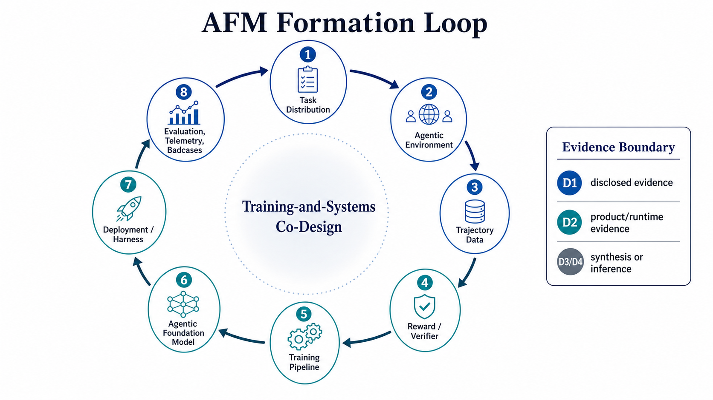

## Why Agentic Foundation Models Need A Separate Lens

Traditional LLM progress is often described through pretraining scale, instruction tuning, RLHF, and benchmark scores. Reasoning models added another layer: reinforcement learning with verifiable rewards, chain-of-thought style exploration, and stronger mathematical or coding reasoning. Agentic foundation models push the story further.

An AFM is not just a model that can call tools. It is a base model whose capabilities are shaped by repeated interaction with tasks, tools, environments, verifiers, and deployment feedback. The key object is no longer a single prompt-response pair. It is a trajectory: task state, action, tool call, observation, error, recovery, reward, and continuation.

This shift changes nearly every part of the stack:

- Model architecture must support long context, memory-like state, cache reuse, and tool-interrupted serving.
- Data pipelines must move from static instruction data to agentic trajectories and rollout traces.
- Environments become first-class training infrastructure, not only evaluation benchmarks.
- Reward systems must handle outcome verification, process feedback, rubrics, tool traces, budgets, and safety constraints.
- Training pipelines become multi-stage systems that combine pretraining, agentic continued training, SFT, preference optimization, RLVR, agentic RL, expert RL, distillation, and continual update loops.
- RL infrastructure must support long-running rollouts, sandboxed environments, verifier services, trajectory stores, weight synchronization, observability, and fault recovery.
- Product harnesses provide the runtime layer where agents interact with users, permissions, workspaces, tools, and governance systems.

## The AFM Formation Stack

The survey organizes the field into six capability-building pillars plus a runtime layer:

1. **Model architecture for agentic inference**
2. **Data pipeline**
3. **Agentic environments**
4. **Reward and verifier systems**
5. **Training pipeline**
6. **Agentic RL infrastructure**
7. **Agent harness and product runtime**

The important thing is not that every model report discloses all seven layers. Most do not. The point is that recent agentic progress is best understood as an interaction between these layers.

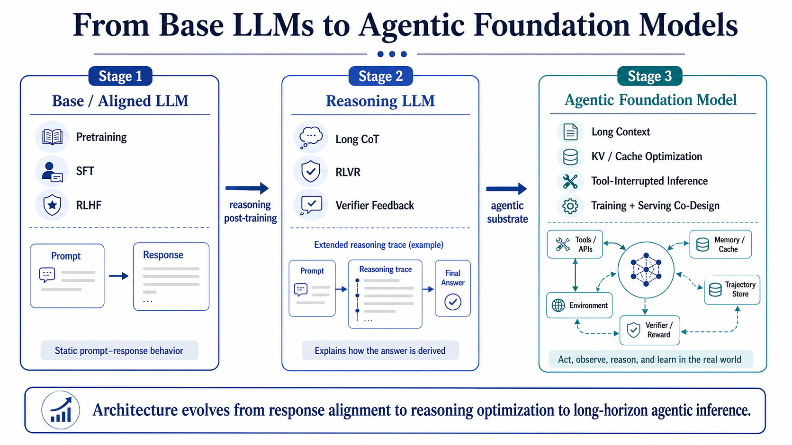

### 1. Architecture: from next-token models to long-horizon substrates

For agentic workloads, long context is not just a convenience feature. It is the substrate for repositories, browsing sessions, task histories, multi-step tool traces, documents, memory, and long-horizon rollouts.

Recent model families and technical reports suggest that AFM-oriented architecture increasingly involves:

- long-context training and inference;
- KV/cache-aware model and serving design;
- sparse, compressed, sliding-window, or hybrid attention;
- MoE and active-parameter budgeting;
- low-precision compute and memory-aware expert routing;
- tool-interrupted generation and state reuse.

DeepSeek-V4 is especially useful as a long-context and model-infrastructure anchor. In this survey, it is treated as evidence for million-token context, hybrid attention, cache hierarchy, context parallelism, deterministic kernels, and rollout-oriented infrastructure. It is **not** treated as a disclosed complete agent-training recipe.

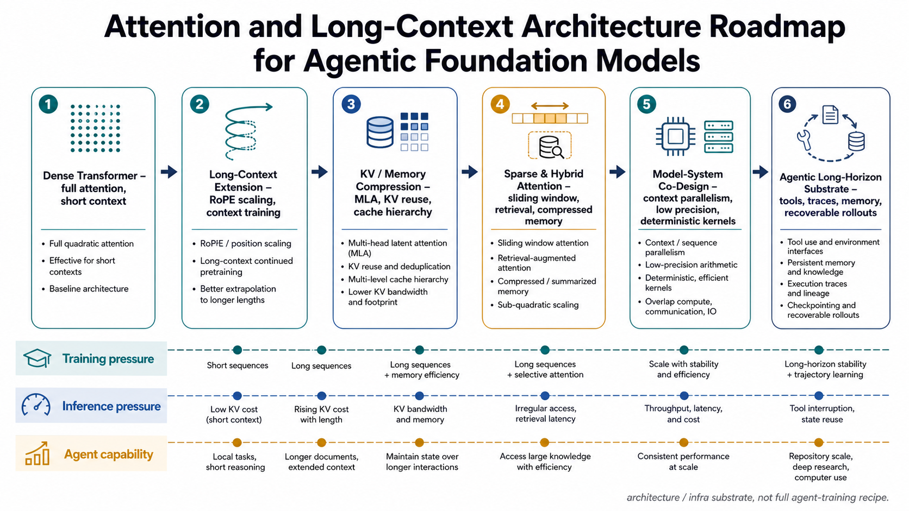

### 2. Data: from prompt-response pairs to trajectories

Agentic data is different from ordinary instruction data. A useful trajectory may include the user task, environment state, model action, tool call, observation, intermediate artifact, failure mode, recovery step, verifier output, reward, and final result.

The survey separates several data stages:

- foundation pretraining data;
- agentic continued pretraining or mid-training data;
- SFT, imitation, and cold-start trajectories;
- preference and rejection-fine-tuning data;
- rollout data from RL or agentic self-improvement;
- deployment or evaluation feedback, when explicitly disclosed and governed.

Coding/SWE agents are a strong special case because unit tests, repositories, issue descriptions, and patch outcomes provide unusually concrete verification signals. General agents are harder: web research, GUI operation, office work, data analysis, and multi-agent collaboration often require partial, delayed, or rubric-based feedback.

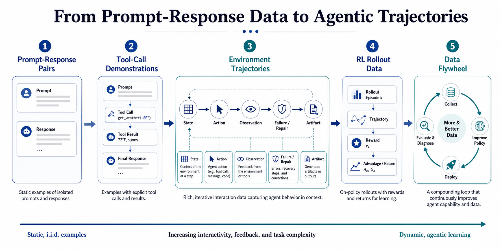

### 3. Environments: training ground, evaluator, and data factory

Agentic environments are the bridge between model behavior and learning signal. They define what the agent sees, what it can do, how state changes, how failures surface, and how outcomes are verified.

The survey distinguishes three roles that are often mixed together:

- **Evaluation harnesses**, such as benchmark scaffolds.
- **Rollout training environments**, where policy behavior generates trajectories.
- **Data-generation environments**, where tasks and traces are synthesized or curated.

This distinction matters because an environment that is good for evaluation is not automatically good for training. Training environments need reset, sandboxing, scalable task generation, verifier access, logging, and cost control.

### 4. Rewards and verifiers: turning interaction into signal

Agentic RL depends on a much broader reward system than classic scalar preference modeling. Rewards can be outcome-based, rule-based, unit-test-based, format-based, process-based, rubric-based, judge-based, budget-aware, safety-aware, or multi-agent.

Coding agents again form the cleanest case: tests, compilation, patches, and repository-level tasks provide strong verifiability. In broader settings, rewards often need to combine environment feedback, LLM-as-judge rubrics, search quality signals, task completion checks, artifact inspection, and human or product governance constraints.

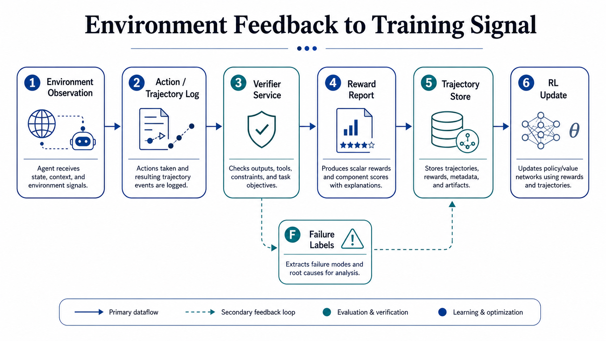

### 5. Training pipeline: full lifecycle first, post-training as the agentic center

The survey treats **training pipeline** as the parent concept. It includes pretraining, continued pretraining, SFT, preference optimization, RLVR, agentic RL, domain RL, mixed/general RL, distillation, unification, and continual update loops.

Within that full pipeline, post-training is where most agentic adaptation happens. The important post-training pattern is not a single linear recipe. It is closer to:

1. Create cold-start or imitation behavior.
2. Run domain or expert RL in verifiable environments.
3. Combine specialized capabilities through OPD/MOPD or cross-stage distillation.
4. Integrate the result into a unified model.
5. Use evaluation, deployment failures, new tools, and new environments to trigger continual post-training loops.

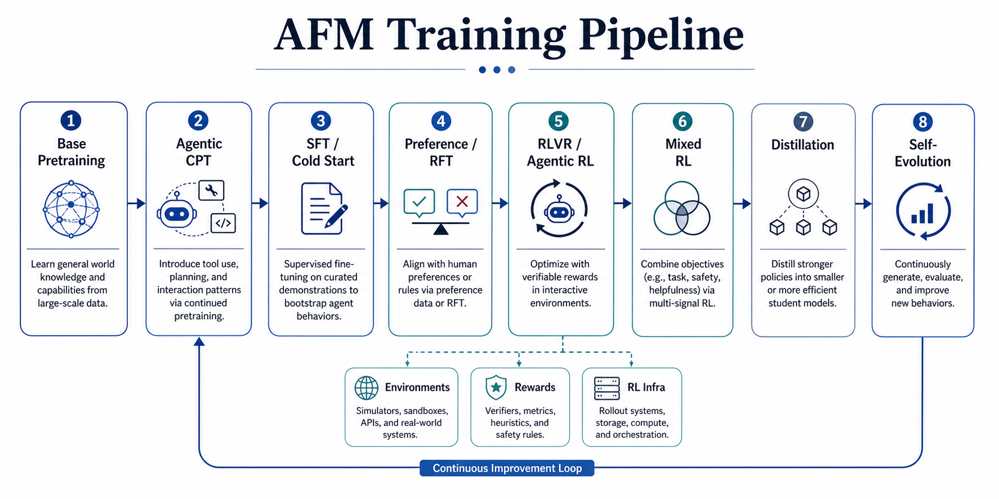

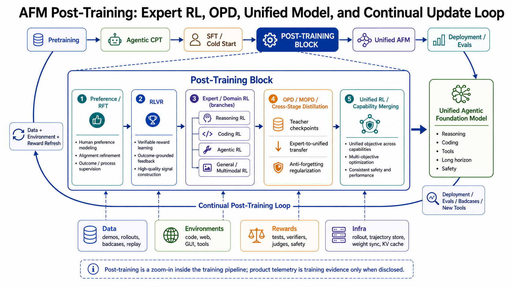

### 6. Agentic RL infrastructure: why ordinary RL infra is not enough

Agentic RL infrastructure faces pressures that are weaker or absent in ordinary RLHF/RLVR pipelines:

- Rollouts are long, multi-turn, and expensive.
- Environments can be stateful, sandboxed, flaky, or slow.
- Tool calls create external latency and failure modes.
- Verifiers may be heterogeneous and delayed.
- Trajectories are large and must be replayable.
- Policy, reference, reward, and tool-serving systems may need disaggregation.
- Long context creates KV/cache pressure.
- Fault tolerance matters because failed rollouts can waste large amounts of compute.

That is why the survey separates foundational RLHF/RLVR infrastructure from frontier agentic RL infrastructure. Systems such as HybridFlow, OpenRLHF, and ReaLHF provide important base abstractions, while AReaL, AReaL-SEA, ROLL/RollArt, ROSE, OpenTinker, Agent Lightning, AgentRL, AgentGym-RL, RLFactory, and related systems point toward agentic-specific rollout and environment infrastructure.

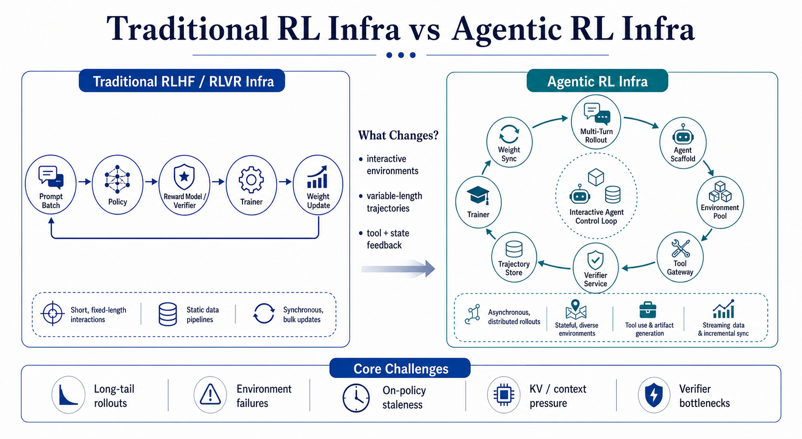

## Mainstream AFM Routes

The survey does not claim that all organizations are following one recipe. Instead, it proposes a route taxonomy:

- **Reasoning-first route**: starts from verifiable reasoning and RLVR, then expands toward tools and agentic tasks.
- **Coding-first route**: uses software engineering as the strongest verifiable agentic domain.
- **General-agent-first route**: emphasizes broad tool use, browsing, task completion, and long-horizon interaction.
- **Product-computer-first route**: builds powerful product runtimes around capable frontier models, often with limited training disclosure.

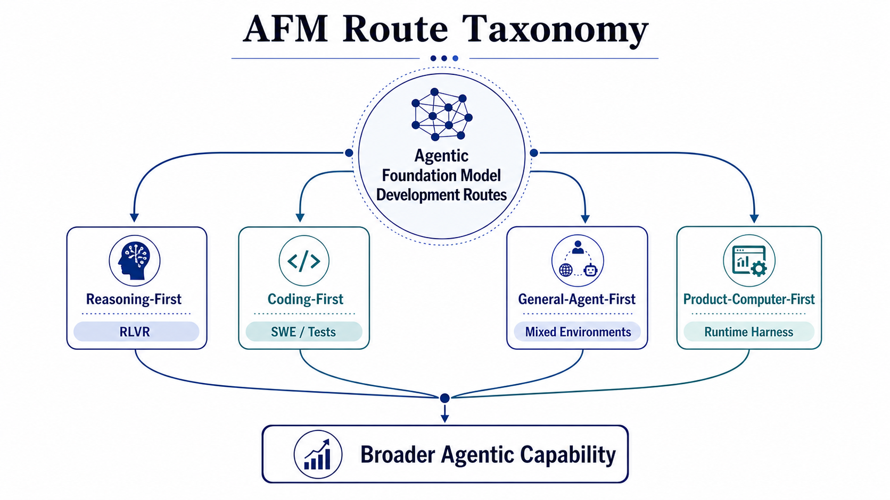

The model landscape includes open or partially disclosed families such as DeepSeek, Qwen, Kimi, GLM, MiniMax, Tongyi, Seed, Nemotron, and Cohere, alongside closed or product-facing systems from OpenAI, Anthropic, Google, and others. The survey is careful to separate what technical reports disclose from what product announcements demonstrate.

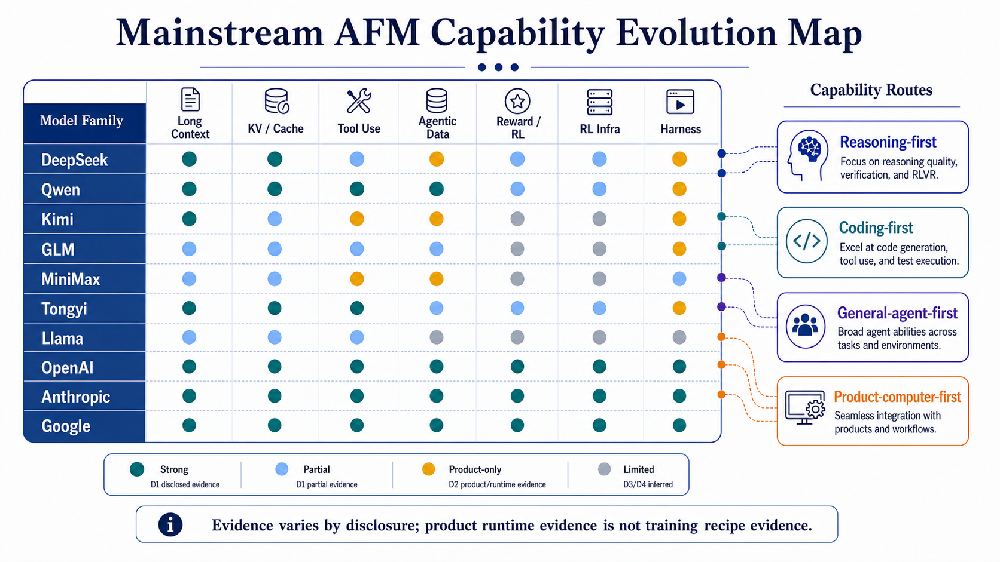

## Product Harnesses Are Not Training Recipes

A product harness is the runtime system that makes a model usable as an agent: tool interfaces, permissions, context management, artifact state, environment access, observability, evals, safety filters, human-in-the-loop controls, and bad-case triage.

Harnesses are essential. They are also easy to misread. A system card or product engineering blog can be strong evidence for runtime behavior, safety governance, and product constraints. It is usually not evidence for an undisclosed training recipe unless the source explicitly says so.

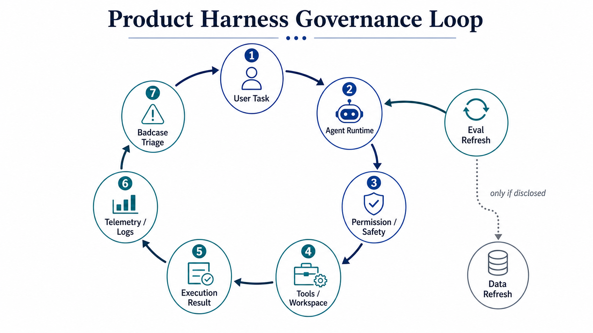

## From AFMs to Scenario Agents

Once the AFM stack exists, scenario agents can be understood as specialized compositions of foundation model capability plus scenario-specific data, environments, rewards, infrastructure, and harnesses.

The survey covers six scenario families:

- Coding and software engineering agents.
- Deep research and search agents.
- GUI and computer-use agents.
- Office and productivity agents.
- SQL, data, and MLE agents.
- Multi-agent and co-work systems.

Each scenario reuses the same formation stack, but with different bottlenecks. Coding has strong verification but complex repositories. Deep research has long evidence chains and source quality. GUI agents have brittle interfaces and safety boundaries. Data agents need executable artifacts and correctness checks. Multi-agent systems need coordination, shared state, and responsibility attribution.

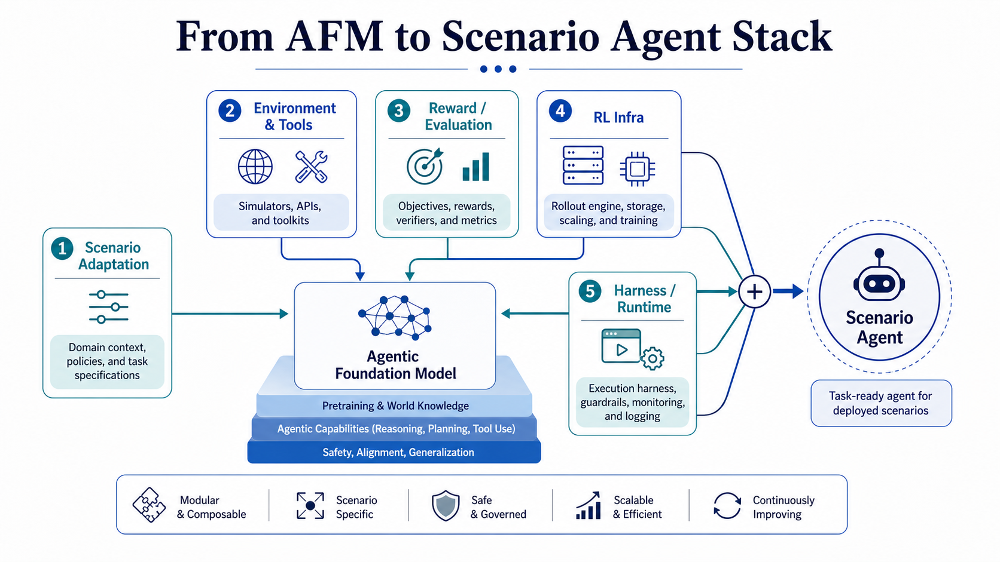

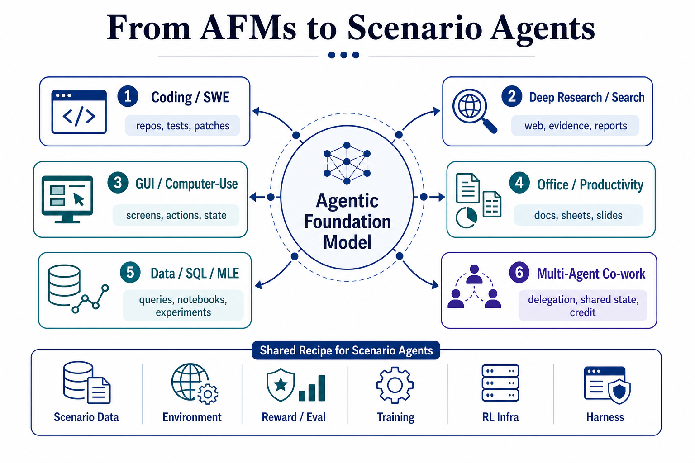

## Open Problems

The field still has several hard problems:

- **Non-coding verification**: many real tasks do not have unit tests.
- **Long-horizon credit assignment**: retaining state is not the same as assigning credit.
- **Trajectory quality**: large rollout logs can be noisy, redundant, or biased.
- **Reward robustness**: judge and rubric systems can be gamed.
- **Compute bottlenecks**: agentic rollouts stress inference, KV cache, environment pools, verifier services, and storage.
- **Harness opacity**: product systems often reveal behavior without revealing training.
- **Reproducibility**: benchmarks, environments, and infra need stronger standardization.
- **Safety and governance**: tool-using agents act in real workspaces, not only in text.

## Future Directions

The next phase of AFMs will likely depend on four directions:

1. **Multi-agent co-work**, where agents coordinate, divide labor, inspect each other, and share artifacts.
2. **Multimodal agents**, where visual, GUI, document, audio, and video contexts are part of the same action loop.
3. **Broader real-world deployment**, especially computer-use, office work, data work, robotics-like interfaces, and enterprise workflows.
4. **Long-horizon memory and continual update loops**, where models, environments, rewards, and harnesses co-evolve.

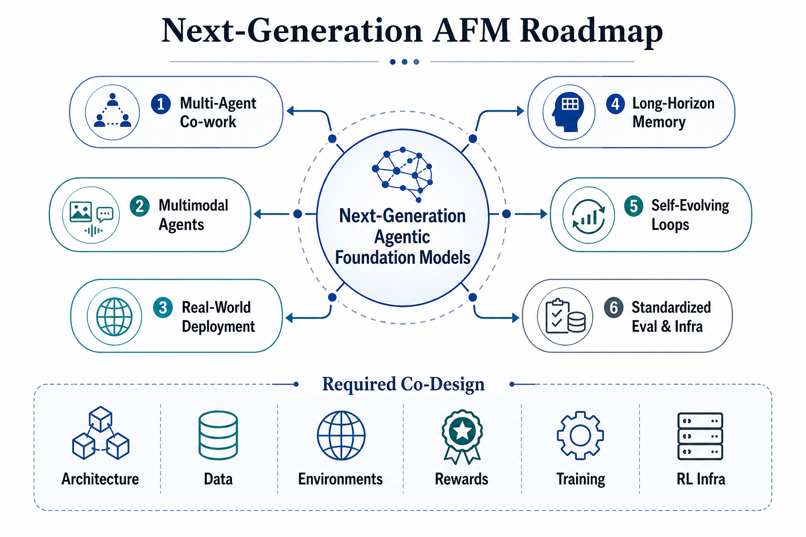

## Takeaway

Agentic foundation models are not simply "LLMs plus tools." They are the result of a training-and-systems paradigm in which model architecture, trajectories, environments, verifiers, training algorithms, RL infrastructure, and product harnesses co-evolve.

The practical implication is that the community should stop asking only which model is best at agentic tasks. A better question is:

> What formation stack produced this agentic capability, what evidence do we have for each layer, and which parts remain undisclosed, inferred, or product-only?

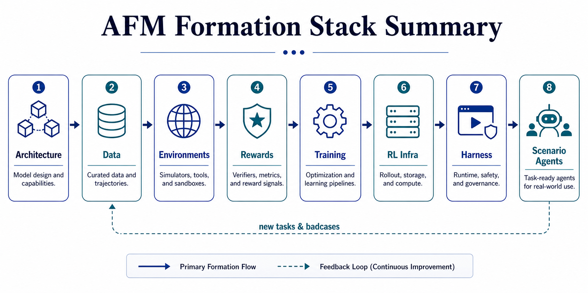

## Selected Anchors

- [DeepSeek-R1: Incentivizing Reasoning Capability in LLMs via Reinforcement Learning](https://arxiv.org/abs/2501.12948)
- [DeepSeek-V3 Technical Report](https://arxiv.org/abs/2412.19437)
- [DeepSeek-V4: Towards Highly Efficient Million-Token Context Intelligence](https://huggingface.co/deepseek-ai/DeepSeek-V4-Pro)
- [Qwen3](https://qwenlm.github.io/blog/qwen3/)
- [Qwen3-Coder-Next Technical Report](https://arxiv.org/abs/2603.00729)
- [Kimi K2: Open Agentic Intelligence](https://arxiv.org/abs/2507.20534)
- [Kimi K2.5: Visual Agentic Intelligence](https://arxiv.org/abs/2602.02276)
- [GLM-4.5: Agentic, Reasoning, and Coding Foundation Models](https://arxiv.org/abs/2508.06471)
- [GLM-5: from Vibe Coding to Agentic Engineering](https://arxiv.org/abs/2602.15763)
- [The MiniMax-M2 Series: Mini Activations Unleashing Max Real-World Intelligence](https://arxiv.org/abs/2605.26494)
- [Tongyi DeepResearch Technical Report](https://arxiv.org/abs/2510.24701)
- [Agent Lightning: Train ANY AI Agents with Reinforcement Learning](https://arxiv.org/abs/2508.03680)
- [AReaL-SEA: Self-Evolving Agents with Verifiable Rewards](https://arxiv.org/abs/2601.22607)
- [EnvFactory: Scaling Tool-Use Agents via Executable Environments Synthesis and Robust RL](https://arxiv.org/abs/2605.18703)
- [Agent Harness Engineering: A Survey](https://openreview.net/forum?id=3hXEPbG0dh)
